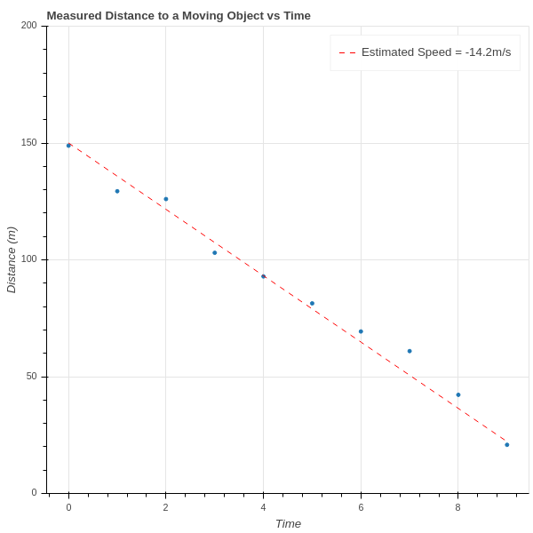
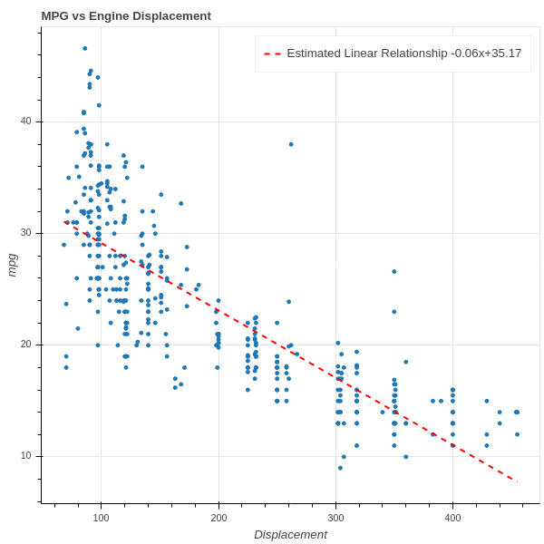
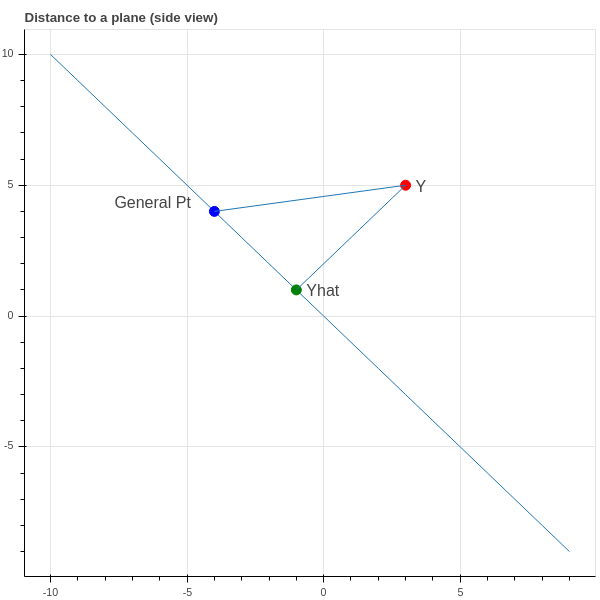
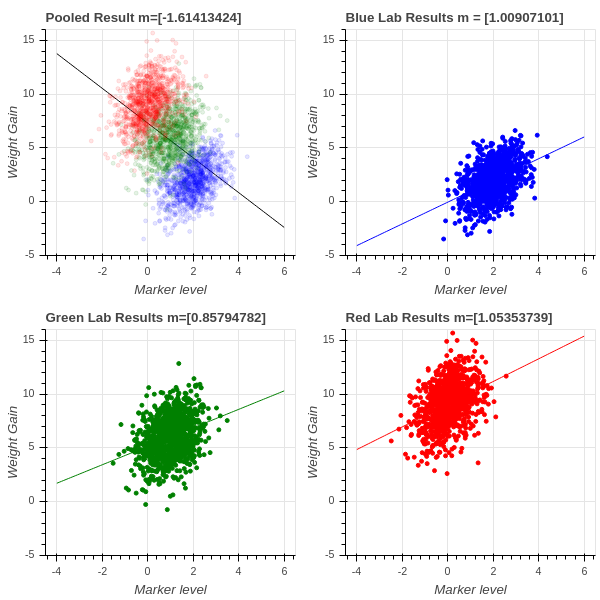

# Linear Regression

## Introduction {#sec-Intro}

Suppose that we are trying to study two quantities $x$ and $y$ that we
suspect are related -- at least approximately -- by a linear equation
$y=ax+b$.  Sometimes this linear relationship is predicted by
theoretical considerations, and sometimes it is
just an empirical hypothesis.  

For example, if we are trying to determine the velocity of an object
travelling towards us at constant speed, and we measure measure the
distances $d_1, d_2, \ldots, d_n$ between us and the object at a
series of times $t_1, t_2, \ldots, t_n$, then since "distance equals
rate times time" we have a theoretical foundation for the assumption
that $d=rt+b$ for some constants $r$ and $b$.  On the other hand,
because of unavoidable experimental errors, we can't expect that this
relationship will hold exactly for the observed data; instead, we
likely get a graph like that shown in @fig-dvt.  We've drawn a line on
the plot that seems to capture the true slope (and hence velocity) of
the object.

{#fig-dvt width=50%}

On the other hand, we might look at a graph such as
@fig-mpg-vs-displacement, which plots the gas mileage of various car
models against their engine size (displacement), and observe a general
trend in which bigger engines get lower mileage.  In this situation we
could ask for the best line of the form $y=mx+b$ that captures this
relationship and use that to make general conclusions without
necessarily having an underlying theory.

{#fig-mpg-vs-displacement width=50%}

## Least Squares (via Calculus) {#sec-Calculus}

In either of the two cases above, the question we face is to determine
the line $y=mx+b$ that "best fits" the data $\{(x_i,y_i)_{i=1}^{N}\}$.
The classic approach is to determine the equation of a line $y=mx+b$
that minimizes the "mean squared error":

$$ MSE(m,b) = \frac{1}{N}\sum_{i=1}^{N} (y_i-mx_i-b)^2 $$

It's worth emphasizing that the $MSE$ is a function of two variables
-- the slope $m$ and the intercept $b$ -- and that the data points
$\{(x_i,y_i)\}$ are constants for these purposes.  Furthermore, it's a
quadratic function in those two variables.  Since our goal is to find
$m$ and $b$ that minimize the $MSE$, we have a Calculus problem that
we can solve by taking partial derivatives and setting them to zero.

To simplify the notation, let's abbreviate $MSE$ by $E$.

$$
\begin{aligned} \frac{\partial E}{\partial m} &=
\frac{1}{N}\sum_{1}^{N}-2x_i(y_i-mx_i-b) \\ \frac{\partial E}{\partial
b} &= \frac{1}{N}\sum_{1}^{N}-2(y_i-mx_i-b) \\ 
\end{aligned} 
$$

We set these two partial derivatives to zero, so we can drop the $-2$
and regroup the sums to obtain two equations in two unknowns (we keep
the $\frac{1}{N}$ because it is illuminating in the final result):

$$
\begin{aligned} \frac{1}{N}(\sum_{i=1}^{N} x_i^2)m &+&
\frac{1}{N}(\sum_{i=1}^{N} x_i)b &=& \frac{1}{N}\sum_{i=1}^{N} x_i y_i
\\ \frac{1}{N}(\sum_{i=1}^{N} x_i)m &+& b &=&
\frac{1}{N}\sum_{i=1}^{N} y_{i} \\ \end{aligned}
$$ {#eq-LS}

In these equations, notice that $\frac{1}{N}\sum_{i=1}^{N} x_i$ is the
average (or mean) value of the $x_i$.  Let's call this $\overline{x}$.
Similarly, $\frac{1}{N}\sum_{i=1}^{N} y_{i}$ is the mean of the $y_i$,
and we'll call it $\overline{y}$.  If we further simplify the notation
and write $S_{xx}$ for $\frac{1}{N}\sum_{i=1}^{N} x_i^2$ and $S_{xy}$
for $\frac{1}{N}\sum_{i=1}^{N}x_iy_i$ then we can write down a
solution to this system using Cramer's rule:

$$ \begin{aligned} m &=
\frac{S_{xy}-\overline{x}\overline{y}}{S_{xx}-\overline{x}^2} \\ b &=
\frac{S_{xx}\overline{y}-S_{xy}\overline{x}}{S_{xx}-\overline{x}^2} \\
\end{aligned}
$$ {#eq-LSAnswer}

where we must have $S_{xx}-\overline{x}^2\not=0$.

### Exercises {#sec-CalcExercises}

1. Verify that @eq-LSAnswer is in fact the solution to the system in
@eq-LS .

2. Suppose that $S_{xx}-\overline{x}^2=0$.  What does that mean about
the $x_i$?  Does it make sense that the problem of finding the "line
of best fit" fails in this case?

## Least Squares (via Geometry) {#sec-LinAlg}

In our discussion above, we thought about our data as consisting of
$N$ pairs $(x_i,y_i)$ corresponding to $N$ points in the $xy$-plane
$\mathbf{R}^2$.  Now let's turn that picture "on its side", and
instead think of our data as consisting of *two* points in
$\mathbf{R}^{N}$:

$$ X=\left[\begin{matrix} x_1\cr x_2\cr \vdots\cr
x_n\end{matrix}\right] \mathrm{\ and\ } Y = \left[\begin{matrix}
y_1\cr y_2\cr \vdots\cr y_n\end{matrix}\right]
$$

Let's also introduce one other vector

$$ E = \left[\begin{matrix} 1 \cr 1 \cr \vdots \cr
1\end{matrix}\right].  
$$

First, let's assume that $E$ and $X$ are linearly independent.  If
not, then $X$ is a constant vector (why?) which we already know is a
problem from @sec-Calculus, Exercise 2.  Therefore $E$ and $X$ span a
plane in $\mathbf{R}^{N}$.

{#fig-perp
width=50%}

Now if our data points $(x_i,y_i)$ all *did* lie on a line $y=mx+b$,
then the three vectors $X$, $Y$, and $E$ would be linearly dependent:

$$ Y = mX + bE.  $$

Since our data is only approximately linear, that's not the case.  So
instead we look for an approximate solution.  One way to phrase that
is to ask:

*What is the point $\hat{Y}$ in the plane $H$ spanned by $X$ and $E$
in $\mathbf{R}^{N}$ which is closest to $Y$?*

If we knew this point $\hat{Y}$, then since it lies in $H$ we would
have $\hat{Y}=mX+bE$ and the coefficients $m$ and $b$ would be a
candidate for defining a line of best fit $y=mx+b$.  Finding the point
in a plane closest to another point in $\mathbf{R}^{N}$ is a geometry
problem that we can solve.

**Proposition:** The point $\hat{Y}$ in the plane spanned by $X$ and
$E$ is the point such that the vector $Y-\hat{Y}$ is perpendicular to
$H$.

**Proof:** See @fig-perp for an illustration -- perhaps you are
already convinced by this, but let's be careful.  $\hat{Y}=mX+bE$ such
that $$ D = \|Y-\hat{Y}\|^2 = \|Y-mX-bE\|^2 $$ is minimal.  Using some
vector calculus, we have $$ \frac{\partial D}{\partial m} =
\frac{\partial}{\partial m} (Y-mX-bE)\cdot (Y-mX-bE) =
-2(Y-mX-bE)\cdot X $$ and $$ \frac{\partial D}{\partial b} =
\frac{\partial}{\partial b} (Y-mX-bE)\cdot (Y-mX-bE) =
-2(Y-mX-bE)\cdot E.  $$

So both derivatives are zero exactly when $\hat{Y}=(Y-mX-bE)$ is
orthogonal to both $X$ and $E$, and therefore every vector in $H$.

We also obtain equations for $m$ and $b$ just as in our first look at
this problem.

$$ \begin{aligned} m(X\cdot E) &+ b(E\cdot E) &= (Y\cdot E) \cr
m(X\cdot X) &+ b(E\cdot X) &= (Y\cdot X) \cr \end{aligned}
$$ {#eq-LSAnswer2}

We leave it is an exercise below to check that these are the same
equations that we obtained in @eq-LSAnswer.

### Exercises

1. Verify that @eq-LSAnswer and @eq-LSAnswer2 are equivalent.

## The Multivariate Case (Calculus) {#sec-Multivariate-calculus}

Having worked through the problem of finding a "line of best fit" from
two points of view, let's look at a more general problem.  We looked
above at a scatterplot showing the relationship between gas mileage
and engine size (displacement).  There are other factors that might
contribute to gas mileage that we want to consider as well -- for
example:

- a car that is heavy compared to its engine size may get worse
  mileage
- a sports car with a drive train that gives fast acceleration as
compared to a car with a transmission designed for long trips may have
different mileage for the same engine size.

Suppose we wish to use engine displacement, vehicle weight, and
acceleration all together to predict mileage.  Instead of looking
points $(x_i,y_i)$ where $x_i$ is the displacement of the $i^{th}$ car
model and we try to predict a value $y$ from a corresponding $x$ as
$y=mx+b$ -- let's look at a situation in which our measured value $y$
depends on multiple variables -- say displacement $d$, weight $w$, and
acceleration $a$ with $k=3$ -- and we are trying to find the best
linear equation

$$ 
y=m_1 d + m_2 w + m_3 a +b 
$${#eq-multivariate}

But to handle this situation more generally we need to adopt a
convention that will allow us to use indexed variables instead of $d$,
$w$, and $a$.  We will use the *tidy* data convention.

**Tidy Data:** A dataset is tidy if it consists of values $x_{ij}$ for
$i=1,\ldots,N$ and $j=1,\ldots, k$ so that:

- the row index corresponds to a *sample* -- a set of measurements
   from a single event or item;
- the column index corresponds to a *feature* -- a particular
   property measured for all of the events or items.

In our case,

- the *samples* are the different types of car models,
- the *features* are the properties of those car models.  

For us, $N$ is the number of different types of cars, and $k$ is the
number of properties we are considering.  Since we are looking at
displacement, weight, and acceleration, we have $k=3$.

So the "independent variables" for a set of data that consists of $N$
samples, and $k$ measurements for each sample, can be represented by a
$N\times k$ matrix

$$ X = \left(\begin{matrix} x_{11} & x_{12} & \cdots & x_{1k} \\
x_{21} & x_{22} & \cdots & x_{2k} \\ \vdots & \vdots & \ddots & \vdots
\\ x_{N1} & x_{k2} & \cdots & x_{Nk} \\ \end{matrix}\right)
$$

and the measured dependent variables $Y$ are a column vector 
$$ Y =
\left[\begin{matrix} y_1 \\ y_2 \\ \vdots \\ y_N\end{matrix}\right].
$$

If $m_1,\ldots, m_k$ are "slopes" associated with these properties in
@eq-multivariate, and $b$ is the "intercept", then the predicted
value $\hat{Y}$ is given by a matrix equation

$$ 
\hat{Y} = X\left[\begin{matrix} m_1 \\ m_2 \\ \cdots \\
m_k\end{matrix}\right]+\left[\begin{matrix} 1 \\ 1 \\ \cdots \\
1\end{matrix}\right]b 
$$

and our goal is to choose these parameters $m_i$ and $b$ to make the
mean squared error:

$$ MSE(m_1,\ldots, m_k,b) = \|Y-\hat{Y}\|^2 = \sum_{i=1}^{N} (y_i -
\sum_{j=1}^{k} x_{ij}m_j -b )^2.
$$

Here we are summing over the $N$ different car models, and for each
model taking the squared difference between the true mileage $y_i$ and
the "predicted" mileage $\sum_{j=1}^{k} x_{ij}m_j +b$. We wish to
minimize this MSE.

Let's make one more simplification.  The intercept variable $b$ is
annoying because it requires separate treatment from the $m_i$.  But
we can use a trick to eliminate the need for special treatment.  Let's
add a new feature to our data matrix (a new column) that has the
constant value $1$.

$$ X = \left(\begin{matrix} x_{11} & x_{12} & \cdots & x_{1k} & 1\\
x_{21} & x_{22} & \cdots & x_{2k} & 1\\ \vdots & \vdots & \ddots &
\vdots & 1\\ x_{N1} & x_{k2} & \cdots & x_{Nk} & 1\\
\end{matrix}\right)
$$

Now our data matrix $X$ is $N\times(k+1)$ and we can put our
"intercept" $b=m_{k+1}$ into our vector of "slopes" $m_1, \ldots,
m_k,m_{k+1}$:

$$ \hat{Y} = X\left[\begin{matrix} m_1 \\ m_2 \\ \cdots \\ m_k \\
m_{k+1}\end{matrix}\right]
$$

and our MSE becomes

$$ 
MSE(M) = \|Y - XM\|^2
$$

where

$$ M=\left[\begin{matrix} m_1 \\ m_2 \\ \cdots \\ m_k \\
m_{k+1}\end{matrix}\right].
$$

**Remark:** Later on (see {@sec-centered}) we will see that if we
"center" our features about their mean, by subtracting the average
value of each column of $X$ from that column; and we also subtract the
average value of $Y$ from the entries of $Y$, then the $b$ that
emerges from the least squares fit is zero.  As a result, instead of
adding a column of $1$'s, you can change coordinates to center each
feature about its mean, and keep your $X$ matrix $N\times k$.

The Calculus approach to minimizing the $MSE$ is to take its partial
derivatives with respect to the $m_{i}$ and set them to zero.  Let's
first work out the derivatives in a nice form for later.

**Proposition:** The gradient of $MSE(M)=E$ is given by

$$ 
\nabla E = \left[\begin{matrix} \df{M_1}E \\ \df{M_2}E \\ \vdots \\
\df{m_{M+1}}E\end{matrix}\right] = -2 X^{\intercal}Y + 2
X^{\intercal}XM 
$${#eq-gradient}

where $X^{\intercal}$ is the transpose of $X$.

**Proof:** First, remember that the $ij$ entry of $X^{\intercal}$ is
the $ji$ entry of $X$. Also, we will use the notation $X[j,:]$ to mean
the $j^{th}$ row of $X$ and $X[:,i]$ to mean the $i^{th}$ column of
$X$.  (This is copied from the Python programming language; the ':'
means that index runs over all possibilities).

Since $$ E = \sum_{j=1}^{N} (Y_j-\sum_{s=1}^{k+1} X_{js}M_{s})^2 $$ we
compute: $$\begin{aligned} \df{M_t}E &= -2\sum_{j=1}^{N}
X_{jt}(Y_{j}-\sum_{s=1}^{k+1} X_{js}M_{s}) \\ &= -2(\sum_{j=1}^{N}
Y_{j}X_{jt} - \sum_{j=1}^{N}\sum_{s=1}^{k+1} X_{jt}X_{js}M_{s}) \\ &=
-2(\sum_{j=1}^{N} X^{\intercal}_{tj}Y_{j}
-\sum_{j=1}^{N}\sum_{s=1}^{k+1} X^{\intercal}_{tj}X_{js}M_{s}) \\ &=
-2(X^{\intercal}[t,:]Y - \sum_{s=1}^{k+1}\sum_{j=1}^{N}
X^{\intercal}_{tj}X_{js}M_{s}) \\ &= -2(X^{\intercal}[t,:]Y -
\sum_{s=1}^{k+1} (X^{\intercal}X)_{ts}M_{s}) \\ &=
-2[X^{\intercal}[t,:]Y - (X^{\intercal}X](t,:)M)\\
\end{aligned}$${#eq-gradient2}

Stacking up the different rows to make $E$ yields the desired formula.

**Proposition:** Assume that $D=X^{\intercal}X$ is invertible (notice
that it is a $(k+1)\times(k+1)$ square matrix so this makes sense).
The solution $M$ to the multivariate least squares problem is $$ M =
D^{-1}X^{\intercal}Y $${#eq-Msolution} and the "predicted value"
$\hat{Y}$ for $Y$ is 
$$ 
\hat{Y} = XD^{-1}X^{\intercal}Y.
$${#eq-projection}

## The Multivariate Case (Geometry)

Let's look more closely at the equation obtained by setting the
gradient of the error, @eq-gradient, to zero. Remember that $M$ is
the unknown vector in this equation, everything else is known:

$$ X^{\intercal}Y = X^{\intercal}XM $$

Here is how to think about this:

   1. As $M$ varies, the $N\times 1$ matrix $XM$ varies over the space
   spanned by the columns of the matrix $X$.
   So as $M$ varies $XM$ is a general element of the subspace $H$ of $R^{N}$ spanned by the $k+1$ columns of $X$.  

   2. The product $X^{\intercal}XM$ is a $(k+1)\times 1$ matrix.  Each
   entry is the dot product of the general element
   of $H$ with one of the $k+1$ basis vectors of $H$.  

   3. The product $X^{\intercal}Y$ is a $(k+1)\times 1$ matrix whose
   entries are the dot product of the basis vectors of $H$ with $Y$.

Therefore, this equation asks for us to find $M$ so that the vector
$XM$ in $H$ has the same dot products with the basis vectors of $H$ as
$Y$ does.  The condition

$$ X^{\intercal}\cdot (Y-XM)=0 $$

says that $Y-XM$ is orthogonal to $H$.  This argument establishes the
following proposition.

**Proposition:** Just as in the simple one-dimensional case, the
predicted value $\hat{Y}$ of the least squares problem is the point in
$H$ closest to $Y$ -- or in other words the point $\hat{Y}$ in $H$
such that $Y-\hat{Y}$ is perpendicular to $H$.

### Orthogonal Projection

Recall that we introduced the notation $D=X^{\intercal}X$, and let's
assume, for now, that $D$ is an invertible matrix.  We have the
formula (see @eq-projection): $$ \hat{Y} = XD^{-1}X^{\intercal}Y.  $$
**Proposition:** The matrix $P=XD^{-1}X^{\intercal}$ is an $N\times N$
matrix called the orthogonal projection operator onto the subspace $H$
spanned by the columns of $X$. It has the following properties:

- $PY$ belongs to the subspace $H$ for any $Y\in\mathbf{R}^{N}$.
- $(Y-PY)$ is orthogonal to $H$.
- $P*P = P$.

**Proof:** First of all, $PY=XD^{-1}X^{\intercal}Y$ so $PY$ is a
linear combination of the columns of $X$ and is therefore an element
of $H$.  Next, we can compute the dot product of $PY$ against a basis
of $H$ by computing

$$ X^{\intercal}PY = X^{\intercal}XD^{-1}X^{\intercal}Y =
X^{\intercal}Y 
$$

since $X^{\intercal}X=D$.  This equation means that
$X^{\intercal}(Y-PY)=0$ which tells us that $Y-PY$ has dot product
zero with a basis for $H$.  Finally,

$$ PP = XD^{-1}X^{\intercal}XD^{-1}X^{\intercal} =
XD^{-1}X^{\intercal}=P.  
$$

It should be clear from the above discussion that the matrix
$D=X^{\intercal}X$ plays an important role in the study of this
problem.  In particular it must be invertible or our analysis above
breaks down.  In the next section we will look more closely at this
matrix and what information it encodes about our data.

## Centered coordinates {#sec-centered}

Recall from last section that the matrix $D=X^{\intercal}X$ is of central importance to the study of the multivariate least squares problem. Let's look at it more closely.

**Lemma:** The $i,j$ entry of $D$ is the dot product $$
D_{ij}=X[:,i]\cdot X[:,j] $$ of the $i^{th}$ and $j^{th}$ columns of
$X$.

**Proof:** In the matrix multiplication $X^{\intercal}X$, the $i^{th}$
row of $X^{\intercal}$ gets "dotted" with the $j^{th}$ column of $X$
to product the $i,j$ entry.  But the $i^{th}$ row of $X^{\intercal}$
is the $i^{th}$ column of $X$, as asserted in the statement of the
lemma.

A crucial point in our construction above relied on the matrix $D$
being invertible.  The following Lemma shows that $D$ fails to be
invertible only when the different features (the columns of $X$) are
linearly dependent.

**Lemma:** $D$ is not invertible if and only if the columns of $X$ are
linearly dependent.

**Proof:** If the columns of $X$ are linearly dependent, then there is
a nonzero vector $m$ so that $Xm=0$.  In that case clearly
$Dm=X^{\intercal}Xm=0$ so $D$ is not invertible.  Suppose $D$ is not
invertible.  Then there is a nonzero vector $m$ with
$Dm=X^{\intercal}Xm=0$.  This means that the vector $Xm$ is orthogonal
to all of the columns of $X$.  Since $Xm$ belongs to the span $H$ of
the columns of $X$, if it is orthogonal to $H$ it must be zero.

In fact, the matrix $D$ captures some important statistical measures
of our data, but to see this clearly we need to make a slight change
of basis.  First recall that $X[:,k+1]$ is our column of all $1$,
added to handle the intercept.  As a result, the dot product
$X[:,i]\cdot X[:,k+1]$ is the sum of the entries in the $i^{th}$
column, and so if we let $\mu_{i}$ denote the average value of the
entries in column $i$, we have $$ \mu_{i} = \frac{1}{N}(X[:,i]\cdot
X[:,k+1]) $$

Now change the matrix $X$ by elementary column operations to obtain a
new data matrix $X_{0}$ by setting $$ X_{0}[:,i] =
X[:,i]-\frac{1}{N}(X[:,i]\cdot X[:,k+1])X[:,k+1] =
X[:,i]-\mu_{i}X[:,k+1] $$ for $i=1,\ldots, k$.

In terms of the original data, we are changing the measurement scale
of the data so that each feature has average value zero, and the
subspace $H$ spanned by the columns of $X_{0}$ is the same as that
spanned by the columns of $X$.  Using $X_{0}$ instead of $X$ for our
least squares problem, we get

$$ \hat{Y} = X_{0}D_{0}^{-1}X_{0}^{\intercal}Y $$

and

$$ M_{0} = D_{0}^{-1}X_{0}^{\intercal}Y $$

where $D_{0}=X_{0}^{\intercal}X_{0}.$

**Proposition:** The matrix $D_{0}$ has a block form. Its upper left
block is a $k\times k$ symmetric block with entries $$ (D_{0})_{ij} =
(X[:,i]-\mu_{i}X[:,k+1])\cdot(X[:,j]-\mu_{j}X[:,k+1]) $$ Its
$(k+1)^{st}$ row and column are all zero, except for the $(k+1),(k+1)$
entry, which is $N$.

**Proof:** This follows from the fact that the last row and column
entries are (for $i\not=k+1$): $$ (X[:,i]-\mu_{i}X[:,k+1])\cdot
X[:,k+1] = (X[:,i]\cdot X[:,k+1])-N\mu_{i} = 0 $$ and for $i=k+1$ we
have $X[:,k+1]\cdot X[:,k+1]=N$ since that column is just $N$ $1$'s.

**Proposition:** If the $x$ coordinates (the features) are centered so
that they have mean zero, then the intercept $b$ is $$ \overline{Y} =
\frac{1}{N}\sum y_{i}.  $$

**Proof:** By centering the coordinates, we replace the matrix $X$ by
$X_{0}$ and $D$ by $D_{0}$.  and we are trying to minimize
$\|Y-X_{0}M_{0}\|^2$.  Use the formula from @eq-Msolution to see that
$$ M_{0} = D_{0}^{-1}X_{0}^{\intercal}Y.  $$ 
The $b$ value we are
interested in is the last entry $m_{k+1}$ in $M_{0}$. From the block
form of $D_{0}$, we know that $D_{0}^{-1}$ has bottom row and last
column zero except for $1/N$ in position $(k+1)\times(k+1)$.  Also
$X_{0}^{\intercal}$ has last row consisting entirely of $1$.  So the
bottom entry of $X_{0}^{\intercal}Y$ is $\sum_{i=1}^{N} y_{i}$, and
the bottom entry $b$ of $D_{0}^{-1}X_{0}^{\intercal}Y$ is $$ \mu_{Y} =
\frac{1}{N}\sum_{i=1}^{N} y_{i}.  $$ as claimed.

**Corollary:** If we make a further change of coordinates to define $$
Y_{0} = Y - \mu_{Y}\left[\begin{matrix} 1 \\ 1 \\ \vdots \\
1\end{matrix}\right] $$ then the associated $b$ is zero.  As a result
we can forget about the extra column of $1's$ that we added to $X$ to
account for it and reduce the dimension of our entire problem by $1$.

Just to recap, if we center our data so that $\mu_{Y}=0$ and
$\mu_{i}=0$ for $i=1,\ldots, k$, then the least squares problem
reduces to minimizing $$ E(M) = \|Y-XM\|^2 $$ where $X$ is the
$N\times k$ matrix with $j^{th}$ row $(x_{j1},x_{j2},\ldots, x_{jk})$
for $j=1,\ldots, N$ and the solutions are as given in @eq-Msolution
and @eq-projection.

## Caveats about Linear Regression

### Basic considerations

Reflecting on our long discussion up to this point, we should take
note of some of the potential pitfalls that lurk in the use of linear
regression.

1. When we apply linear regression, we are explicitly assuming that
    the variable $Y$ is associated to $X$ via linear
equations.  This is a big assumption!

2. When we use multilinear regression, we are assuming that changes
in the different features have independent effects on the target
variable $y$.  In other words, suppose that $y=ax_1+bx_2$.  Then an
increase of $x_1$ by $1$ increases $y$ by $a$, and an increase of
$x_2$ by $1$ increases $y$ by $b$.  These effects are independent of
one another and combine to yield an increase of $a+b$.

3. We showed in our discussion above that linear regression problem
has a solution when the matrix $D=X^{\intercal}X$ is invertible, and
this happens when the columns of $D$ are linearly independent.  When
working with real data, which is messy, we could have a situation in
which the features we are studying are, in fact, dependent -- but
because of measurement error, the samples that we collected aren't.
In this case, the matrix $D$ will be "close" to being non-invertible,
although formally still invertible.  In this case, computing $D^{-1}$
leads to numerical instability and the solution we obtain is very
unreliable.

### Simpson's Effect

Simpson's effect is a famous phenomenon that illustrates that linear
regression can be very misleading in some circumstances.  It is often
a product of "pooling" results from multiple experiments.  Suppose,
for example, that we are studying the relationship between a certain
measure of blood chemistry and an individual's weight gain or less on
a particular diet.  We do our experiments in three labs, the blue,
green, and red labs.  Each lab obtains similar results -- higher
levels of the blood marker correspond to greater weight gain, with a
regression line of slope around 1.  However, because of differences in
the population that each lab is studying, some populations are more
susceptible to weight gain and so the red lab sees a mean increase of
almost 9 lbs while the blue lab sees a weight gain of only 3 lbs on
average.

The three groups of scientists pool their results to get a larger
sample size and do a new regression.  Surprise!  Now the regression
line has slope $-1.6$ and increasing amounts of the marker seem to
lead to *less* weight gain!

This is called Simpson's effect, or Simpson's paradox, and it shows
that unknown factors (confounding factors) may cause linear regression
to yield misleading results.  This is particularly true when data from
experiments conducted under different conditions is combined; in this
case, the differences in experimental setting, called *batch effects*,
can throw off the analysis very dramatically.  See @fig-simpsons .

{#fig-simpsons
width=50%}

### Exercises

1. When proving that $D$ is invertible if and only if the columns of
$X$ are linearly independent, we argued that if $X^{\intercal}Xm=0$
for a nonzero vector $m$, then $Xm$ is orthogonal to the span of the
columns of $X$, and is also an element of that span, and is therefore
zero.  Provide the details: show that if $H$ is a subspace of
$\mathbf{R}^{N}$, and $x$ is a vector in $H$ such that $x\cdot h=0$
for all $h\in H$, then $x=0$.
