# Principal Component Analysis

## Introduction

Suppose that, as usual,  we begin with a
collection of measurements of different features for a group of samples.  Some of these measurements
will tell us quite a bit about the difference among our samples, while others may contain relatively little
information.  For example, if we are analyzing the effect of a certain weight loss regimen on a group of people,
the age and weight of the subjects may have a great deal of influence on how successful the regimen is, while
their blood pressure might not.  One way to help identify which features are more significant is
to ask whether or not the feature varies a lot among the different samples.  If nearly all the measurements
of a feature are the same, it can't have much power in distinguishing the samples, while if the measurements
vary a great deal then that feature has a chance to contain useful information.

In this section we will discuss a way to measure the variability of measurements and then introduce principal
component analysis (PCA).  PCA is a method for finding which linear combinations of measurements have the
greatest variability and therefore might contain the most information.  It also allows us to identify
combinations of measurements that don't vary much at all.  Combining this information, we can sometimes
replace our original system of features with a smaller set that still captures most of the interesting
information in our data, and thereby find hidden characteristics of the data and simplify our analysis
a great deal.

## Variance and Covariance

### Variance

Suppose that we have a collection of measurements $(x_1,\ldots, x_N)$ of a particular feature $X$.
For example,  $x_i$ might be the initial weight of the $ith$ participant in our weight loss study.
The mean of the values $(x_1,\ldots, x_N)$ is

$$
\mu_{X} = \frac{1}{N}\sum_{i=1}^{N} x_{i}.
$$

The simplest measure of the variability of the data is called its *variance.*

**Definition:** The (sample) variance of the data $x_1,\ldots, x_N$ is

$$
\sigma_{X}^2 = \frac{1}{N}\sum_{i=1}^{N} \left(x_{i}-\mu_{X}\right)^2 = \frac{1}{N}\left(\sum_{i=1}^{N} x_{i}^2\right)- \mu_{X}^2
$${#eq-variance}

The square root of the variance is called the *standard deviation.*

As we see from the formula, the variance is a measure of how 'spread out' the data is from the mean.

Recall that in our discussion of linear regression we thought of our set of measurements $x_1,\ldots, x_N$
as a vector -- it's one of the columns of our data matrix.  From that point of view, the variance
has a geometric interpretation -- it is $\frac{1}{N}$ times the square of the
distance from the point $X=(x_1,\ldots, x_N)$ to the point $\mu_{X}(1,1,\ldots,1)=\mu_{X}E$:

$$
\sigma_{X}^2 = \frac{1}{N}(X-\mu_{X}E)\cdot(X-\mu_{X}E)  = \frac{1}{N}\|X-\mu_{X}E\|^2.
$${#eq-variancedot}

### Covariance

The variance measures the dispersion of measures of a single feature.  Often, we have measurements
of multiple features and we might want to know something about how two features are related.  The
*covariance* is a measure of whether two features tend to be related, in the sense that when one
increases, the other one increases; or when one increases, the other one decreases.  

**Definition:**
Given measurements $(x_1,\ldots, x_N)$ and $(y_1,\ldots, y_N)$ of two features $X$ and $Y$, the covariance
of $X$ and $Y$ is

$$
\sigma_{XY} = \frac{1}{N}\sum_{i=1}^{N} (x_i-\mu_{X})(y_i-\mu_{Y})
$${#eq-covariancedot}

There is a nice geometric interpretation of this, as well, in terms of the dot product.  If
$X=(x_1,\ldots, x_N)$ and $Y=(y_1\ldots,y_N)$ then

$$
\sigma_{XY} = \frac{1}{N} ((X-\mu_{X}E)\cdot (Y-\mu_{Y}E)).
$$

From this point of view, we can see that $\sigma_{XY}$ is positive if the $X-\mu_{X}E$ and $Y-\mu_{Y}E$ vectors
"point roughly
in the same direction" and its negative if they "point roughly in the opposite direction."

### Correlation

One problem with interpreting the variance and covariance is that we don't have a scale --
for example, if $\sigma_{XY}$ is large and positive, then we'd like to say that $X$ and $Y$ are closely related,
but it could be just that the entries of $X-\mu_{X}E$ and $Y-\mu_{Y}E$ are large.   Here, though,
we can really take advantage of the geometric interpretation.  Recall that the dot product of
two vectors satisfies the formula

$$
a \cdot b = \|a\|\|b\|\cos(\theta)
$$

where $\theta$ is the angle between $a$ and $b$.  So

$$
\cos(\theta) = \frac{a\cdot b}{\|a\|\|b\|}.
$$

Let's apply this to the variance and covariance, by noticing that

$$
\frac{(X-\mu_{X}E)\cdot (Y-\mu_{Y}E)}{\|(X-\mu_{X}E)\|\|(Y-\mu_{Y}E)\|} = \frac{\sigma_{XY}}{\sigma_{XX}\sigma_{YY}}
$$

so the quantity

$$
r_{XY} = \frac{\sigma_{XY}}{\sigma_{X}\sigma_{Y}}
$${#eq-rxy}

measures the cosine of the angle between the vectors $X-\mu_{X}E$ and $Y-\mu_{Y}E$.

**Definition:** The quantity $r_{XY}$ defined in  @eq-rxy is called the (sample)
*correlation coefficient* between $X$ and $Y$.  We have $0\le |r_{XY}|\le 1$ with $r_{XY}=\pm 1$
if and only if the two vectors $X-\mu_{X}$ and $Y-\mu_{Y}$ are collinear in $\mathbf{R}^{N}$.

*@fig-corrfig illustrates data with different values of the correlation coefficient.

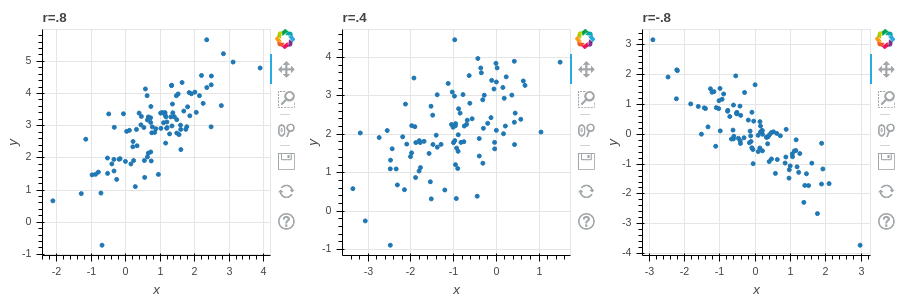{#fig-corrfig width=50%}

### The covariance matrix {#sec-covarmat}

In a typical situation we have many features for each of our (many)
samples, that we organize into a data matrix $X$.  To recall, each
column of $X$ corresponds to a feature that we measure, and each row
corresponds to a sample.  For example, each row of our matrix might
correspond to a person enrolled in a study, and the columns correspond
to height (cm), weight (kg), systolic blood pressure, and age (in
years):

|sample | Ht | Wgt |Bp | Age|
|----|-------:|-------:|--:|---:|
| A   |  180   |  75    |110| 35 |
| B   |  193   |  80    |130| 40 |
| ... | ...    | ...    |...|... |
| U   | 150    |  92    |105| 55 |

: A sample data matrix $X$

If we have multiple features, as in this example, we might be interested in the variance of each
feature and all of their mutual covariances.  This "package" of information can be obtained "all at once"
by taking advantage of some matrix algebra.

**Definition:** Let $X$ be a $N\times k$ data matrix, where the $k$ columns of $X$ correspond to different features and
the $N$ rows to different samples.  Let $X_{0}$ be the centered version of this data matrix, obtained by subtracting
the mean $\mu_{i}$ of column  $i$ from all the entries $x_{si}$ in that column.  Then the $k\times k$ symmetric matrix

$$
D_{0} = \frac{1}{N}X_{0}^{\intercal}X_{0}
$$

is called the (sample) covariance matrix for the data.

**Proposition:** The diagonal entries  $d_{ii}$ of $D_{0}$ are the variances
of the columns of $X$:

$$
d_{ii} = \sigma_{i}^2 = \frac{1}{N}\sum_{s=1}^{N}(x_{si}-\mu_i)^2
$$

and the off-diagonal entries $d_{ij} = d_{ji}$ are the covariances of the $i^{th}$ and $j^{th}$ columns of $X$:

$$
d_{ij} = \sigma_{ij} = \frac{1}{N}\sum_{s=1}^{N}(x_{si}-\mu_{i})(x_{sj}-\mu_{j})
$$

The sum of the diagonal entries, the trace of $D_{0}$ is the **total** variance of the data.

**Proof:** This follows from the definitions, but it's worth checking the details, which we leave as an exercise.

### Visualizing the covariance matrix {#sec-visualizecovar}

If the number of features in the data is not too large, a density matrix plot provides a tool
for visualizing the covariance matrix of the data.  A density matrix plot is an $k\times k$ grid
of plots (where $k$ is the number of features).  The  entry with $(i,j)$ coordinates in the grid is a scatter plot of the $i^{th}$
feature against the $j^{th}$ one if $i\not=j$, and is a histogram of the $i^{th}$ variable if $i=j$.

*@fig-density0 is an example of a density matrix plot for a dataset with $50$ samples and $2$ features.
This data has been centered, so it can be represented
in a $50\times 2$ data matrix $X_{0}$.  The upper left and lower right graphs are scatter plots
of the two columns, while the lower left and upper right are the histograms of the columns.

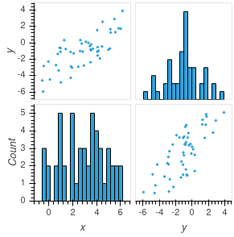{#fig-density0 width=50%}

### Linear Combinations of Features (Scores)

Sometimes useful information about our data can be revealed if we combine different measurements
together to obtain a "hybrid" measure that captures something interesting.  For example, in the Auto MPG
dataset that we studied in the section on Linear Regression, we looked at the influence of both vehicle
weight $w$ and engine displacement $e$ on gas mileage; perhaps their is some value in considering a hybrid
"score" defined as
$$
S = aw + be
$$
for some constants $a$ and $b$ -- maybe by choosing a good combination we could find a better predictor
of gas mileage than using one or the other of the features individually.

As another example, suppose we are interested in the impact of the nutritional content of food on
weight gain in a study.  We know that both calorie content and the level
dietary fiber contribute to the weight gain of participants eating this particular food; maybe there is some
kind of combined "calorie/fiber" score we could introduce that captures the impact of that food better.

Finally, when we assign grades in a course, we typically compute a weighted combination of the scores of each student on a series
of assignments.  Such a combination is another example of a "score" and may help explain the origin of the term.

**Definition:** Let $X_{0}$ be a (centered) $N\times k$ data matrix  giving information about $k$ features for
each of $N$ samples.  A linear synthetic feature, or a linear score, is a linear combination of the $k$ features.
The linear score is defined by constants $a_{1},\ldots, a_{k}$ so that
If $y_{1},\ldots, y_{k}$ are the values of the features for a particular sample, then the linear score
for that sample is

$$
S = a_{1}y_{1}+a_{2}y_{2}+\cdots+a_{k}y_{k}
$$

**Lemma:**
The values of the linear score for each of the $N$ samples can be calculated as

$$
\left[\begin{matrix} S_{1} \\ \vdots \\ S_{N}\\ \end{matrix}\right] =
X_{0}\left[
\begin{matrix} a_{1} \\ \vdots \\ a_{k}\end{matrix}\right].
$${#eq-linearscore}

**Proof:** Multiplying a matrix by a column vector computes a linear combination of the columns --
that's what this lemma says. Exercise 3 asks you to write out the indices and make sure you believe this.

### Mean and variance of scores

When we combine features to make a hybrid score, we assume that the features were centered to begin with,
so that each features has mean zero.  As a result, the mean of the hybrid features is again zero.

**Lemma:** A linear combination of features with mean zero again has mean zero.

**Proof:** Let $S_{i}$ be the score for the $i^{th}$ sample, so
$$
S_{i} = \sum_{j=1}^{k} x_{ij}a_{j}.
$$
where $X_{0}$ has entries $x_{ij}$.  Then the mean value of the score is
$$
\mu_{S} = \frac{1}{k}\sum_{i=1}^{N} S_{i} = \frac{1}{N}\sum_{i=1}^{N}\sum_{j=1}^{k} x_{ij}a_{j}.
$$
Reversing the order of the sum yields
$$
\mu_{S} = \frac{1}{N}\sum_{j=1}^{k}\sum_{i=1}^{N} x_{ij}a_{j} = \sum_{j=1}^{k} a_{j}\frac{1}{N}(\sum_{i=1}^{N} x_{ij})=
\sum_{j=1}^{k}a_{j}\mu_{j}=0
$$
where $\mu_{j}=0$ is the mean of the $j^{th}$ feature (column) of $X_{0}$.

The variance is more interesting, and gives us an opportunity to put the covariance matrix to work.
Remember from @eq-variancedot that, since a score $S$ has mean zero, it's variance is
$\sigma_{S}^2=\frac{1}{N}S\cdot S$ -- where here the score $S$ is represented by the column vector with entries
$S_{1},\ldots S_{k}$ as in @eq-linearscore.

**Lemma:** The variance of the score $S$ with weights $a_1,\ldots a_k$ is
$$
\sigma_{S}^2 = a^{\intercal}D_{0}a = \left[\begin{matrix}a_{1} & \cdots & a_{k}\end{matrix}\right]D_{0}
\left[\begin{matrix} a_{1} \\ \vdots \\ a_{k}\end{matrix}\right]
$${#eq-ada}
More generally, if $S_{1}$ and $S_{2}$ are scores with weights $a_1,\ldots, a_k$ and
$b_1,\ldots, b_k$ respectively, then the covariance $\sigma_{S_{1}S_{2}}$
is
$$
\sigma_{S_{1}S_{2}} = a^{\intercal}D_{0}b.
$$

**Proof:** From @eq-variancedot and @eq-linearscore we know that
$$
\sigma_{S}^2 = \frac{1}{N}S\cdot S
$$
and
$$
S = X_{0}a.
$$
Since $\frac{1}{N}S\cdot S = \frac{1}{N}S^{\intercal}S$, this gives us
$$
\frac{1}{N}\sigma_{S}^2 = \frac{1}{N}(X_{0}a)^{\intercal}(X_{0}a) = \frac{1}{N}a^{\intercal}X_{0}^{\intercal}X_{0}a = a^{\intercal}D_{0}a
$$
as claimed.

For the covariance, use a similar argument with @eq-covariancedot and @eq-linearscore.
writing $\sigma_{S_{1}S_{2}}=\frac{1}{N}S_{1}\cdot S_{2}$ and
the fact that $S_{1}$ and $S_{2}$ can be written as $X_{0}a$ and $X_{0}b$.

The point of this lemma is that the covariance matrix contains not just the variances and covariances
of the original features, but also enough information to construct the variances and covariances
for *any linear combination of features.*

In the next section we will see how to exploit this
idea to reveal hidden structure in our data.

### Geometry of Scores

Let's return to the dataset that we looked at in @sec-visualizecovar.  We simplify the density
matrix plot in @fig-pcasimfig, which shows one of the scatter plots
and the two histograms.

The scatter plot shows that the data points are arranged
in a more or less elliptical cloud oriented at an angle to the $xy$-axes which represent the two given
features.  The two individual histograms show the distribution of the two features -- each has mean zero,
with the $x$-features distributed between $-2$ and $2$ and the $y$ feature between $-4$ and $4$.
Looking just at the two features individually, meaning only at the two histograms, we can't see the
overall elliptical structure.

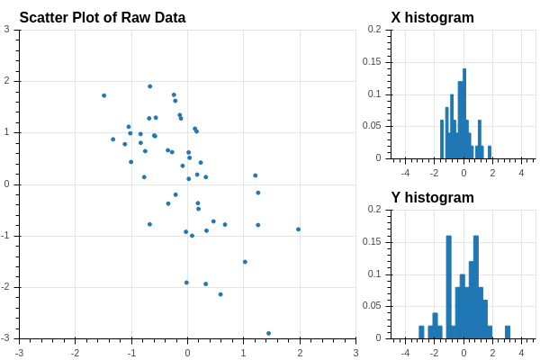{#fig-pcasimfig width=50%}

How can we get a better grip on our data in this situation? We can try to find a "direction"
in our data that better illuminates the variation of the data.   For example,
suppose that we pick a unit vector at the origin pointing in a particular direction
in our data.  See @fig-pcasimfig-1.

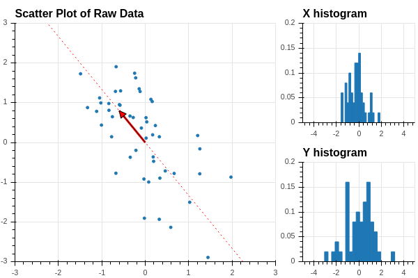{#fig-pcasimfig-1 width=50%}

Now we can orthogonally project the datapoints onto the line defined by this vector,
as shown in @fig-pcasimfig-2.

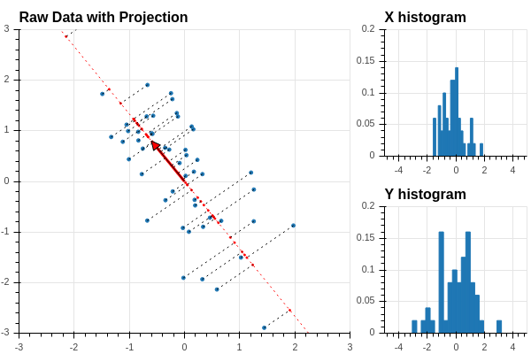{#fig-pcasimfig-2 width=50%}

Recall that if the unit vector is defined by coordinates $u=[u_0,u_1]$, then the
orthogonal projection of the point $x$ with coordinates $(x_0,x_1)$ is $(x\cdot u)u$.
Now
$$
x\cdot u = u_0 x_0 + u_1 x_1
$$
so the coordinates of the points along the line defined by $u$ are the values of the score $Z$
defined by $u=[u_0,u_1]$.  Using our work in the previous section, we see that we can
find all of these coordinates by matrix multiplication:
$$
Z = X_0 u
$$
where $X_0$ is our data matrix.  Now let's add a histogram of the values of $Z$
to our picture:

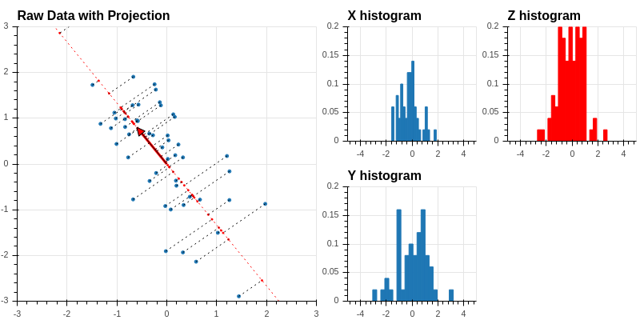{#fig-pcasimfig-3 width=50%}

This histogram shows the distribution of the values of $Z$ along the tilted line defined
by the unit vector $u$.

Finally, using our work on the covariance matrix, we see that the
variance of $Z$ is given by
$$
\sigma_{Z}^2 = \frac{1}{50}u^{\intercal}X_{0}^{\intercal}X_{0}u = u^{\intercal}D_{0}u
$$
where $D_{0}$ is the covariance matrix of the data $X_{0}$.

**Lemma:** Let $X_{0}$ be a $N\times k$ centered data matrix, and let $D_{0}=\frac{1}{N}X_{0}^{\intercal}X_{0}$
be the associated covariance matrix.  Let $u$ be a unit vector in "feature space" $\mathbf{R}^{k}$.  Then
the score $S=X_{0}u$ can be interpreted as the coordinates of the points of $X_{0}$ projected onto the line
generated by $u$. The variance of this score is
$$
\sigma^{2}_{S} = u^{\intercal}D_{0}u = \sum_{i=1}^{N} s_{i}^2
$$
where $s_{i} = X_{0}[i,:]u$ is the dot product of the $i^{th}$ row $X_{0}[i,:]$ with $u$. It measures
the variability in the data "in the direction of the unit vector $u$".

## Principal Components

### Change of variance with direction

As we've seen in the previous section, if we choose a unit vector $u$ in the feature space and
find the projection $X_{0}u$ of our data onto the line through $u$, we get a "score" that we can use
to measure the variance of the data in the direction of $u$.  What happens as we vary $u$?

To study this question, let's continue with our simulated data from the previous section,
and introduce a unit vector
$$
u(\theta) = \left[\begin{matrix} \cos(\theta) & \sin(\theta)\end{matrix}\right].
$$
This is in fact a unit vector, since $\sin^2(\theta)+\cos^2(\theta)=1$, and it is oriented
at an angle $\theta$ from the $x$-axis.

The variance of the data in the direction of $u(\theta)$ is given by
$$
\sigma_{\theta}^2 = u(\theta)^{\intercal}D_{0}u(\theta).
$$

A plot of this function for the data we have been considering is in @fig-pcatheta.
As you can see, the variance goes through two full periods with the angle, and it reaches a maximum and
minimum value at intervals of $\pi/2$ -- so the two angles where the variance are maximum and minimum
are orthogonal to one another.

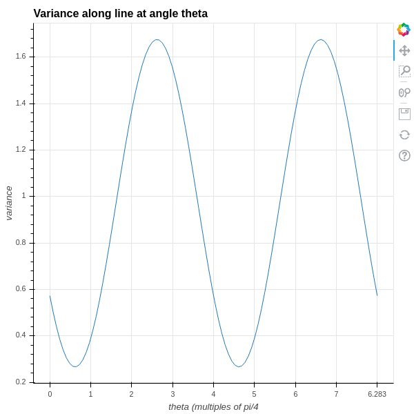{#fig-pcatheta width=25%}

The two directions where the variance is maximum and minimum are drawn on the original
data scatter plot in @fig-pcaprincipal .

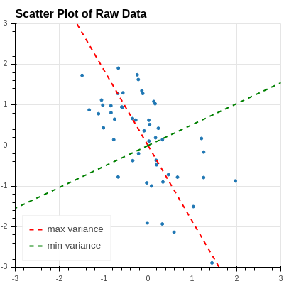{#fig-pcaprincipal width=25%}

Let's try to understand why this is happening.

### Directions of extremal variance {#sec-extremalvariance}

Given our centered, $N\times i$ data matrix $X_{0}$, with its associated covariance matrix
$D_{0}=\frac{1}{N}X_{0}^{\intercal}X_{0}$, we would like to find unit vectors $u$ in $\mathbf{R}^{k}$
so that
$$
\sigma_{u}^{2} = u^{\intercal}D_{0}u
$$
reaches its maximum and its minimum.  Here $\sigma_{u}^2$ is the variance of the "linear score"
$X_{0}u$ and it represents how dispersed the data is in the "u direction" in $\mathbf{R}^{k}$.

In this problem, remember that the coordinates of $u=(u_1,\ldots, u_{k})$ are the variables
and the symmetric matrix $D_{0}$ is given.  As usual, we to find the maximum and minimum
values of $\sigma_{u}^{2}$, we should look at the partial derivatives of $\sigma_{u}^{2}$ with
respect to the variables $u_{i}$ and set them to zero.  Here, however, there is a catch -- we
want to restrict $u$ to being a unit vector, with $u\cdot u =\sum u_{i}^2=1$.

So this is a *constrained optimization problem*:

- Find extreme values of the function
$$
\sigma_{u}^{2} = u^{\intercal}D_{0}u
$$
- Subject to the constraint $\|u\|^2 = u\cdot u=1$ (or $u\cdot u-1=0$)

We will use the technique of *Lagrange Multipliers* to solve
such a problem.  

To apply this method, we introduce the function

$$
S(u, \lambda) = u^{\intercal}D_{0}u - \lambda(u\cdot u -1)
$${#eq-lagrange}

Then we compute the gradient

$$
\nabla S = \left[\begin{matrix} \frac{\partial S}{\partial u_{1}} \\ \vdots \\ \frac{\partial S}{\partial u_{k}} \\ \frac{\partial S}{\partial \lambda}\end{matrix}\right]
$${#eq-lagrangegradient}

and solve the system of equations $\nabla S=0$.  Here we have written the gradient as a column vector for reasons that will become
clearer shortly.

Computing all of these partial derivatives looks messy, but actually if we take advantage of matrix algebra it's not too bad.
The following two lemmas explain how to do this.

**Lemma**: Let $M$ be a $N\times k$ matrix with constant coefficients and let $u$ be a $k\times 1$ column vector whose entries are $u_1,\ldots u_{k}$.
The function $F(u) = Mu$ is a linear map from $\mathbf{R}^{k}\to\mathbf{R}^{N}$.  Its (total) derivative is a linear map between the
same vector spaces, and satisfies
$$
D(F)(v) = Mv
$$
for any $k\times 1$ vector $v$.   If $u$ is a $1\times N$ matrix, and $G(u) = uM$, then
$$
D(G)(v) = vM
$$

for any $1\times N$ vector $v$. (This is the matrix version of the derivative rule that $\frac{d}{dx}(ax)=a$ for a constant $a$.)  

**Proof:**  Since $F:\mathbf{R}^{k}\to\mathbf{R}^{N}$, we can write out $F$ in more traditional function notation
as
$$
F(u) = (F_{1}(u_1,\ldots, u_k), \ldots, F_{N}(u_1,\ldots, u_{k})
$$
where
$$
F_{i}(u_1,\ldots u_k) = \sum_{j=1}^{k} m_{ij}u_{j}.
$$
Thus $\frac{\partial F_{i}}{\partial u_{j}} = m_{ij}$.  The total derivative $D(F)$ is the linear map with matrix
$$
D(F)_{ij} = \frac{\partial F_{i}}{\partial u_{j}} = m_{ij}
$$
and so $D(F)=M$.

The other result is proved the same way.

**Lemma**:  Let $D$ be a symmetric $k\times k$ matrix with constant entries and let $u$ be an $k\times 1$ column vector of variables
$u_{1},\ldots, u_{k}$.  Let $F:\mathbf{R}^{k}\to R$ be the function $F(u) = u^{\intercal}Du$.  Then the  gradient $\nabla_{u} F$ is a
vector field -- that is, a vector-valued function of $u$, and is given by the formula
$$
\nabla_{u} F = 2Du
$$

**Proof:** Let $d_{ij}$ be the $i,j$ entry of $D$.  We can write out the function $F$ to obtain
$$
F(u_1,\ldots, u_{k}) = \sum_{i=1}^{k} \sum_{j=1}^{k} u_i d_{ij} u_j.
$$
Now $\frac{\partial F}{\partial u_{i}}$ is going to pick out only terms where $u_{i}$ appears, yielding:
$$
\frac{\partial F}{\partial u_{i}} = \sum_{j=1}^{k} d_{ij}u_{j} + \sum_{j=1}^{k} u_{j}d_{ji}
$$
Here the first sum catches all of the terms where the first "u" is $u_{i}$; and the second sum catches all
the terms where the second "u" is $u_{i}$.  The diagonal terms $u_{i}^2d_{ii}$ contribute once to each sum,
which is consistent with the rule that the derivative of $u_{i}^2d_{ii} = 2u_{i}d_{ii}$.
To finish the proof, notice that
$$
\sum_{j=1}^{k} u_{j}d_{ji} = \sum_{j=1}^{k} d_{ij}u_{j}
$$
since $D$ is symmetric, so in fact the two terms are the same
Thus
$$
\df{u_{i}}F = 2\sum_{j=1}^{k} d_{ij}u_{j}
$$
But the right hand side of this equation is twice the $i^{th}$ entry of $Du$, so
putting the results together we get
$$
\nabla_{u}F = \left[\begin{matrix} \frac{\partial F}{\partial u_{1}} \\ \vdots \\ \frac{\partial F}{\partial u_{k}}\end{matrix}\right] = 2Du.
$$

The following theorem puts all of this work together to reduce our questions about how variance changes with direction.

### Critical values of the variance {#sec-critvals}

**Theorem:** The critical values of the variance $\sigma_{u}^2$, as $u$ varies over unit vectors in $\mathbf{R}^{N}$, are the eigenvalues
$\lambda_{1},\ldots,\lambda_{k}$ of the covariance matrix $D$, and if $e_{i}$ is a unit eigenvector corresponding to $\lambda_{i}$,
then $\sigma_{e_{i}}^2 = \lambda_{i}$.  

**Proof:**
Recall that we introduced the Lagrange function $S(u,\lambda)$, whose critical points give us the solutions to our constrained optimization problem.
As we said in @eq-lagrange:
$$
S(u,\lambda) = u^{\intercal}D_{0}u - \lambda(u\cdot u - 1) = u^{\intercal}D_{0}u -\lambda(u\cdot u) + \lambda
$$
Now apply our Matrix calculus lemmas.  First, let's treat $\lambda$ as a constant and focus on the $u$ variables.  We can write
$u\cdot u = u^{\intercal} I_{N} u$ where $I_{N}$ is the identity matrix to compute:
$$
\nabla_{u} S = 2D_{0}u -2\lambda u
$$
For $\lambda$ we have
$$
\df{\lambda}S = -u\cdot u +1.
$$
The critical points occur when
$$
\nabla_{u} S = 2(D_{0}-\lambda)u = 0
$$
and
$$
\df{\lambda}S = 1-u\cdot u = 0
$$
The first equation says that $\lambda$ must be an eigenvalue, and $u$ an eigenvector:
$$
D_{0}u = \lambda u
$$
while the second says $u$ must be a unit vector $u\cdot u=\|u\|^2=1$.    The second part of the result follows from the fact that
if $e_{i}$ is a unit eigenvector with eigenvalue $\lambda_{i}$ then
$$
\sigma_{e_{i}}^2 = e_{i}^{\intercal}D_{0}e_{i} = \lambda_{i}\|e_{i}\|^2=\lambda_{i}.
$$

To really make this result pay off, we need to recall some key facts about the eigenvalues and
eigenvectors of symmetric matrices.  Because these facts are so central to this result, and
to other applications throughout machine learning and mathematics generally, we provide
proofs in @sec-spectraltheorem.

\newpage

-----------------------------------------------------------------------
Summary                                                                
-----------------------------------------------------------------------
1. All of the eigenvalues $\lambda_{1},\ldots, \lambda_{l}$ of  $D$ are real.
If $u^{\intercal}Du\ge 0$ for all $u\in\mathbf{R}^{k}$, then all eigenvalues $\lambda_{i}$ are non-negative.  In the latter case we say that $D$ is *positive semi-definite.*

2. If $v$ is an eigenvector for $D$ with eigenvalue $\lambda$, and $w$ is an eigenvector with a different eigenvalue  $\lambda'$, then $v$ and $w$ are orthogonal: $v\cdot w = 0$.

3. There is an orthonormal basis $u_{1},\ldots, u_{k}$  of $\mathbf{R}^{k}$ made up of eigenvectors of 
$D$ corresponding to the eigenvalues $\lambda_{i}$.

4. Let $\Lambda$ be the diagonal matrix with entries $\lambda_{1},\ldots, \lambda_{N}$ and let $P$ 
be the matrix whose columns are made up of the vectors $u_{i}$.  Then $D = P\Lambda P^{\intercal}.$
------------------------------------------------------------------------

: Properties of Eigenvalues of Real Symmetric Matrices {#tbl-symmmat}

If we combine our theorem on the critical values with the spectral theorem we get a complete picture.  Let $D_{0}$ be the covariance matrix of our data.
Since
$$
\sigma_{u}^2 = u^{\intercal}D_{0}u\ge 0 \hbox{(it's a sum of squares)}
$$
we know that the eigenvalues $\lambda_{1}\ge\lambda_{2}\ge \cdots \ge \lambda_{k}\ge 0$ are all nonnegative.  Choose a corresponding sequence
$u_{1},\ldots u_{k}$ of orthogonal eigenvectors where all $\|u_{i}\|^2=1$. Since the $u_{i}$ form a basis of $\mathbf{R}^{N}$, any score is a
linear combination of the $u_{i}$:
$$
S = \sum_{i=1}^{k} a_{i}u_{i}.
$$
Since $u_{i}^{\intercal}D_{0}u_{j} = \lambda_{j}u_{i}^{\intercal}u_{j} = 0$ unless $i=j$, in which case it is $\lambda_{i}$, we can compute
$$
\sigma_{S}^2 = \sum_{i=1}^{k} \lambda_{i}a_{i}^2,
$$
and $\|S\|^2=\sum_{i=1}^{k} a_{i}^2$ since the $u_{i}$ are an orthonormal set. So in these coordinates, our optimization problem is:

- maximize $\sum \lambda_{i}a_{i}^2$
- subject to the constraint $\sum a_{i}^2 = 1$.

We don't need any fancy math to see that the maximum happens when $a_{1}=1$ and the other $a_{j}=0$, and in that case, the maximum is $\lambda_{1}$. (If $\lambda_{1}$
occurs more than once, there may be a whole subspace of directions where the variance is maximal).  Similarly, the minimum value is $\lambda_{k}$ and occurs when $a_{k}=1$ and the others are zero.  

### Subspaces of extremal variance {#sec-subspaces}

We can generalize the idea of the variance of our data in a particular direction to a higher dimensional version of *total variance* in a subspace.
Suppose that  $E$ is a subspace of $\mathbf{R}^{k}$ and $U$ is a matrix whose columns span $E$ -- the columns of $U$ are
the weights of a family of scores that span $E$.  The values of these scores are $XU$ and the covariance matrix of this projected data
is
$$\frac{1}{N}U^{\intercal}X^{\intercal}XU=U^{\intercal}D_{0}U.$$.

Finally, the *total variance* $\sigma_{E}^2$ of the data projected into $E$ is the sum of the diagonal entries of the matrix

$$
\sigma^2_{E} = \mathop{trace}(U^{\intercal}D_{0}U)
$$

Just as the variance in a given direction $u$ depends on the scaling of $u$, the variance in a subspace depends on the scaling of the columns
of $U$.  To normalize this scaling, we assume that the columns of $U$ are an orthonormal basis of the subspace $E$.  

Now we can generalize the question asked in @sec-extremalvariance by seeking, not just a vector $u$ pointing in the direction
of the extremal variance, but instead the *subspace* $U_{s}$ of dimension $s$ with the property that the total variance of
the projection of the data into $U_{s}$ is maximal compared to its projection into other subspaces of that dimension.
This is called a *subspace of extremal variance.*

To make this concrete, suppose we consider a subspace $E$ of $\mathbf{R}^{k}$ of dimension $t$ with basis $w_{1},\ldots, w_{t}$.
Complete this to a basis $w_{1},\ldots, w_{t},w_{t+1},\ldots, w_{k}$ of $\mathbf{R}^{k}$ and then apply the Gram Schmidt Process
(see @sec-gsprocess) to find an orthonormal basis $w'_{1},\ldots,w'_{s},w'_{s+1},\ldots, w'_{k}$ where the $w'_{1},\ldots, w'_{t}$
are an orthonormal basis for $E$.  Let $W$ be the $k\times t$ matrix whose columns are the $w'_{i}$ for $i=1,\ldots,t$.  The
rows of the matrix $X_{0}W$ given the coordinates of the projection of each sample into the subspace $E$ expressed in terms
of the scores corresponding to these vectors $w'_{i}$.  The total variance of these projections is

$$
\sigma_{E}^2 = \sum_{i=1}^{t} \|X_{0}w'_{i}\|^2 = \sum_{i=1}^{t} (w'_{i})^{\intercal}X_{0}^{\intercal}X_{0}w'_{i}  = \sum_{i=1}^{t} (w'_{i})^{\intercal}D_{0}w'_{i}
$$

If we want to maximize this, we have the constrained optimization problem of finding $w'_{1},\ldots, w'_{t}$ so that

- $\sum_{i=1}^{t} (w'_{i})^{\intercal}D_{0}w'_{i}$ is maximal
- subject to the constraint that each $w_{i}$ has $\|w'_{i}\|^2=1$,
- and that the $w'_{i}$ are orthogonal, meaning $w'_{i}\cdot w'_{j}=0$ for $i\not=j$,
- and that the $w'_{i}$ are linearly independent.

Then the span $E$ of these $w'_{i}$ is subspace of extremal variance.

**Theorem:** A $t$-dimensional subspace $E$ is a subspace of extremal variance if and only if it is spanned by $t$ orthonormal eigenvectors of the matrix $D_{0}$ corresponding
to the $t$ largest eigenvalues for $D_{0}$.

**Proof:** We can approach this problem using Lagrange multipliers and matrix calculus if we are careful.  Our unknown is  $k\times t$ matrix $W$ whose columns
are the  $t$ (unknown) vectors $w'_{i}$.  The objective function that we are seeking to maximize is
$$
F = \mathop{trace}(W^{\intercal}D_{0}W) = \sum_{i=1}^{t} (w'_{i})^{\intercal}D_{0}w_{i}.
$$
The constraints are the requirements that $\|w'_{i}\|^2=1$ and $w'_{i}\cdot w'_{j}=0$ if $i\not=j$.  If we introduction a matrix of lagrange multipliers
$\Lambda=(\lambda_{ij})$, where $\lambda_{ij}$ is the multiplier that goes with the the first of these constraints when $i=j$, and the second when $i\not=j$,
we can express our Lagrange function as:
$$
S(W,\Lambda) = \mathop{trace}(W^{\intercal}D_{0}W) - (W^{\intercal}W-I)\Lambda
$$
where $I$ is the $t\times t$ identity matrix.

Taking the derivatives with respect to the entries of $W$ and of $\Lambda$ yields the following two equations:
\begin{align*}
D_{0}W &= W\Lambda \\
W^{\intercal}W &= I \\
\end{align*}

The first of these equations says that the space $E$ spanned by the columns of $W$ is *invariant* under $D_{0}$, while the second says that the
columns of $W$ form an orthonormal basis.  

Let's assume for the moment that we have a matrix $W$ that satisfies these conditions.  
Then it must be the case that $\Lambda$ is a symmetric, real valued $t\times t$ matrix, since
$$
W^{\intercal}D_{0}W = W^{\intercal}W\Lambda = \Lambda.
$$
and the matrix on the left is symmetric.

By the properties of real symmetric matrices (the spectral theorem), there are orthonormal
vectors $q_{1},\ldots q_{t}$ that are eigenvectors of $\Lambda$ with corresponding eigenvalues $\tau_{i}$.
If we let $Q$ be the matrix whose columns are the vectors $q_{i}$ and let $T$ be the diagonal $t\times t$ matrix whose entries are the $\tau_{i}$, we have
$$
\Lambda Q = QT.
$$

If we go back to our original equations, we see that if $W$ exists such that $DW=W\Lambda$,
then there is a matrix $Q$ with orthonormal columns and a diagonal matrix $T$ such that
$$
D_{0}WQ = W\Lambda Q = W Q T.
$$
In other words,
$WQ$ is a matrix whose columns are eigenvectors of $D_{0}$ with eigenvalues $\tau_{i}$ for $i=1,\ldots, t$.

Thus we see how to construct an invariant subspace $E$ and a solution matrix $W$.
Such an  $E$ is spanned by $t$ orthonormal eigenvectors $q_{i}$
with eigenvalues $\tau_{i}$
of $D_{0}$; and $W$ is is the matrix  whose columns are the $q_{i}$. Further, in that case,
the total variance associated to $E$ is the sum of the eigenvalues $\tau_{i}$; to make this as large as possible, we should choose our eigenvectors
to correspond to $t$ of the largest eigenvalues of $D_{0}$. This concludes the proof.

### Definition of Principal Components

**Definition:** The orthonormal unit eigenvectors $u_{i}$ for $D_{0}$ are the *principal directions* or *principal components* for the data $X_{0}$.  

**Theorem:** The maximum
variance occurs in the principal direction(s) associated to the largest eigenvalue, and the minimum variance in the principal direction(s) associated with the smallest one. The covariance between scores in  principal directions associatedwith different eigenvalues is zero.

At this point, the picture in @fig-pcaprincipal makes sense -- the red and green dashed lines are the principal directions,
they are orthogonal to one another, and the point in the directions where the data is most (and least) "spread out."

**Proof:** The statement about the largest and smallest eigenvalues is proved at the very end of the last section.
The covariance of two scores corresponding to different eigenvectors $u_{i}$ and $u_{j}$ is
$$u_{i}^{\intercal}D_{0}u_{j} = \lambda_{j}(u_{i}\cdot u_{j}) = 0$$ since the $u_{i}$ and $u_{j}$ are
orthogonal.

Sometimes the results above are presented in a slightly different form, and may be referred to, in part, as Rayleigh's theorem.

**Corollary:** (Rayleigh's Theorem)  Let $D$ be a real symmetric matrix and let
$$
H(v) = \max_{v\not = 0}\frac{v^{\intercal}Dv}{v^{\intercal}v}.
$$
Then $H(v)$ is the largest eigenvalue of $D$. (Similarly, if we replace $\max$ by $\min$, then the minimum
is the least eigenvalue).

**Proof:** The maximum of the function $H(v)$ is the solution to the same optimization problem that we considered above.

**Exercises.**

1. Prove that the two expressions for $\sigma_{X}^2$ given in @eq-variance are the same.

2. Prove that the covariance matrix is as described in the proposition in  @sec-covarmat.

3. Let $X_{0}$  be a $k\times N$ matrix with entries $x_{ij}$ for $1\le i\le k$ and $1\le j\le N$.
If a linear score is defined by the constants $a_{1},\ldots a_{N}$, check that equation
@eq-linearscore holds as claimed.

4. Why is it important to use a unit vector when computing the variance of $X_{0}$ in the direction
of $u$?  Suppose $v=\lambda u$ where $u$ is a unit vector and $\lambda>0$ is a constant.  Let
$S'$ be the score $X_{0}v$.  How is the variance of $S'$ related to that of $S=X_{0}u$?

## Dimensionality Reduction via Principal Components

The principal components associated with a dataset separate out directions in the feature space
in which the data is most (or least) variable.  One of the main applications of this information
is to enable us to take data with a great many features -- a set of points in a high dimensional
space -- and, by focusing  our attention on the scores corresponding to the principal directions,
capture most of the information in the data in a much lower dimensional setting.

To illustrate how this is done, let $X$ be a $N\times k$ data matrix, let $X_{0}$ be its centered
version, and let $D_{0} = \frac{1}{N}X_{0}^{\intercal}X$ be the associated covariance matrix.

Apply the spectral theorem  (proved in @sec-spectraltheorem)
to the covariance matrix to obtain eigenvalues $\lambda_{1}\ge \lambda_{2}\ge\cdots \lambda_{k}\ge 0$
and associated eigenvectors $u_{1},\ldots, u_{k}$.  The scores $S_{i}=X_{0}u_{i}$
give the values of the data in the principal  directions.  The variance of $S_{i}$ is $\lambda_{i}$.

Now choose a number $t<k$ and consider the vectors $S_{1},\ldots, S_{t}$.  The $j^{th}$ entry in $S_{i}$ is
the value of the score $S_{i}$ for the $j^{th}$ data point.  Because $S_{1},\ldots, S_{t}$ capture
the most significant variability in the original data, we can learn a lot about our data by
considering just these $t$ features of the data, instead of needing all $N$.  

To illustrate, let's look at an example.  We begin with a synthetic dataset $X_{0}$ which has
$200$ samples and $15$ features.  The data (some of it) for some of the samples is shown in
@tbl-rawdata.

          f-0      f-1       f-2      f-3      f-4      \... f-10     f-11     f-12     f-13     f-14
  ------- -------- --------- -------- -------- -------- ---- -------- -------- -------- -------- --------
  s-0         1.18     -0.41     2.02     0.44     2.24  \...    0.32     0.95     0.88     1.10     0.89
  s-1         0.74      0.58     1.54     0.23     2.05  \...    0.99     1.14     1.56     0.99     0.59
  \...    \...     \...      \...     \...     \...      \...\...     \...     \...     \...     \...
  s-198       1.04      2.02     1.44   0.40       1.33  \...    0.62     0.62     0.54     1.96     0.04
  s-199       0.92      2.09     1.58   1.19       1.17  \...    0.42     0.85     0.83     2.22     0.90

: Simulated Data for PCA Analysis {#tbl-rawdata}

The full dataset is a  $200\times 15$ matrix;
it has $3000$ numbers in it and we're not really equipped to make sense of it.  We could try
some graphing -- for example, @fig-features shows a scatter plot of two of the features plotted against each other.

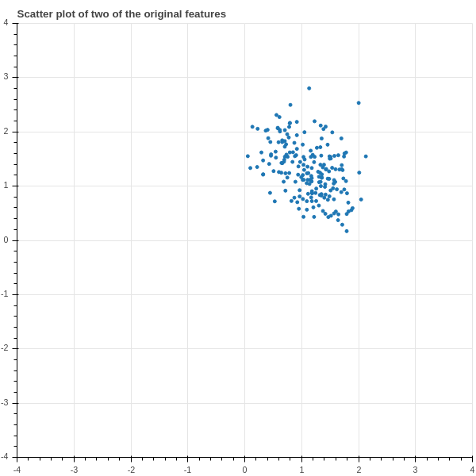{#fig-features width=50%}

Unfortunately there's not much to see in  @fig-features -- just a blob -- because the individual features of the data
don't tell us much in isolation, whatever structure there is in this data arises out of the relationship
between different features.

In @fig-densitygrid we show a "density grid" plot of the data.  The graph in position $i,j$
shows a scatter plot of the $i^{th}$ and $j^{th}$ columns of the data, except in the diagonal
positions, where in position $i,i$ we plot a histogram of column $i$.  There's not much structure
visible; it is a lot of blobs.

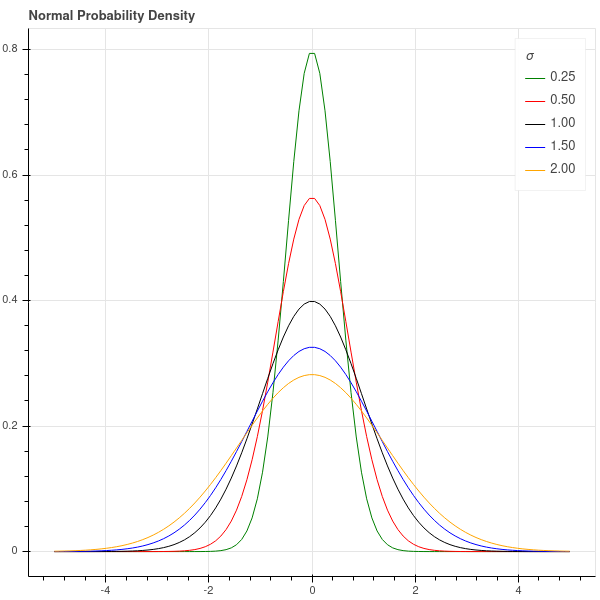{#fig-densitygrid width=50%}

So let's apply the theory of principal components.  We use a software package to compute the eigenvalues
and eigenvectors of the matrix $D_{0}$.  The $15$  eigenvalues $\lambda_{1}\ge \cdots \ge \lambda_{15}$
are plotted, in descending order, in @fig-eigenvalues .

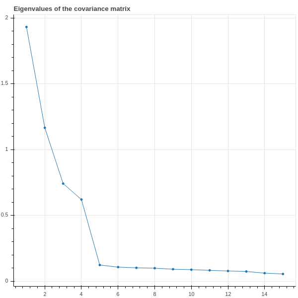{#fig-eigenvalues width=50%}

This plot shows that the first $4$ eigenvalues are relatively large, while the remaining $11$
are smaller and not much different from each other.  We interpret this as saying that *most of the
variation in the data is accounted for by the first four principal components.*  We can even
make this quantitative.  The *total variance* of the data is the sum of the eigenvalues of the covariance
matrix -- the trace of $D_{0}$ -- and in this example that sum is around $5$.  The sum of the first
$4$ eigenvalues is about $4$, so the first four eignvalues account for about $4/5$ of the total variance,
or about $80\%$ of the variation of the data.

Now let's focus in on the two largest eigenvalues $\lambda_{1}$ and $\lambda_{2}$
and their corresponding eigenvectors $u_{1}$ and $u_{2}$.  The $200\times 1$ column vectors
$S_{1}=X_{0}u_{1}$ and $S_{2}=X_{0}u_{2}$ are the values of the scores associated with these
two eigenvectors.  So for each data point (each row of $X_{0}$) we have two values (the corresponding
entries of $S_{1}$ and $S_{2}$.)  In @fig-principalvalues we show a scatter plot of these scores.

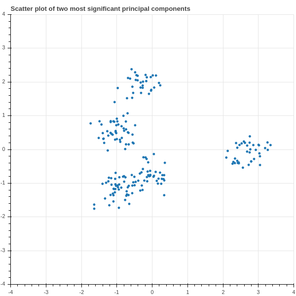{#fig-principalvalues width=50%}

Notice that suddenly some structure emerges in our data!  We can see that the 200 points are separated into
five clusters, distinguished by the values of their scores!  This ability to find hidden structure in complicated
data, is one of the most important applications of principal components.

If we were dealing with real data, we would now want to investigate the different groups of points to see
if we can understand what characteristics the principal components have identified.

### Loadings

There's one last piece of the PCA puzzle that we are going to investigate.  In @fig-principalvalues, we plotted
our data points in the coordinates given by the first two principal components.  In geometric terms,
we took the cloud of $200$ points in $\mathbf{R}^{15}$ given by the rows of $X_{0}$ and projected those
points into the two dimensional plane spanned by the eigenvectors $u_{1}$ and $u_{2}$, and then plotted the
distribution of the points in that plane.  

More generally, suppose we take our dataset $X_{0}$ and consider the first $t$ principal components corresponding
to the eigenvectors $u_{1},\ldots, u_{t}$.  The projection of the data into the space spanned by these eigenvectors
is the represented by the $S = k\times t$ matrix $X_{0}U$ where $U$ is the $k\times t$ matrix whose columns are the eigenvectors $u_{i}$.
Each row of $S$ gives the values of the score arising from $u_{i}$ in the $i^{th}$ column for $i=1,\ldots, t$.

The remaining question that we wish to consider is: how can we see some evidence of the original features in subspace?
We can answer this by imagining that we had an artificial sample $x$ that has a measurement of $1$ for the $i^{th}$
feature and a measurement of zero for all the other features.  The corresponding point is represented by a $1\times k$
row vector with a $1$ in position $i$.  The projection of this synthetic sample into the span of the first
$t$ principal components is the $1\times t$ vector $xU$.  Notice, however, that $xU$ is just the $i^{th}$ row
of the matrix $U$.   This vector in the space spanned by the $u_{i}$ is called the "loading" of the $i^{th}$ feature
in the principal components.

This is illustrated in @fig-loadings, which shows a line along the direction of the  loading corresponding to the each feature
added to the scatter plot of the data in the plane spanned by the first two principal components.  One observation one can make
is that some of the features are more "left to right", like features $7$ and $8$, while others are more "top to bottom", like $6$.
So points that lie on the left side of the plot have smaller values of features $7$ and $8$, while those at the top of the
plot have larger values of feature $6$.

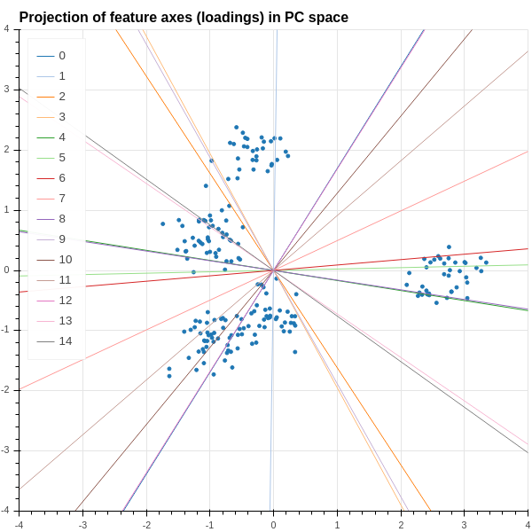{#fig-loadings width=50%}

### The singular value decomposition {#sec-svd}

The singular value decomposition is a slightly more detailed way of looking at principal components.  Let
$\Lambda$ be the diagonal matrix of eigenvalues of $D_{0}$ and let $P$ be the $k\times k$ orthogonal
matrix whose columns are the principal components.  Then we have
$$
D_{0} =\frac{1}{N}X_{0}^{\intercal}X_{0}= P\Lambda P^{\intercal}.
$$
Consider the $N\times k$ matrix
$$
X_{0}P = A.
$$

As we saw in the previous section, the columns of $A$ give the projection of the data into
the $k$ principal directions. 
Then

$$A^{\intercal}A=P^{\intercal}X_{0}^{\intercal}X_{0}P=N\Lambda.$$

In other words,
the columns of $A$ are orthogonal and the diagonal entries of $A^{\intercal}A$
are $N$ times the variance of the data in the various principal directions.

Now we are going to tinker with the matrix $A$ in order to make an $N\times N$ orthogonal matrix.
The first modification we make is to normalize the columns of $A$ so that they have length $1$.
We do this by setting
$$
A_{1} = A(N\Lambda)^{-1/2}.
$$
Then $A_{1}^{\intercal}A_{1}$ is the identity, so the columns of $A_{1}$ are orthonormal. Here we
are assuming that the eigenvalues of $D_{0}$ are nonzero -- this isn't strictly necessary, and we could
work around this, but for simplicity we will assume it's true.  It amounts to the assumption that the
independent variables are not linearly related, as we've seen before.

The second modification is to extend $A_{1}$ to an $N\times N$ matrix.
The $k$ columns of $A_1$ span only a $k$-dimensional subspace of the $N$-dimensional space where the feature
vectors lie.  
Complete the subspace by finding an orthogonal complement to it -- that is, find $N-k$ mutually orthogonal
unit vectors all orthogonal to the column space of $A_1$.  By adding these vectors to $A$ as columns,
create an extended $N\times N$ matrix $\tilde{A}_1$ which is orthogonal.

Notice that
$\tilde{A}_{1}^{\intercal}A$ is an $N\times k$ matrix whose upper $k\times k$ block is $(N\Lambda)^{1/2}$
and whose final $N-k$ rows are all zero.  We call this matrix $\tilde{\Lambda}$.

To maintain consistency with the traditional formulation, we let $U=\tilde{A}_{1}^{\intercal}$ and
then we have the following proposition. 

**Proposition:** We have a factorization
$$
X_{0} = U\tilde{\Lambda}P^{\intercal}
$$ {#eq-svd}
where $U$ and $P$ are orthogonal matrices of size $N\times N$ and $k\times k$ respectively, and $\tilde{\Lambda}$
is an $N\times k$ diagonal matrix. This is called the "singular value decomposition" of $X_{0}$,
and the entries of $\tilde{\Lambda}$ are called the singular values.  If we let $u_1,\ldots, u_k$
be the first $k$ rows of $U$, then the $k$ column vectors $u_{i}^{\intercal}$ are an orthonormal
basis for the feature space spanned by the columns of $X_{0}$, and they point in the "principal directions"
for the data matrix $X_{0}$. 

In this section we take a slight detour and apply what we've learned about the covariance matrix,
principal components, and the singular value decomposition to the original problem of linear regression that
we studied in Chapter 1.  

In this setting, in addition to our centered data matrix $X_{0}$, we have a vector $Y$ of target
values and we find the "best" approximation
$$
\hat{Y} = X_{0}M
$$
using the least squares method.  As we showed in Chapter 1, the optimum $M$ is found as
$$
M = (X_{0}^{\intercal}X_{0})^{-1}X^{\intercal}Y = ND_{0}^{-1}X_0^{\intercal}Y
$$
and the predicted values $\hat{Y}$ are
$$
\hat{Y} = NX_{0}D_{0}^{-1}X_0^{\intercal}Y.
$$

Geometrically, we understood this process as defining $\hat{Y}$ to be the orthogonal projection of $Y$ into the subspace spanned by the columns of $X_{0}$.

Let's use the decomposition (see @eq-svd ) $X_{0}=U\tilde{\Lambda}P^{\intercal}$ in this formula. First, notice that 
$$
X_{0}^{\intercal}X_{0}= P\tilde{\Lambda}^{\intercal}U^{\intercal}U\tilde{\Lambda}P^{\intercal} = P\tilde{\Lambda}^{\intercal}\tilde{\Lambda}P^{\intercal}.
$$

The middle term $\tilde{\Lambda}^{\intercal}\tilde{\Lambda}$ is the $k\times k$ matrix $\Lambda$ whose diagonal entries
are $N\lambda_{i}$ where $\lambda_{i}$ are the eigenvalues of the covariance matrix $D_{0}$. Assuming
these are all nonzero (which is tantamount to the assumption that the covariance matrix is invertible),
we obtain
$$
\hat{Y} = NU\tilde{\Lambda}P^{\intercal}P\Lambda^{-1}P^{\intercal}P\tilde{\Lambda}^{\intercal}U^{\intercal}Y.
$$
There is a lot of cancellation here, and in the end what's left is
$$
\hat{Y}=UEU^{\intercal}Y
$$
where $E$ is and $N\times N$ matrix whose upper $k\times k$ block is the identity and whose remaining
entries are zero.  Rearranging a bit more we have
$$
U^{\intercal}\hat{Y} = EU^{\intercal}Y.
$$

To unpack this equation, let $u_{1},\ldots, u_{N}$ be the rows of the matrix $U$.  Since $U$
is an orthogonal matrix, the column vectors $u_{i}^{\intercal}$ are an orthonormal basis for
the $N$ dimensional space where the columns of $X_{0}$ lie.  We can write the target vector $Y$
$$
Y = \sum_{j=1}^{N} (u_{j}\cdot Y)u_{j}^{\intercal}.
$$

Then the projection $\hat{Y}$ of $Y$ into the subspace spanned by the data is obtained by dropping the last $N-k$ terms in the sum:

$$
\hat{Y}=\sum_{j=1}^{k} (u_{j}\cdot Y)u_{j}^{\intercal}
$$

## Eigenvalues and Eigenvectors of Real Symmetric Matrices (The Spectral Theorem) {#sec-spectraltheorem}

Now that we've shown how to apply the theory of eigenvalues and eigenvectors of symmetric matrices
to extract principal directions from data, and to use those principal directions to find structure,
we will give a proof of the properties that we summarized in @tbl-symmmat.

A key tool in the proof is the Gram-Schmidt
orthogonalization process.

### Gram-Schmidt {#sec-gsprocess}

**Proposition (Gram-Schmidt Process):** Let $w_{1},\ldots, w_{k}$ be a collection of linearly independent vectors
in $\mathbf{R}^{N}$ and let $W$ be the span of the $w_{i}$.  Let $u_{1} = w_{1}$ and let
$$
u_{i} = w_{i} - \sum_{j=1}^{i-1} \frac{w_{i}\cdot u_{j}}{u_{j}\cdot u_{j}}u_{j}
$$
for $i=2,\ldots, k$.  Then

- The vectors $u_{i}$ are orthogonal: $u_{i}\cdot u_{j}=0$ unless $i=j$.
- The vectors $u_{i}$ span $W$.
- Each $u_{i}$ is orthogonal to the all of $w_{1},\ldots, w_{i-1}$.
- The vectors $u'_{i} = u_{i}/\|u_{i}\|$ are orthonormal.

**Proof:** This is an inductive exercise, and we leave it to you to work out the details.

### The spectral theorem

**Theorem:** Let $D$ be a real symmetric $N\times N$ matrix.  Then:

1. All of the $N$ eigenvalues $\lambda_1\ge \lambda_2\ge \cdots \ge \lambda_{N}$ are real.  If
$u^{\intercal}Du\ge 0$ for all $u\in\mathbf{R}^{N}$, then all eigenvalues $\lambda_{i}\ge 0$.
2. The matrix $D$ is diagonalizable -- that is, it has $N$ linearly independent eigenvectors.
3. If $v$ and $w$ are eigenvectors corresponding to eigenvalues $\lambda$ and $\lambda'$, with $\lambda\not=\lambda'$,
then $v$ and $w$ are orthogonal: $v\cdot w=0$.
4. There is an orthonormal basis $u_{1},\ldots, u_{N}$ of $\mathbf{R}^{N}$ made up of eigenvectors for the eigenvalues
$\lambda_{i}$.
5. Let $\Lambda$ be the diagonal matrix with entries $\lambda_{1},\ldots, \lambda_{N}$ and let $P$ be the matrix
whose columns are made up of the eigenvectors $u_{i}$.  Then $D=P\Lambda P^{\intercal}$.

**Proof:** First of all, we use the fact that any matrix has at least one eigenvector with associated eigenvalue.
This is a theorem from linear algebra that relies on the fundamental theorem of algebra.  With this result available,
we start by proving part 1. 
Suppose that $\lambda$ is an eigenvalue of
$D$.  Let $u$ be a corresponding nonzero eigenvector.  Then
$Du=\lambda u$ and $D\overline{u}=\overline{\lambda}\overline{u}$, where $\overline{u}$ is the
vector whose entries are the conjugates of the entries of $u$ (and $\overline{D}=D$ since $D$ is real).
Now we have
$$
\overline{u}^{\intercal}Du = \lambda \overline{u}\cdot u = \lambda\|u\|^2
$$
and
$$
u^{\intercal}D\overline{u} = \overline{\lambda}u\cdot \overline{u} = \overline{\lambda}\|u\|^2.
$$
But the left hand side of both of these equations are the same (take the transpose and use the symmetry of $D$)
so we must have $\lambda\|u\|^2 = \overline{\lambda}\|u\|^2$ so $\lambda=\overline{\lambda}$, meaning $\lambda$
is real.  

If we have the additional property that $u^{\intercal}Du\ge 0$ for all $u$, then in particular
$u_{i}^{\intercal}Du_{i} = \lambda\|u\|^2\ge 0$, and since $\|u\|^2> 0$ we must have $\lambda\ge 0$.

Property $2$ is in some ways the most critical fact. We know from the
general theory of the characteristic polynomial, and the fundamental
theorem of algebra, that $D$ has $N$ complex eigenvalues, although
some may be repeated.  However, it may not be the case that $D$ has $N$ linearly
independent eigenvectors -- it may not be *diagonalizable*.  So we will establish that any *symmetric* matrix over the real
numbers is diagonalizable. 

A one-by-one matrix is automatically symmetric and diagonalizable.  In the $N$-dimensional case,
we know, at least, that $D$ has at least one eigenvector, and real one at that by part $1$,
and this gives us a place to begin an inductive argument.  

Let $v_{N}\not=0$ be an eigenvector with eigenvalue $\lambda$ and normalized so that $\|v_{N}\|^2=1$,  
and extend this to a basis $v_{1},\ldots v_{N}$ of $\mathbf{R}^{N}$.
Apply the Gram-Schmidt process  to construct an orthonormal basis of $\mathbf{R}^{N}$
$u_{1},\ldots, u_{N}$ so that $u_{N}=v_{N}$.  

Any vector $v\in\mathbf{R}^{N}$ is a linear combination
$$
v = \sum_{i=1}^{N} a_{i}u_{i}
$$
and, since the $u_{i}$ are orthonormal, the coefficients can be calculated as $a_{i}=(u_{i}\cdot v)$.

Using this, we can find the matrix $D'$ of the linear map defined by our original matrix $D$
in this new basis.  By definition, if $d'_{ij}$ are the entries of $D'$, then

$$
Du_{i} = \sum_{j=1}^{N} d'_{ij} u_{j}
$$

and so

$$
d'_{ij} = u_{j}\cdot Du_{i} = u_{j}^{\intercal}Du_{i}.
$$

Since $D$ is symmetric, $u_{j}^{\intercal}Du_{i} =u_{i}^{\intercal}Du_{j}$ and so $d'_{ij}=d'_{ji}$.
In other words, the matrix $D'$ is still symmetric.  Furthermore,

$$
d'_{Ni} = u_{i}\cdot Du_{N} = u_{i}\cdot \lambda u_{N} = \lambda (u_{i}\cdot u_{N})
$$

since $u_{N}=v_{N}$.  Since the $u_{i}$ are an orthonormal basis, we see that
$d'_{iN}=0$ unless $i=N$, and $d'_{NN}=\lambda$.

In other words, the matrix $D'$ has a block form:
$$
D' = \left(\begin{matrix} *&* & \cdots &*  & 0 \\ \vdots & \vdots & \ddots   & \vdots & \vdots \\
* & *& \cdots &*  & 0 \\
0 & 0 & \cdots &0 &\lambda \end{matrix}\right)
$$
and the block denoted by $*$'s is symmetric.  If we call that block $D_{*}$,
the inductive hypothesis tells us that the symmetric matrix $D_{*}$ is diagonalizable, so it has a basis of
eigenvectors $u'_{1},\ldots, u'_{N-1}$ with eigenvalues $\lambda_{1},\ldots, \lambda_{N-1}$; this gives
us a basis for the subspace of $\mathbf{R}^{N}$ spanned by $u_{1},\ldots, u_{N-1}$ which, together
with $u_{N}$ gives us a basis of $\mathbf{R}^{N}$ consisting of eigenvectors of $D$.

This finishes the proof of Property $2$.

For property $3$, compute
$$
v^{\intercal}Dw = \lambda'(v\cdot w)=w^{\intercal}Dv = \lambda (w\cdot v).
$$
Since $\lambda\not=\lambda'$, we must have $v\cdot w=0$.

For property $4$, if the eigenvalues are all distinct, this is a consequence of property $2$ -- you have
$N$ eigenvectors, scaled to length $1$, for different eigenvalues, and by $2$ they are orthogonal.  So the
only complication is the case where some eigenvalues are repeated.  If $\lambda$ occurs $r$ times, then
you have $r$ linearly independent vectors $u_{1},\ldots, u_{r}$ that span the $\lambda$ eigenspace.
The Gram-Schmidt process allows you to construct an orthonormal set that spans this eigenspace, and while
this orthonormal set isn't unique, any one of them will do.

For property $5$, let $e_{i}$ be the column vector that is zero except for a $1$ in position $i$.
The product $e_{j}^{\intercal}De_{i}=d_{ij}$.  Let's write $e_{i}$ and $e_{j}$ in terms of the orthonormal
basis $u_{1},\ldots u_{N}$:
$$
e_{i} = \sum_{k=1}^{N} (e_{i}\cdot u_{k})u_k \hbox{ and } e_{j} = \sum_{k=1}^{N}(e_{j}\cdot u_{k})u_{k}.
$$
Using this expansion, we compute $e_{j}^{\intercal}De_{i}$ in a more complicated way:
$$
e_{j}^{\intercal}De_{i} = \sum_{r=1}^{N}\sum_{s=1}^{N} (e_{j}\cdot u_{r})(e_{i}\cdot u_{s})(u_{r}^{\intercal}Du_{s}).
$$
But $u_{r}^{\intercal}Du_{s}=\lambda_{s}(u_{r}\cdot u_{s})=0$ unless $r=s$, in which case it equals $\lambda_{r}$, so
$$
e_{j}^{\intercal}De_{i} = \sum_{r=1}^{N} \lambda_{r}(e_{j}\cdot u_{r})(e_{i}\cdot u_{r}).
$$
On the other hand,
$$
P^{\intercal}e_{i} = \left[\begin{matrix} (e_{i}\cdot u_{1})\\ (e_{i}\cdot u_{2})\\ \vdots \\(e_{i}\cdot u_{N})\end{matrix}\right]
$$
and
$$
\Lambda P^{\intercal}e_{i} = \left[\begin{matrix} \lambda_{1}(e_{i}\cdot u_{i})\\ \lambda_{2}(e_{i}\cdot u_{2})\\ \vdots \\ \lambda_{N}(e_{i}\cdot u_{N})\end{matrix}\right]
$$
Therefore the $i,j$ entry of $P\Lambda P^{\intercal}$ is
$$
(e_{j}^{\intercal}P)\Lambda (P^{\intercal}e_{j}) = \sum_{r=1}^{N} \lambda_{r}(e_{i}\cdot u_{r})(e_{j}\cdot u_{r}) = d_{ij}
$$
so the two matrices $D$ and $P\Lambda P^{\intercal}$ are in fact equal.

**Exercises:**

1. Prove the rest of the first lemma in @sec-svd.

2. Prove the Gram-Schmidt Process has the claimed properties in @sec-gsprocess.
