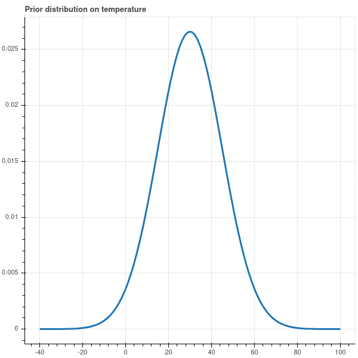
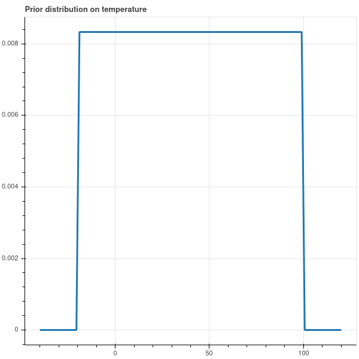
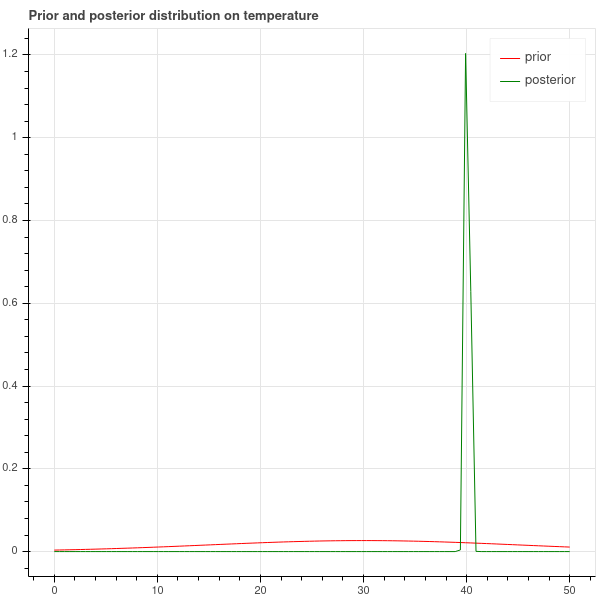
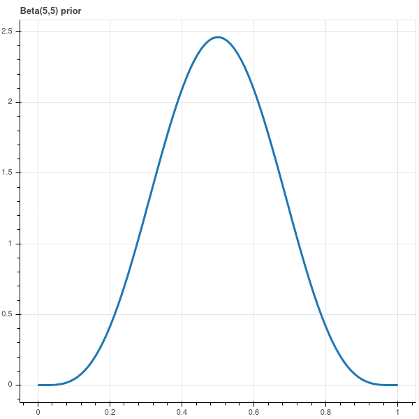

# Bayesian Inference

## Bayesian Perspective on Data 

We conclude our review of ideas from probability by examining the Bayesian perspective on data.

Suppose that we wish to conduct an experiment to determine the temperature outside our house.
We begin our experiment with a statistical model that is supposed to explain the variability in the
results.  The model depends on some parameters that we wish to estimate.  For example,
the parameters of our experiment might be the 'true'  temperature $t_*$ and the variance
$\sigma^2$ of the error.

From the Bayesian point of view, at the beginning of this experiment we have an initial
sense of what the temperature is likely to be, expressed in the form of a probability distribution.
This initial information is called the *prior* distribution.

For example, if we know that it's December in Connecticut, our prior distribution might say that the
temperature is more likely to be between 20 and 40 degrees Fahrenheit and is quite unlikely to be higher than
60 or lower than 0.  So our prior distribution might look like @fig-tempprior.

{#fig-tempprior}

If we really have no opinion about the temperature other than its between say, $-20$ and $100$ degrees,
our prior distribution might be uniform over that range, as in @fig-uniformprior.

{#fig-uniformprior}

The choice of a prior will guide the interpretation of our experiments in ways that we will see shortly.

The next step in our experiment is the collection of data.  Suppose we let
$\mathbf{t}=(t_1,t_2,\ldots, t_n)$ be a random variable representing $n$ independent measurements
of the temperature.  We consider the *joint distribution*
of the parameters $t_*$ and $\sigma^2$ and the possible measurements $\mathbf{t}$:
$$
P(\mathbf{t},t_*,\sigma^2)=\left(\frac{1}{\sigma\sqrt{2\pi}}\right)^{n}e^{-\|\mathbf{t}-t_*\mathbf{e}\|^2/(2\sigma^2)}
$$
where $\mathbf{e}=(1,1,\ldots, 1)$.  

The conditional probability $P(t_{*},\sigma^2|\mathbf{t})$ is the distribution of the values of $t_*$ and
$\sigma^2$*given*a value of the $\mathbf{t}$.  This is what we hope to learn by our experiment -- namely,
if we make a particular measurement, what does it tell us about $t_*$ and $\sigma^2$?

Now suppose that we actually make some measurements, and so we obtain a specific set of values $\mathbf{t}_0$
for $\mathbf{t}$.

By Bayes Theorem,
$$
P(t_{*},\sigma^2|\mathbf{t}=\mathbf{t}_0) = \frac{P(\mathbf{t}=\mathbf{t}_0|t_{*},\sigma^2)P(t_{*},\sigma^2)}{P(\mathbf{t}=\mathbf{t}_0)}
$$
We interpret this as follows:

- the left hand side $P(t_{*},\sigma^2|\mathbf{t}=\mathbf{t}_0)$ is called the *posterior distribution* and is
the distribution of $t_{*}$ and $\sigma^2$ obtained by *updating our prior knowledge with the results of our experiment.*
- The probability $P(\mathbf{t}=\mathbf{t}_{0}|t_{*},\sigma^2)$ is the probability of obtaining the
measurements we found for a particular value of the parameters $t_{*}$ and $\sigma^2$.
- The probability $P(t_{*},\sigma^2)$ is the *prior distribution* on the parameters that reflects our
initial impression of the distribution of these parameters.
- The denominator $P(\mathbf{t}=\mathbf{t}_{0})$ is the total probability of the results that we obtained,
and is the integral over the distribution of the parameters weighted by their prior probability:
$$
P(\mathbf{t}=\mathbf{t}_{0})=\int_{t_{*},\sigma^2}P(\mathbf{t}=\mathbf{t}_{0}|t_{*},\sigma^2)P(t_{*},\sigma^2)
$$

### Bayesian experiments with the normal distribution

To illustrate these Bayesian ideas, we'll consider the problem of measuring the temperature, but for simplicity
let's assume that we fix the variance in our error measurements at $1$ degree.  Let's use
the prior distribution on the true temperature that I proposed in @fig-tempprior, which is a normal
distribution with variance $15$ "shifted" to be centered at $30$:
$$
P(t_*)=\left(\frac{1}{\sqrt{2\pi}}\right)e^{-(t_*-30)^2/30}.
$$
The expected value $E[t]$ -- the mean of the this distribution -- is $30$.

Since the error in our measurements is normally distributed with variance $1$, we have
$$
P(t-t_{*})=\left(\frac{1}{\sqrt{2\pi}}\right)e^{-(t-t_{*})^2/2}
$$
or as a function of the absolute temperature, we have
$$
P(t,t_{*}) = \left(\frac{1}{\sqrt{2\pi}}\right)e^{-(t-t_*)^2/2}.
$$

Now we make a bunch of measurements to obtain $\mathbf{t}_0=(t_1,\ldots, t_n)$. We have
$$
P(\mathbf{t}=\mathbf{t}_0|t_{*}) = \left(\frac{1}{\sqrt{2\pi}}\right)^ne^{-\|\mathbf{t}-t_*\mathbf{e}\|^2/2}.
$$

The total probability $T=P(\mathbf{t}=\mathbf{t_0})$ is hard to calculate, so let's table that for a while.
The posterior probability is
$$
P(t_{*}|\mathbf{t}=\mathbf{t}_{0}) = \frac{1}{T}
\left(\frac{1}{\sqrt{2\pi}}\right)^ne^{-\|\mathbf{t}-t_*\mathbf{e}\|^2/2}
\left(\frac{1}{\sqrt{2\pi}}\right)e^{-(t_*-30)^2/30}.
$$

Leaving aside the multiplicative constants for the moment, consider the exponential
$$
e^{-(\|\mathbf{t}-t_{*}\mathbf{e}\|^2/2+(t_{*}-30)^2)/30}.
$$
Since $\mathbf{t}$ is a vector of constants -- it is a vector of our particular measurements --
the exponent
$$
\|\mathbf{t}-t_{*}\mathbf{e}\|^2/2+(t_{*}-30)^2/30 = (t_{*}-30)^2/30+\sum_{i} (t_{i}-t_{*})^2/2
$$
is a quadratic polynomial in $t_{*}$ that simplifies:
$$
(t_{*}-30)^2/30+\sum_{i} (t_{i}-t_{*})^2/2 = At_{*}^2+Bt_{*}+C.
$$
Here
$$
A=(\frac{1}{30}+\frac{n}{2}),
$$
$$
B=-2-\sum_{i} t_{i}
$$
$$
C=30+\frac{1}{2}\sum_{i} t_{i}^2.
$$

We can complete the square to write
$$
At_{*}^2+Bt_{*}+C = (t_{*}-U)^2/2V +K
$$
where
$$
U=\frac{2+\sum_{i}t_{i}}{\frac{1}{15}+n}
$$
and
$$
V=\frac{1}{\frac{1}{15}+n}.
$$
So up to constants that don't involve $t_{*}$, the posterior density is
of the form
$$
e^{(t_{*}-U)^2/2V}
$$
and since it is a probability density, the constants must work out to give total integral of $1$.
Therefore the posterior density is a normal distribution centered at $U$ and with variance $V$.
Here $U$ is called the*posterior mean*and $V$ the*posterior variance*.

To make this explicit, suppose $n=5$ and we measured the following temperatures:
$$
40, 41,39, 37, 44
$$
The mean of these observations is $40.2$ and the variance is $5.4$.

A calculation shows that the posterior mean is $40.1$ and the posterior variance is
$0.2$.  Comparing the prior with the posterior, we obtain the plot in @fig-comparison.
The posterior has a sharp peak at $40.1$ degrees.  This value is just a bit
smaller than the
mean of the observed temperatures which is $40.2$ degrees.  This difference is caused by the prior --
our prior distribution said the temperature was likely to be around $30$ degrees, and so the prior pulls
the observed mean a bit towards the prior mean taking into account past experience.  Because the
variance of the prior is large, it has a relatively small influence on the posterior.

The general version of the calculation above is summarized in this proposition.

**Proposition:** Suppose that our statistical model for an experiment proposes that
the measurements are normally distributed around an (unknown)  mean value of $\mu$ with a (fixed)
variance $\sigma^2$.  Suppose further that our prior distribution on the unknown mean $\mu$
is normal with mean $\mu_0$ and variance $\tau^2$.  Suppose we make measurements
$$
y_1,\ldots, y_n
$$
with mean $\overline{y}$.  Then the posterior distribution of $\mu$ is again normal,
with posterior variance
$$
\tau'^2 = \frac{1}{\frac{1}{\tau^2}+\frac{n}{\sigma^2}}
$$
and posterior mean
$$
\mu' = \frac{\frac{\mu_0}{\tau^2}+\frac{n}{\sigma^2}\overline{y}}{\frac{1}{\frac{1}{\tau^2}+\frac{n}{\sigma^2}}}
$$

So the posterior mean is a sort of weighted average of the sample mean and the prior mean; and as $n\to\infty$,
the posterior mean approaches the sample mean -- in other words, as you get more data, the prior has
less and less influence on the results of the experiment.

{#fig-comparison}

### Bayesian coin flipping

For our final example in this fast overview of ideas from probability, we consider the problem of deciding
whether a coin is fair.  Our experiment consists of $N$ flips of  a coin with unknown probability $p$ of heads,
so the data consists of the number $h$ of heads out of the $N$ flips.  To apply Bayesian reasoning,
we need a prior distribution on $p$.  Let's first assume that we have no reason to prefer one value of $p$
over another, and so we choose for our prior the uniform distribution on $p$ between $0$ and $1$.

We wish to analyze $P(p|h)$, the probability distribution of $p$ given $h$ heads out of $N$ flips.
Bayes Theorem gives us:## Bayesian Inference

We conclude our review of ideas from probability by examining the Bayesian perspective on data.

Suppose that we wish to conduct an experiment to determine the temperature outside our house.
We begin our experiment with a statistical model that is supposed to explain the variability in the
results.  The model depends on some parameters that we wish to estimate.  For example,
the parameters of our experiment might be the 'true'  temperature $t_*$ and the variance
$\sigma^2$ of the error.

From the Bayesian point of view, at the beginning of this experiment we have an initial
sense of what the temperature is likely to be, expressed in the form of a probability distribution.
This initial information is called the *prior* distribution.

For example, if we know that it's December in Connecticut, our prior distribution might say that the
temperature is more likely to be between 20 and 40 degrees Fahrenheit and is quite unlikely to be higher than
60 or lower than 0.  So our prior distribution might look like @fig-tempprior.

{#fig-tempprior}

If we really have no opinion about the temperature other than its between say, $-20$ and $100$ degrees,
our prior distribution might be uniform over that range, as in @fig-uniformprior.

{#fig-uniformprior}

The choice of a prior will guide the interpretation of our experiments in ways that we will see shortly.

The next step in our experiment is the collection of data.  Suppose we let
$\mathbf{t}=(t_1,t_2,\ldots, t_n)$ be a random variable representing $n$ independent measurements
of the temperature.  We consider the *joint distribution*
of the parameters $t_*$ and $\sigma^2$ and the possible measurements $\mathbf{t}$:
$$
P(\mathbf{t},t_*,\sigma^2)=\left(\frac{1}{\sigma\sqrt{2\pi}}\right)^{n}e^{-\|\mathbf{t}-t_*\mathbf{e}\|^2/(2\sigma^2)}
$$
where $\mathbf{e}=(1,1,\ldots, 1)$.  

The conditional probability $P(t_{*},\sigma^2|\mathbf{t})$ is the distribution of the values of $t_*$ and
$\sigma^2$*given*a value of the $\mathbf{t}$.  This is what we hope to learn by our experiment -- namely,
if we make a particular measurement, what does it tell us about $t_*$ and $\sigma^2$?

Now suppose that we actually make some measurements, and so we obtain a specific set of values $\mathbf{t}_0$
for $\mathbf{t}$.

By Bayes Theorem,
$$
P(t_{*},\sigma^2|\mathbf{t}=\mathbf{t}_0) = \frac{P(\mathbf{t}=\mathbf{t}_0|t_{*},\sigma^2)P(t_{*},\sigma^2)}{P(\mathbf{t}=\mathbf{t}_0)}
$$
We interpret this as follows:

- the left hand side $P(t_{*},\sigma^2|\mathbf{t}=\mathbf{t}_0)$ is called the *posterior distribution* and is
the distribution of $t_{*}$ and $\sigma^2$ obtained by *updating our prior knowledge with the results of our experiment.*
- The probability $P(\mathbf{t}=\mathbf{t}_{0}|t_{*},\sigma^2)$ is the probability of obtaining the
measurements we found for a particular value of the parameters $t_{*}$ and $\sigma^2$.
- The probability $P(t_{*},\sigma^2)$ is the *prior distribution* on the parameters that reflects our
initial impression of the distribution of these parameters.
- The denominator $P(\mathbf{t}=\mathbf{t}_{0})$ is the total probability of the results that we obtained,
and is the integral over the distribution of the parameters weighted by their prior probability:
$$
P(\mathbf{t}=\mathbf{t}_{0})=\int_{t_{*},\sigma^2}P(\mathbf{t}=\mathbf{t}_{0}|t_{*},\sigma^2)P(t_{*},\sigma^2)
$$

### Bayesian experiments with the normal distribution

To illustrate these Bayesian ideas, we'll consider the problem of measuring the temperature, but for simplicity
let's assume that we fix the variance in our error measurements at $1$ degree.  Let's use
the prior distribution on the true temperature that I proposed in @fig-tempprior, which is a normal
distribution with variance $15$ "shifted" to be centered at $30$:
$$
P(t_*)=\left(\frac{1}{\sqrt{2\pi}}\right)e^{-(t_*-30)^2/30}.
$$
The expected value $E[t]$ -- the mean of the this distribution -- is $30$.

Since the error in our measurements is normally distributed with variance $1$, we have
$$
P(t-t_{*})=\left(\frac{1}{\sqrt{2\pi}}\right)e^{-(t-t_{*})^2/2}
$$
or as a function of the absolute temperature, we have
$$
P(t,t_{*}) = \left(\frac{1}{\sqrt{2\pi}}\right)e^{-(t-t_*)^2/2}.
$$

Now we make a bunch of measurements to obtain $\mathbf{t}_0=(t_1,\ldots, t_n)$. We have
$$
P(\mathbf{t}=\mathbf{t}_0|t_{*}) = \left(\frac{1}{\sqrt{2\pi}}\right)^ne^{-\|\mathbf{t}-t_*\mathbf{e}\|^2/2}.
$$

The total probability $T=P(\mathbf{t}=\mathbf{t_0})$ is hard to calculate, so let's table that for a while.
The posterior probability is
$$
P(t_{*}|\mathbf{t}=\mathbf{t}_{0}) = \frac{1}{T}
\left(\frac{1}{\sqrt{2\pi}}\right)^ne^{-\|\mathbf{t}-t_*\mathbf{e}\|^2/2}
\left(\frac{1}{\sqrt{2\pi}}\right)e^{-(t_*-30)^2/30}.
$$

Leaving aside the multiplicative constants for the moment, consider the exponential
$$
e^{-(\|\mathbf{t}-t_{*}\mathbf{e}\|^2/2+(t_{*}-30)^2)/30}.
$$
Since $\mathbf{t}$ is a vector of constants -- it is a vector of our particular measurements --
the exponent
$$
\|\mathbf{t}-t_{*}\mathbf{e}\|^2/2+(t_{*}-30)^2/30 = (t_{*}-30)^2/30+\sum_{i} (t_{i}-t_{*})^2/2
$$
is a quadratic polynomial in $t_{*}$ that simplifies:
$$
(t_{*}-30)^2/30+\sum_{i} (t_{i}-t_{*})^2/2 = At_{*}^2+Bt_{*}+C.
$$
Here
$$
A=(\frac{1}{30}+\frac{n}{2}),
$$
$$
B=-2-\sum_{i} t_{i}
$$
$$
C=30+\frac{1}{2}\sum_{i} t_{i}^2.
$$

We can complete the square to write
$$
At_{*}^2+Bt_{*}+C = (t_{*}-U)^2/2V +K
$$
where
$$
U=\frac{2+\sum_{i}t_{i}}{\frac{1}{15}+n}
$$
and
$$
V=\frac{1}{\frac{1}{15}+n}.
$$
So up to constants that don't involve $t_{*}$, the posterior density is
of the form
$$
e^{(t_{*}-U)^2/2V}
$$
and since it is a probability density, the constants must work out to give total integral of $1$.
Therefore the posterior density is a normal distribution centered at $U$ and with variance $V$.
Here $U$ is called the*posterior mean*and $V$ the*posterior variance*.

To make this explicit, suppose $n=5$ and we measured the following temperatures:
$$
40, 41,39, 37, 44
$$
The mean of these observations is $40.2$ and the variance is $5.4$.

A calculation shows that the posterior mean is $40.1$ and the posterior variance is
$0.2$.  Comparing the prior with the posterior, we obtain the plot in @fig-comparison.
The posterior has a sharp peak at $40.1$ degrees.  This value is just a bit
smaller than the
mean of the observed temperatures which is $40.2$ degrees.  This difference is caused by the prior --
our prior distribution said the temperature was likely to be around $30$ degrees, and so the prior pulls
the observed mean a bit towards the prior mean taking into account past experience.  Because the
variance of the prior is large, it has a relatively small influence on the posterior.

The general version of the calculation above is summarized in this proposition.

**Proposition:** Suppose that our statistical model for an experiment proposes that
the measurements are normally distributed around an (unknown)  mean value of $\mu$ with a (fixed)
variance $\sigma^2$.  Suppose further that our prior distribution on the unknown mean $\mu$
is normal with mean $\mu_0$ and variance $\tau^2$.  Suppose we make measurements
$$
y_1,\ldots, y_n
$$
with mean $\overline{y}$.  Then the posterior distribution of $\mu$ is again normal,
with posterior variance
$$
\tau'^2 = \frac{1}{\frac{1}{\tau^2}+\frac{n}{\sigma^2}}
$$
and posterior mean
$$
\mu' = \frac{\frac{\mu_0}{\tau^2}+\frac{n}{\sigma^2}\overline{y}}{\frac{1}{\frac{1}{\tau^2}+\frac{n}{\sigma^2}}}
$$

So the posterior mean is a sort of weighted average of the sample mean and the prior mean; and as $n\to\infty$,
the posterior mean approaches the sample mean -- in other words, as you get more data, the prior has
less and less influence on the results of the experiment.

{#fig-comparison}

### Bayesian coin flipping

For our final example in this fast overview of ideas from probability, we consider the problem of deciding
whether a coin is fair.  Our experiment consists of $N$ flips of  a coin with unknown probability $p$ of heads,
so the data consists of the number $h$ of heads out of the $N$ flips.  To apply Bayesian reasoning,
we need a prior distribution on $p$.  Let's first assume that we have no reason to prefer one value of $p$
over another, and so we choose for our prior the uniform distribution on $p$ between $0$ and $1$.

We wish to analyze $P(p|h)$, the probability distribution of $p$ given $h$ heads out of $N$ flips.
Bayes Theorem gives us:
$$
P(p|h) = \frac{P(h|p)P(p)}{P(h)}
$$
where
$$
P(h|p) = \binom{N}{h}p^{h}(1-p)^{N-h}
$$
and
$$
P(h)=\int_{p=0}^{1} P(h|p)P(p) dp = \binom{N}{h}\int_{p=0}^{1} p^{h}(1-p)^{N-h}dp
$$
is a constant which insures that $$\int_{p}P(p|h)dp=1.$$

We see that the posterior distribution $P(p|h)$ is proportional to the polynomial function
$$
P(p|h)\propto p^{h}(1-p)^{N-h}.
$$
As in @sec-mlcoin, we see that this function peaks at $h/N$.  This is called the maximum *a posteriori estimate*
for $p$.  

Another way to summarize the posterior distribution $P(p|h)$ is to look at the expected value of $p$.
This is called the *posterior mean* of $p$.  To compute it, we need to know the normalization
constant in the expression for $P(p|h)$, and for that we can take advantage of the properties of a special
function $B(a,b)$ called the Beta-function:
$$
B(a,b) = \int_{p=0}^{1} p^{a-1}(1-p)^{b-1} dp.
$$

**Proposition:** If $a$ and $b$ are integers, then $B(a,b)=\frac{a+b}{ab}\frac{1}{\binom{a+b}{a}}$.

**Proof:**   Using integration by parts, one can show that
$$
B(a,b)=\frac{a-1}{b}B(a-1,b+1)
$$
and a simple calculation shows that
$$
B(1,b) = \frac{1}{b}.
$$
Let
$$
H(a,b)=\frac{a+b}{ab}\frac{1}{\binom{a+b}{a}} = \frac{(a-1)!(b-1)!}{(a+b-1)!}
$$
Then it's easy to check that $H$ satsifies the same recurrences as $B(a,b)$, and that
$H(1,b)=1/b$.  So the two functions agree by induction.

Using this Proposition, we see that
$$
P(p|h) = \frac{p^{h}(1-p)^{N-h}}{B(h+1,N-h+1)}
$$
and## Bayesian Inference

We conclude our review of ideas from probability by examining the Bayesian perspective on data.

Suppose that we wish to conduct an experiment to determine the temperature outside our house.
We begin our experiment with a statistical model that is supposed to explain the variability in the
results.  The model depends on some parameters that we wish to estimate.  For example,
the parameters of our experiment might be the 'true'  temperature $t_*$ and the variance
$\sigma^2$ of the error.

From the Bayesian point of view, at the beginning of this experiment we have an initial
sense of what the temperature is likely to be, expressed in the form of a probability distribution.
This initial information is called the *prior* distribution.

For example, if we know that it's December in Connecticut, our prior distribution might say that the
temperature is more likely to be between 20 and 40 degrees Fahrenheit and is quite unlikely to be higher than
60 or lower than 0.  So our prior distribution might look like @fig-tempprior.

{#fig-tempprior}

If we really have no opinion about the temperature other than its between say, $-20$ and $100$ degrees,
our prior distribution might be uniform over that range, as in @fig-uniformprior.

{#fig-uniformprior}

The choice of a prior will guide the interpretation of our experiments in ways that we will see shortly.

The next step in our experiment is the collection of data.  Suppose we let
$\mathbf{t}=(t_1,t_2,\ldots, t_n)$ be a random variable representing $n$ independent measurements
of the temperature.  We consider the *joint distribution*
of the parameters $t_*$ and $\sigma^2$ and the possible measurements $\mathbf{t}$:
$$
P(\mathbf{t},t_*,\sigma^2)=\left(\frac{1}{\sigma\sqrt{2\pi}}\right)^{n}e^{-\|\mathbf{t}-t_*\mathbf{e}\|^2/(2\sigma^2)}
$$
where $\mathbf{e}=(1,1,\ldots, 1)$.  

The conditional probability $P(t_{*},\sigma^2|\mathbf{t})$ is the distribution of the values of $t_*$ and
$\sigma^2$*given*a value of the $\mathbf{t}$.  This is what we hope to learn by our experiment -- namely,
if we make a particular measurement, what does it tell us about $t_*$ and $\sigma^2$?

Now suppose that we actually make some measurements, and so we obtain a specific set of values $\mathbf{t}_0$
for $\mathbf{t}$.

By Bayes Theorem,
$$
P(t_{*},\sigma^2|\mathbf{t}=\mathbf{t}_0) = \frac{P(\mathbf{t}=\mathbf{t}_0|t_{*},\sigma^2)P(t_{*},\sigma^2)}{P(\mathbf{t}=\mathbf{t}_0)}
$$
We interpret this as follows:

- the left hand side $P(t_{*},\sigma^2|\mathbf{t}=\mathbf{t}_0)$ is called the *posterior distribution* and is
the distribution of $t_{*}$ and $\sigma^2$ obtained by *updating our prior knowledge with the results of our experiment.*
- The probability $P(\mathbf{t}=\mathbf{t}_{0}|t_{*},\sigma^2)$ is the probability of obtaining the
measurements we found for a particular value of the parameters $t_{*}$ and $\sigma^2$.
- The probability $P(t_{*},\sigma^2)$ is the *prior distribution* on the parameters that reflects our
initial impression of the distribution of these parameters.
- The denominator $P(\mathbf{t}=\mathbf{t}_{0})$ is the total probability of the results that we obtained,
and is the integral over the distribution of the parameters weighted by their prior probability:
$$
P(\mathbf{t}=\mathbf{t}_{0})=\int_{t_{*},\sigma^2}P(\mathbf{t}=\mathbf{t}_{0}|t_{*},\sigma^2)P(t_{*},\sigma^2)
$$

### Bayesian experiments with the normal distribution

To illustrate these Bayesian ideas, we'll consider the problem of measuring the temperature, but for simplicity
let's assume that we fix the variance in our error measurements at $1$ degree.  Let's use
the prior distribution on the true temperature that I proposed in @fig-tempprior, which is a normal
distribution with variance $15$ "shifted" to be centered at $30$:
$$
P(t_*)=\left(\frac{1}{\sqrt{2\pi}}\right)e^{-(t_*-30)^2/30}.
$$
The expected value $E[t]$ -- the mean of the this distribution -- is $30$.

Since the error in our measurements is normally distributed with variance $1$, we have
$$
P(t-t_{*})=\left(\frac{1}{\sqrt{2\pi}}\right)e^{-(t-t_{*})^2/2}
$$
or as a function of the absolute temperature, we have
$$
P(t,t_{*}) = \left(\frac{1}{\sqrt{2\pi}}\right)e^{-(t-t_*)^2/2}.
$$

Now we make a bunch of measurements to obtain $\mathbf{t}_0=(t_1,\ldots, t_n)$. We have
$$
P(\mathbf{t}=\mathbf{t}_0|t_{*}) = \left(\frac{1}{\sqrt{2\pi}}\right)^ne^{-\|\mathbf{t}-t_*\mathbf{e}\|^2/2}.
$$

The total probability $T=P(\mathbf{t}=\mathbf{t_0})$ is hard to calculate, so let's table that for a while.
The posterior probability is
$$
P(t_{*}|\mathbf{t}=\mathbf{t}_{0}) = \frac{1}{T}
\left(\frac{1}{\sqrt{2\pi}}\right)^ne^{-\|\mathbf{t}-t_*\mathbf{e}\|^2/2}
\left(\frac{1}{\sqrt{2\pi}}\right)e^{-(t_*-30)^2/30}.
$$

Leaving aside the multiplicative constants for the moment, consider the exponential
$$
e^{-(\|\mathbf{t}-t_{*}\mathbf{e}\|^2/2+(t_{*}-30)^2)/30}.
$$
Since $\mathbf{t}$ is a vector of constants -- it is a vector of our particular measurements --
the exponent
$$
\|\mathbf{t}-t_{*}\mathbf{e}\|^2/2+(t_{*}-30)^2/30 = (t_{*}-30)^2/30+\sum_{i} (t_{i}-t_{*})^2/2
$$
is a quadratic polynomial in $t_{*}$ that simplifies:
$$
(t_{*}-30)^2/30+\sum_{i} (t_{i}-t_{*})^2/2 = At_{*}^2+Bt_{*}+C.
$$
Here
$$
A=(\frac{1}{30}+\frac{n}{2}),
$$
$$
B=-2-\sum_{i} t_{i}
$$
$$
C=30+\frac{1}{2}\sum_{i} t_{i}^2.
$$

We can complete the square to write
$$
At_{*}^2+Bt_{*}+C = (t_{*}-U)^2/2V +K
$$
where
$$
U=\frac{2+\sum_{i}t_{i}}{\frac{1}{15}+n}
$$
and
$$
V=\frac{1}{\frac{1}{15}+n}.
$$
So up to constants that don't involve $t_{*}$, the posterior density is
of the form
$$
e^{(t_{*}-U)^2/2V}
$$
and since it is a probability density, the constants must work out to give total integral of $1$.
Therefore the posterior density is a normal distribution centered at $U$ and with variance $V$.
Here $U$ is called the*posterior mean*and $V$ the*posterior variance*.

To make this explicit, suppose $n=5$ and we measured the following temperatures:
$$
40, 41,39, 37, 44
$$
The mean of these observations is $40.2$ and the variance is $5.4$.

A calculation shows that the posterior mean is $40.1$ and the posterior variance is
$0.2$.  Comparing the prior with the posterior, we obtain the plot in @fig-comparison.
The posterior has a sharp peak at $40.1$ degrees.  This value is just a bit
smaller than the
mean of the observed temperatures which is $40.2$ degrees.  This difference is caused by the prior --
our prior distribution said the temperature was likely to be around $30$ degrees, and so the prior pulls
the observed mean a bit towards the prior mean taking into account past experience.  Because the
variance of the prior is large, it has a relatively small influence on the posterior.

The general version of the calculation above is summarized in this proposition.

**Proposition:** Suppose that our statistical model for an experiment proposes that
the measurements are normally distributed around an (unknown)  mean value of $\mu$ with a (fixed)
variance $\sigma^2$.  Suppose further that our prior distribution on the unknown mean $\mu$
is normal with mean $\mu_0$ and variance $\tau^2$.  Suppose we make measurements
$$
y_1,\ldots, y_n
$$
with mean $\overline{y}$.  Then the posterior distribution of $\mu$ is again normal,
with posterior variance
$$
\tau'^2 = \frac{1}{\frac{1}{\tau^2}+\frac{n}{\sigma^2}}
$$
and posterior mean
$$
\mu' = \frac{\frac{\mu_0}{\tau^2}+\frac{n}{\sigma^2}\overline{y}}{\frac{1}{\frac{1}{\tau^2}+\frac{n}{\sigma^2}}}
$$

So the posterior mean is a sort of weighted average of the sample mean and the prior mean; and as $n\to\infty$,
the posterior mean approaches the sample mean -- in other words, as you get more data, the prior has
less and less influence on the results of the experiment.

{#fig-comparison}

### Bayesian coin flipping

For our final example in this fast overview of ideas from probability, we consider the problem of deciding
whether a coin is fair.  Our experiment consists of $N$ flips of  a coin with unknown probability $p$ of heads,
so the data consists of the number $h$ of heads out of the $N$ flips.  To apply Bayesian reasoning,
we need a prior distribution on $p$.  Let's first assume that we have no reason to prefer one value of $p$
over another, and so we choose for our prior the uniform distribution on $p$ between $0$ and $1$.

We wish to analyze $P(p|h)$, the probability distribution of $p$ given $h$ heads out of $N$ flips.
Bayes Theorem gives us:
$$
P(p|h) = \frac{P(h|p)P(p)}{P(h)}
$$
where
$$
P(h|p) = \binom{N}{h}p^{h}(1-p)^{N-h}
$$
and
$$
P(h)=\int_{p=0}^{1} P(h|p)P(p) dp = \binom{N}{h}\int_{p=0}^{1} p^{h}(1-p)^{N-h}dp
$$
is a constant which insures that $$\int_{p}P(p|h)dp=1.$$

We see that the posterior distribution $P(p|h)$ is proportional to the polynomial function
$$
P(p|h)\propto p^{h}(1-p)^{N-h}.
$$
As in @sec-mlcoin, we see that this function peaks at $h/N$.  This is called the maximum *a posteriori estimate*
for $p$.  

Another way to summarize the posterior distribution $P(p|h)$ is to look at the expected value of $p$.
This is called the *posterior mean* of $p$.  To compute it, we need to know the normalization
constant in the expression for $P(p|h)$, and for that we can take advantage of the properties of a special
function $B(a,b)$ called the Beta-function:
$$
B(a,b) = \int_{p=0}^{1} p^{a-1}(1-p)^{b-1} dp.
$$

**Proposition:** If $a$ and $b$ are integers, then $B(a,b)=\frac{a+b}{ab}\frac{1}{\binom{a+b}{a}}$.

**Proof:**   Using integration by parts, one can show that
$$
B(a,b)=\frac{a-1}{b}B(a-1,b+1)
$$
and a simple calculation shows that
$$
B(1,b) = \frac{1}{b}.
$$
Let
$$
H(a,b)=\frac{a+b}{ab}\frac{1}{\binom{a+b}{a}} = \frac{(a-1)!(b-1)!}{(a+b-1)!}
$$
Then it's easy to check that $H$ satsifies the same recurrences as $B(a,b)$, and that
$H(1,b)=1/b$.  So the two functions agree by induction.

Using this Proposition, we see that
$$
P(p|h) = \frac{p^{h}(1-p)^{N-h}}{B(h+1,N-h+1)}
$$
and
$$
E[p] = \frac{\int_{p=0}^{1} p^{h+1}(1-p)^{N-h}dp}{B(h+1,N-h+1)}=\frac{B(h+2,N-h+1)}{B(h+1,N-h+1)}.
$$
Sorting through this using the formula for $B(a,b)$ we obtain
$$
E[p]=\frac{h+1}{N+2}.
$$

So if we obtained $55$ heads  out of $100$ flips, the maximum a posteriori estimate for $p$ is $.55$,
while the posterior mean is $56/102=.549$ -- just a bit less.

Now suppose that we had some reason to believe that our coin was fair.  Then we can choose a prior
probability distribution that expresses this.  For example, we can choose
$$
P(p) = \frac{1}{B(5,5)}p^{4}(1-p)^{4}.
$$
Here we use the Beta function to guarantee that $\int_{0}^{1}P(p)dp=1$.  We show this prior distribution
in @fig-betaprior.  

{#fig-betaprior}

If we redo our Bayes theorem calculation, we find that our posterior distribution is
$$
P(p|h) \propto p^{h+4}(1-p)^{N-h+4}
$$
and relying again on the Beta function for normalization we have
$$
P(p|h) = \frac{1}{B(h+5,N-h+5)}p^{h+4}(1-p)^{N-h+4}
$$
Here the maximum a posterior estimate for $p$ is $h+4/N+8$ while our posterior mean is
$$
\frac{B(h+6,N-h+5)}{B(h+5,N-h+5)} = \frac{h+5}{N+10}.
$$

In the situation of $55$ heads out of $100$, the maximum a posteriori estimate is $.546$ and
the posterior mean is $.545$.  These numbers have been pulled just a bit towards $.5$ because our
prior knowledge makes us a little bit biased towards $p=.5$.

### Bayesian Regression (or Ridge Regression)

In this chapter we return to our discussion of linear regression and introduce some Bayesian ideas.
The combination will lead us to the notion of "ridge" regression, which is a type of linear regression that
includes a prior distribution on the coefficients that indicates our preference for smaller rather than larger
coefficients. Introduction of this prior leads to a form of linear regression that is more resilient in situations
where the independent variables are less independent than we would hope.

Before introducing these Bayesian ideas, let us recall from @sec-LRLike that ordinary least squares yields the
parameters that give the "most likely" set of parameters for a model of the form
$$
Y=XM + \epsilon
$$
where the error $\epsilon$ is normally distributed with mean $0$ and variance $\sigma^2$, and the mean squared error becomes the maximum likelihood estimate of the variance $\sigma^2$.

To put this into a Bayesian perspective, we notice that the linear regression model views $Y-XM$
as normally distributed given $M$.  That is, we see the probability $P(Y-XM|M)$ as normal with variance
$\sigma^2$.  

Then we introduce a prior distribution on the coefficients $M$, assuming that they, too, are normally
distributed around zero with variance $\tau^2$.  This means that *ab initio* we think that the coefficients
are likely to be small.

From Bayes Theorem, we then have
$$
P(M|Y,X) = \frac{P(Y,X|M)P(M)}{P(Y,X)}
$$
and in distribution terms we have
$$
P(M|Y,X) = Ae^{\|Y-XM\|^2/\sigma^2}e^{-\|M\|^2/\tau^{2}}
$$
where $A$ is a normalizing constant.

The first thing to note from this expression is that the posterior distribution for the $M$ parameters for regression are 
themselves normally distributed. 

The maximum likelihood estimate $M_{r}$ for the parameters $M$ occurs when $P(M|Y,X)$ is maximum,
which we find by taking the derivatives.  Using the matrix algebra developed in our linear regression
chapter, we obtain the equation
$$
(X^{\intercal}Y-(X^{\intercal}X)M_r)/\sigma^2-M_r/\tau^{2}=0
$$
or
$$
(X^{\intercal}X+s)M_r=X^{\intercal}Y
$${#eq-ridgeformula}
where $s=\sigma^2/\tau^2$.

Therefore the ridge coefficients are given by the equation
$$
M_{r}=(X^{\intercal}X+s)^{-1}X^{\intercal}Y
$${#eq-ridgecoeffs}

#### Practical aspects of ridge regression

Using ridge regression leads to a solution to the least squares problem in which the regression coefficients
are biased towards being smaller.  Beyond this, there are a number of implications of the technique which
affect its use in practice.

First, we can put the Bayesian derivation of the ridge regression formulae in the background and focus our attention
on @eq-ridgecoeffs.  We can treat the  parameter $s$ (which must be non-negative) as "adjustable".  

One important consideration when using ridge regression is that @eq-ridgecoeffs is not invariant if we scale $X$ and $Y$ by a constant.  This is different from "plain"
regression where we consider the equation $Y=XM$.  In that case, rescaling $X$ and $Y$ by the same factor leaves the coefficients $M$ alone.  For this reason, ridge regression
is typically used on centered, standardized coordinates.  In other words, we replace each feature $x_i$ by $(x_i-\mu_i)/\sigma_i$ where $\mu_i$ and $\sigma_i$ are the sample mean and standard
deviation of the $i^{th}$ feature, and we replace our response variables $y_i$ similarly by $(y-\mu)/\sigma$ where $\mu$ and $\sigma$ are the mean and standard deviation of the $y$-values.
Then we find $M$ using @eq-ridgecoeffs, perhaps experimenting with different values of $s$, using our centered and standardized variables. 

To emphasize that we are using centered coordinates, we write $X_{0}$ for our data matrix instead
of $X$. Recall that the matrix $X_0^{\intercal}X_0$
that enters into @eq-ridgeformula is $ND_{0}$ where $D_{0}$ is the covariance matrix. Therefore in ridge regression we have replaced $ND_0$ by $ND_0+s$.
Since $D_0$ is a real symmetric matrix, as we've seen in Chapter 2 it is diagonalizable so that $AD_0A^{-1}$ is diagonal for
an orthogonal matrix $A$ and has eigenvalues $\lambda_1\ge \ldots\ge \lambda_k$ which are the variances of the data
along the principal directions.

One effect of using ridge regression is that the eigenvalues of $ND_{0}+s$ are always at least
$s>0$, so the use of ridge regression avoids the possibility that $D_{0}$ might not be invertible. 
In fact, a bit more is true.  Numerical analysis tells us that when considering the problem
of computing the inverse of  a matrix, we should look at its
*condition number*, which is the ratio $\lambda_1/\lambda_k$ of the largest to the smallest eigenvalue.

If the condition number of a matrix  is large, then results from numerical analysis show that it is *almost singular* and its inverse becomes very sensitive
to small changes in the entries of the matrix.  However, the eigenvalues of $ND_0+s$ are $N\lambda_{i}+s$ and so the condition number becomes $(N\lambda_1+s)/(N\lambda_k+s)$.
For larger values of $\lambda$, this condition number shrinks, and so the inverse of the matrix $ND_0+s$ becomes better behaved
than $ND_{0}$.  In this way, ridge regression helps to improve the numerical stability of the linear regression algorithm.

A second way to look at Ridge regression is to go back to the discussion of the singular value decomposition of the matrix $X_{0}$ in section @sec-svd.  There we showed that the SVD of
$X_{0}$ yields an expression
$$
X_{0}=U\tilde{\Lambda}P^{\intercal}
$$
where $U$ and $P$ are orthogonal matrices and $\Lambda$ is an $N\times k$ matrix whose upper block
is diagonal with eigenvalues $\sqrt{N\lambda_{i}}$.  The rows of $U$ gave us an orthonormal basis
that allowed us to write the predicted vector $\hat{Y}$ as a projection:
$$
\hat{Y}=\sum_{i=1}^{k} (u_j\cdot Y)u_{j}^{\intercal}.
$$

If we repeat this calculation, but using the ridge regression formula, we obtain
$$
\hat{Y}_{r}=X_{0}M_r = U\tilde{\Lambda}P^{\intercal}(P\tilde{\Lambda}^{\intercal}U^{\intercal}U\tilde{\Lambda}P^{\intercal}+s)^{-1}P\tilde{\Lambda}^{\intercal}U^{\intercal}Y.
$$
Since $P$ is orthogonal, $P^{\intercal}=P^{-1}$, so
$$
P^{\intercal}(P\tilde{\Lambda}^2P^{\intercal}+s)^{-1}P=P^{-1}(P(\Lambda+s)P^{-1})P=(\Lambda+s)^{-1}
$$
and $\Lambda+s$ is a $k\times k$ diagonal matrix with entries $N\lambda_{i}+s$.

Putting the pieces together we see that
$$
\hat{Y}_{r}=U\tilde{\Lambda}(\Lambda+s)^{-1}\tilde{\Lambda}U^{\intercal}Y.
$$

In the language of orthogonal projection, this means that
$$
\hat{Y}_{r} = \sum_{i=1}^{k} \frac{N\lambda_{i}}{N\lambda_{i}+s}(u_j\cdot Y)u_{j}^{\intercal}.
$$

In other words, the predicted value computed by ridge regression is obtained by projecting
$Y$ into the space spanned by the feature vectors, but weighting the different principal components 
by $N\lambda_{i}/(N\lambda_{i}+s)$.  With this weighting, the  principal components with smaller variances are weighted less than those with larger variances.  For this reason,
ridge regression is sometimes called a *shrinkage* method.

$$
E[p] = \frac{\int_{p=0}^{1} p^{h+1}(1-p)^{N-h}dp}{B(h+1,N-h+1)}=\frac{B(h+2,N-h+1)}{B(h+1,N-h+1)}.
$$
Sorting through this using the formula for $B(a,b)$ we obtain
$$
E[p]=\frac{h+1}{N+2}.
$$

So if we obtained $55$ heads  out of $100$ flips, the maximum a posteriori estimate for $p$ is $.55$,
while the posterior mean is $56/102=.549$ -- just a bit less.

Now suppose that we had some reason to believe that our coin was fair.  Then we can choose a prior
probability distribution that expresses this.  For example, we can choose
$$
P(p) = \frac{1}{B(5,5)}p^{4}(1-p)^{4}.
$$
Here we use the Beta function to guarantee that $\int_{0}^{1}P(p)dp=1$.  We show this prior distribution
in @fig-betaprior.  

{#fig-betaprior}

If we redo our Bayes theorem calculation, we find that our posterior distribution is
$$
P(p|h) \propto p^{h+4}(1-p)^{N-h+4}
$$
and relying again on the Beta function for normalization we have
$$
P(p|h) = \frac{1}{B(h+5,N-h+5)}p^{h+4}(1-p)^{N-h+4}
$$
Here the maximum a posterior estimate for $p$ is $h+4/N+8$ while our posterior mean is
$$
\frac{B(h+6,N-h+5)}{B(h+5,N-h+5)} = \frac{h+5}{N+10}.
$$

In the situation of $55$ heads out of $100$, the maximum a posteriori estimate is $.546$ and
the posterior mean is $.545$.  These numbers have been pulled just a bit towards $.5$ because our
prior knowledge makes us a little bit biased towards $p=.5$.

### Bayesian Regression (or Ridge Regression)

In this chapter we return to our discussion of linear regression and introduce some Bayesian ideas.
The combination will lead us to the notion of "ridge" regression, which is a type of linear regression that
includes a prior distribution on the coefficients that indicates our preference for smaller rather than larger
coefficients. Introduction of this prior leads to a form of linear regression that is more resilient in situations
where the independent variables are less independent than we would hope.

Before introducing these Bayesian ideas, let us recall from @sec-LRLike that ordinary least squares yields the
parameters that give the "most likely" set of parameters for a model of the form
$$
Y=XM + \epsilon
$$
where the error $\epsilon$ is normally distributed with mean $0$ and variance $\sigma^2$, and the mean squared error becomes the maximum likelihood estimate of the variance $\sigma^2$.

To put this into a Bayesian perspective, we notice that the linear regression model views $Y-XM$
as normally distributed given $M$.  That is, we see the probability $P(Y-XM|M)$ as normal with variance
$\sigma^2$.  

Then we introduce a prior distribution on the coefficients $M$, assuming that they, too, are normally
distributed around zero with variance $\tau^2$.  This means that *ab initio* we think that the coefficients
are likely to be small.

From Bayes Theorem, we then have
$$
P(M|Y,X) = \frac{P(Y,X|M)P(M)}{P(Y,X)}
$$
and in distribution terms we have
$$
P(M|Y,X) = Ae^{\|Y-XM\|^2/\sigma^2}e^{-\|M\|^2/\tau^{2}}
$$
where $A$ is a normalizing constant.

The first thing to note from this expression is that the posterior distribution for the $M$ parameters for regression are 
themselves normally distributed. 

The maximum likelihood estimate $M_{r}$ for the parameters $M$ occurs when $P(M|Y,X)$ is maximum,
which we find by taking the derivatives.  Using the matrix algebra developed in our linear regression
chapter, we obtain the equation
$$
(X^{\intercal}Y-(X^{\intercal}X)M_r)/\sigma^2-M_r/\tau^{2}=0
$$
or
$$
(X^{\intercal}X+s)M_r=X^{\intercal}Y
$${#eq-ridgeformula}
where $s=\sigma^2/\tau^2$.

Therefore the ridge coefficients are given by the equation
$$
M_{r}=(X^{\intercal}X+s)^{-1}X^{\intercal}Y
$${#eq-ridgecoeffs}

#### Practical aspects of ridge regression

Using ridge regression leads to a solution to the least squares problem in which the regression coefficients
are biased towards being smaller.  Beyond this, there are a number of implications of the technique which
affect its use in practice.

First, we can put the Bayesian derivation of the ridge regression formulae in the background and focus our attention
on @eq-ridgecoeffs.  We can treat the  parameter $s$ (which must be non-negative) as "adjustable".  

One important consideration when using ridge regression is that @eq-ridgecoeffs is not invariant if we scale $X$ and $Y$ by a constant.  This is different from "plain"
regression where we consider the equation $Y=XM$.  In that case, rescaling $X$ and $Y$ by the same factor leaves the coefficients $M$ alone.  For this reason, ridge regression
is typically used on centered, standardized coordinates.  In other words, we replace each feature $x_i$ by $(x_i-\mu_i)/\sigma_i$ where $\mu_i$ and $\sigma_i$ are the sample mean and standard
deviation of the $i^{th}$ feature, and we replace our response variables $y_i$ similarly by $(y-\mu)/\sigma$ where $\mu$ and $\sigma$ are the mean and standard deviation of the $y$-values.
Then we find $M$ using @eq-ridgecoeffs, perhaps experimenting with different values of $s$, using our centered and standardized variables. 

To emphasize that we are using centered coordinates, we write $X_{0}$ for our data matrix instead
of $X$. Recall that the matrix $X_0^{\intercal}X_0$
that enters into @eq-ridgeformula is $ND_{0}$ where $D_{0}$ is the covariance matrix. Therefore in ridge regression we have replaced $ND_0$ by $ND_0+s$.
Since $D_0$ is a real symmetric matrix, as we've seen in Chapter 2 it is diagonalizable so that $AD_0A^{-1}$ is diagonal for
an orthogonal matrix $A$ and has eigenvalues $\lambda_1\ge \ldots\ge \lambda_k$ which are the variances of the data
along the principal directions.

One effect of using ridge regression is that the eigenvalues of $ND_{0}+s$ are always at least
$s>0$, so the use of ridge regression avoids the possibility that $D_{0}$ might not be invertible. 
In fact, a bit more is true.  Numerical analysis tells us that when considering the problem
of computing the inverse of  a matrix, we should look at its
*condition number*, which is the ratio $\lambda_1/\lambda_k$ of the largest to the smallest eigenvalue.

If the condition number of a matrix  is large, then results from numerical analysis show that it is *almost singular* and its inverse becomes very sensitive
to small changes in the entries of the matrix.  However, the eigenvalues of $ND_0+s$ are $N\lambda_{i}+s$ and so the condition number becomes $(N\lambda_1+s)/(N\lambda_k+s)$.
For larger values of $\lambda$, this condition number shrinks, and so the inverse of the matrix $ND_0+s$ becomes better behaved
than $ND_{0}$.  In this way, ridge regression helps to improve the numerical stability of the linear regression algorithm.

A second way to look at Ridge regression is to go back to the discussion of the singular value decomposition of the matrix $X_{0}$ in section @sec-svd.  There we showed that the SVD of
$X_{0}$ yields an expression
$$
X_{0}=U\tilde{\Lambda}P^{\intercal}
$$
where $U$ and $P$ are orthogonal matrices and $\Lambda$ is an $N\times k$ matrix whose upper block
is diagonal with eigenvalues $\sqrt{N\lambda_{i}}$.  The rows of $U$ gave us an orthonormal basis
that allowed us to write the predicted vector $\hat{Y}$ as a projection:
$$
\hat{Y}=\sum_{i=1}^{k} (u_j\cdot Y)u_{j}^{\intercal}.
$$

If we repeat this calculation, but using the ridge regression formula, we obtain
$$
\hat{Y}_{r}=X_{0}M_r = U\tilde{\Lambda}P^{\intercal}(P\tilde{\Lambda}^{\intercal}U^{\intercal}U\tilde{\Lambda}P^{\intercal}+s)^{-1}P\tilde{\Lambda}^{\intercal}U^{\intercal}Y.
$$
Since $P$ is orthogonal, $P^{\intercal}=P^{-1}$, so
$$
P^{\intercal}(P\tilde{\Lambda}^2P^{\intercal}+s)^{-1}P=P^{-1}(P(\Lambda+s)P^{-1})P=(\Lambda+s)^{-1}
$$
and $\Lambda+s$ is a $k\times k$ diagonal matrix with entries $N\lambda_{i}+s$.

Putting the pieces together we see that
$$
\hat{Y}_{r}=U\tilde{\Lambda}(\Lambda+s)^{-1}\tilde{\Lambda}U^{\intercal}Y.
$$

In the language of orthogonal projection, this means that
$$
\hat{Y}_{r} = \sum_{i=1}^{k} \frac{N\lambda_{i}}{N\lambda_{i}+s}(u_j\cdot Y)u_{j}^{\intercal}.
$$

In other words, the predicted value computed by ridge regression is obtained by projecting
$Y$ into the space spanned by the feature vectors, but weighting the different principal components 
by $N\lambda_{i}/(N\lambda_{i}+s)$.  With this weighting, the  principal components with smaller variances are weighted less than those with larger variances.  For this reason,
ridge regression is sometimes called a *shrinkage* method.

$$
P(p|h) = \frac{P(h|p)P(p)}{P(h)}
$$
where
$$
P(h|p) = \binom{N}{h}p^{h}(1-p)^{N-h}
$$
and
$$
P(h)=\int_{p=0}^{1} P(h|p)P(p) dp = \binom{N}{h}\int_{p=0}^{1} p^{h}(1-p)^{N-h}dp
$$
is a constant which insures that $$\int_{p}P(p|h)dp=1.$$

We see that the posterior distribution $P(p|h)$ is proportional to the polynomial function
$$
P(p|h)\propto p^{h}(1-p)^{N-h}.
$$
As in @sec-mlcoin, we see that this function peaks at $h/N$.  This is called the maximum *a posteriori estimate*
for $p$.  

Another way to summarize the posterior distribution $P(p|h)$ is to look at the expected value of $p$.
This is called the *posterior mean* of $p$.  To compute it, we need to know the normalization
constant in the expression for $P(p|h)$, and for that we can take advantage of the properties of a special
function $B(a,b)$ called the Beta-function:
$$
B(a,b) = \int_{p=0}^{1} p^{a-1}(1-p)^{b-1} dp.
$$

**Proposition:** If $a$ and $b$ are integers, then $B(a,b)=\frac{a+b}{ab}\frac{1}{\binom{a+b}{a}}$.

**Proof:**   Using integration by parts, one can show that
$$
B(a,b)=\frac{a-1}{b}B(a-1,b+1)
$$
and a simple calculation shows that
$$
B(1,b) = \frac{1}{b}.
$$
Let
$$
H(a,b)=\frac{a+b}{ab}\frac{1}{\binom{a+b}{a}} = \frac{(a-1)!(b-1)!}{(a+b-1)!}
$$
Then it's easy to check that $H$ satsifies the same recurrences as $B(a,b)$, and that
$H(1,b)=1/b$.  So the two functions agree by induction.

Using this Proposition, we see that
$$
P(p|h) = \frac{p^{h}(1-p)^{N-h}}{B(h+1,N-h+1)}
$$
and
$$
E[p] = \frac{\int_{p=0}^{1} p^{h+1}(1-p)^{N-h}dp}{B(h+1,N-h+1)}=\frac{B(h+2,N-h+1)}{B(h+1,N-h+1)}.
$$
Sorting through this using the formula for $B(a,b)$ we obtain
$$
E[p]=\frac{h+1}{N+2}.
$$

So if we obtained $55$ heads  out of $100$ flips, the maximum a posteriori estimate for $p$ is $.55$,
while the posterior mean is $56/102=.549$ -- just a bit less.

Now suppose that we had some reason to believe that our coin was fair.  Then we can choose a prior
probability distribution that expresses this.  For example, we can choose
$$
P(p) = \frac{1}{B(5,5)}p^{4}(1-p)^{4}.
$$
Here we use the Beta function to guarantee that $\int_{0}^{1}P(p)dp=1$.  We show this prior distribution
in @fig-betaprior.  

{#fig-betaprior}

If we redo our Bayes theorem calculation, we find that our posterior distribution is
$$
P(p|h) \propto p^{h+4}(1-p)^{N-h+4}
$$
and relying again on the Beta function for normalization we have
$$
P(p|h) = \frac{1}{B(h+5,N-h+5)}p^{h+4}(1-p)^{N-h+4}
$$
Here the maximum a posterior estimate for $p$ is $h+4/N+8$ while our posterior mean is
$$
\frac{B(h+6,N-h+5)}{B(h+5,N-h+5)} = \frac{h+5}{N+10}.
$$

In the situation of $55$ heads out of $100$, the maximum a posteriori estimate is $.546$ and
the posterior mean is $.545$.  These numbers have been pulled just a bit towards $.5$ because our
prior knowledge makes us a little bit biased towards $p=.5$.

### Bayesian Regression (or Ridge Regression)

In this chapter we return to our discussion of linear regression and introduce some Bayesian ideas.
The combination will lead us to the notion of "ridge" regression, which is a type of linear regression that
includes a prior distribution on the coefficients that indicates our preference for smaller rather than larger
coefficients. Introduction of this prior leads to a form of linear regression that is more resilient in situations
where the independent variables are less independent than we would hope.

Before introducing these Bayesian ideas, let us recall from @sec-LRLike that ordinary least squares yields the
parameters that give the "most likely" set of parameters for a model of the form
$$
Y=XM + \epsilon
$$
where the error $\epsilon$ is normally distributed with mean $0$ and variance $\sigma^2$, and the mean squared error becomes the maximum likelihood estimate of the variance $\sigma^2$.

To put this into a Bayesian perspective, we notice that the linear regression model views $Y-XM$
as normally distributed given $M$.  That is, we see the probability $P(Y-XM|M)$ as normal with variance
$\sigma^2$.  

Then we introduce a prior distribution on the coefficients $M$, assuming that they, too, are normally
distributed around zero with variance $\tau^2$.  This means that *ab initio* we think that the coefficients
are likely to be small.

From Bayes Theorem, we then have
$$
P(M|Y,X) = \frac{P(Y,X|M)P(M)}{P(Y,X)}
$$
and in distribution terms we have
$$
P(M|Y,X) = Ae^{\|Y-XM\|^2/\sigma^2}e^{-\|M\|^2/\tau^{2}}
$$
where $A$ is a normalizing constant.

The first thing to note from this expression is that the posterior distribution for the $M$ parameters for regression are 
themselves normally distributed. 

The maximum likelihood estimate $M_{r}$ for the parameters $M$ occurs when $P(M|Y,X)$ is maximum,
which we find by taking the derivatives.  Using the matrix algebra developed in our linear regression
chapter, we obtain the equation
$$
(X^{\intercal}Y-(X^{\intercal}X)M_r)/\sigma^2-M_r/\tau^{2}=0
$$
or
$$
(X^{\intercal}X+s)M_r=X^{\intercal}Y
$${#eq-ridgeformula}
where $s=\sigma^2/\tau^2$.

Therefore the ridge coefficients are given by the equation
$$
M_{r}=(X^{\intercal}X+s)^{-1}X^{\intercal}Y
$${#eq-ridgecoeffs}

#### Practical aspects of ridge regression

Using ridge regression leads to a solution to the least squares problem in which the regression coefficients
are biased towards being smaller.  Beyond this, there are a number of implications of the technique which
affect its use in practice.

First, we can put the Bayesian derivation of the ridge regression formulae in the background and focus our attention
on @eq-ridgecoeffs.  We can treat the  parameter $s$ (which must be non-negative) as "adjustable".  
## Bayesian Inference

We conclude our review of ideas from probability by examining the Bayesian perspective on data.

Suppose that we wish to conduct an experiment to determine the temperature outside our house.
We begin our experiment with a statistical model that is supposed to explain the variability in the
results.  The model depends on some parameters that we wish to estimate.  For example,
the parameters of our experiment might be the 'true'  temperature $t_*$ and the variance
$\sigma^2$ of the error.

From the Bayesian point of view, at the beginning of this experiment we have an initial
sense of what the temperature is likely to be, expressed in the form of a probability distribution.
This initial information is called the *prior* distribution.

For example, if we know that it's December in Connecticut, our prior distribution might say that the
temperature is more likely to be between 20 and 40 degrees Fahrenheit and is quite unlikely to be higher than
60 or lower than 0.  So our prior distribution might look like @fig-tempprior.

{#fig-tempprior}

If we really have no opinion about the temperature other than its between say, $-20$ and $100$ degrees,
our prior distribution might be uniform over that range, as in @fig-uniformprior.

{#fig-uniformprior}

The choice of a prior will guide the interpretation of our experiments in ways that we will see shortly.

The next step in our experiment is the collection of data.  Suppose we let
$\mathbf{t}=(t_1,t_2,\ldots, t_n)$ be a random variable representing $n$ independent measurements
of the temperature.  We consider the *joint distribution*
of the parameters $t_*$ and $\sigma^2$ and the possible measurements $\mathbf{t}$:
$$
P(\mathbf{t},t_*,\sigma^2)=\left(\frac{1}{\sigma\sqrt{2\pi}}\right)^{n}e^{-\|\mathbf{t}-t_*\mathbf{e}\|^2/(2\sigma^2)}
$$
where $\mathbf{e}=(1,1,\ldots, 1)$.  

The conditional probability $P(t_{*},\sigma^2|\mathbf{t})$ is the distribution of the values of $t_*$ and
$\sigma^2$*given*a value of the $\mathbf{t}$.  This is what we hope to learn by our experiment -- namely,
if we make a particular measurement, what does it tell us about $t_*$ and $\sigma^2$?

Now suppose that we actually make some measurements, and so we obtain a specific set of values $\mathbf{t}_0$
for $\mathbf{t}$.

By Bayes Theorem,
$$
P(t_{*},\sigma^2|\mathbf{t}=\mathbf{t}_0) = \frac{P(\mathbf{t}=\mathbf{t}_0|t_{*},\sigma^2)P(t_{*},\sigma^2)}{P(\mathbf{t}=\mathbf{t}_0)}
$$
We interpret this as follows:

- the left hand side $P(t_{*},\sigma^2|\mathbf{t}=\mathbf{t}_0)$ is called the *posterior distribution* and is
the distribution of $t_{*}$ and $\sigma^2$ obtained by *updating our prior knowledge with the results of our experiment.*
- The probability $P(\mathbf{t}=\mathbf{t}_{0}|t_{*},\sigma^2)$ is the probability of obtaining the
measurements we found for a particular value of the parameters $t_{*}$ and $\sigma^2$.
- The probability $P(t_{*},\sigma^2)$ is the *prior distribution* on the parameters that reflects our
initial impression of the distribution of these parameters.
- The denominator $P(\mathbf{t}=\mathbf{t}_{0})$ is the total probability of the results that we obtained,
and is the integral over the distribution of the parameters weighted by their prior probability:
$$
P(\mathbf{t}=\mathbf{t}_{0})=\int_{t_{*},\sigma^2}P(\mathbf{t}=\mathbf{t}_{0}|t_{*},\sigma^2)P(t_{*},\sigma^2)
$$

### Bayesian experiments with the normal distribution

To illustrate these Bayesian ideas, we'll consider the problem of measuring the temperature, but for simplicity
let's assume that we fix the variance in our error measurements at $1$ degree.  Let's use
the prior distribution on the true temperature that I proposed in @fig-tempprior, which is a normal
distribution with variance $15$ "shifted" to be centered at $30$:
$$
P(t_*)=\left(\frac{1}{\sqrt{2\pi}}\right)e^{-(t_*-30)^2/30}.
$$
The expected value $E[t]$ -- the mean of the this distribution -- is $30$.

Since the error in our measurements is normally distributed with variance $1$, we have
$$
P(t-t_{*})=\left(\frac{1}{\sqrt{2\pi}}\right)e^{-(t-t_{*})^2/2}
$$
or as a function of the absolute temperature, we have
$$
P(t,t_{*}) = \left(\frac{1}{\sqrt{2\pi}}\right)e^{-(t-t_*)^2/2}.
$$

Now we make a bunch of measurements to obtain $\mathbf{t}_0=(t_1,\ldots, t_n)$. We have
$$
P(\mathbf{t}=\mathbf{t}_0|t_{*}) = \left(\frac{1}{\sqrt{2\pi}}\right)^ne^{-\|\mathbf{t}-t_*\mathbf{e}\|^2/2}.
$$

The total probability $T=P(\mathbf{t}=\mathbf{t_0})$ is hard to calculate, so let's table that for a while.
The posterior probability is
$$
P(t_{*}|\mathbf{t}=\mathbf{t}_{0}) = \frac{1}{T}
\left(\frac{1}{\sqrt{2\pi}}\right)^ne^{-\|\mathbf{t}-t_*\mathbf{e}\|^2/2}
\left(\frac{1}{\sqrt{2\pi}}\right)e^{-(t_*-30)^2/30}.
$$

Leaving aside the multiplicative constants for the moment, consider the exponential
$$
e^{-(\|\mathbf{t}-t_{*}\mathbf{e}\|^2/2+(t_{*}-30)^2)/30}.
$$
Since $\mathbf{t}$ is a vector of constants -- it is a vector of our particular measurements --
the exponent
$$
\|\mathbf{t}-t_{*}\mathbf{e}\|^2/2+(t_{*}-30)^2/30 = (t_{*}-30)^2/30+\sum_{i} (t_{i}-t_{*})^2/2
$$
is a quadratic polynomial in $t_{*}$ that simplifies:
$$
(t_{*}-30)^2/30+\sum_{i} (t_{i}-t_{*})^2/2 = At_{*}^2+Bt_{*}+C.
$$
Here
$$
A=(\frac{1}{30}+\frac{n}{2}),
$$
$$
B=-2-\sum_{i} t_{i}
$$
$$
C=30+\frac{1}{2}\sum_{i} t_{i}^2.
$$

We can complete the square to write
$$
At_{*}^2+Bt_{*}+C = (t_{*}-U)^2/2V +K
$$
where
$$
U=\frac{2+\sum_{i}t_{i}}{\frac{1}{15}+n}
$$
and
$$
V=\frac{1}{\frac{1}{15}+n}.
$$
So up to constants that don't involve $t_{*}$, the posterior density is
of the form
$$
e^{(t_{*}-U)^2/2V}
$$
and since it is a probability density, the constants must work out to give total integral of $1$.
Therefore the posterior density is a normal distribution centered at $U$ and with variance $V$.
Here $U$ is called the*posterior mean*and $V$ the*posterior variance*.

To make this explicit, suppose $n=5$ and we measured the following temperatures:
$$
40, 41,39, 37, 44
$$
The mean of these observations is $40.2$ and the variance is $5.4$.

A calculation shows that the posterior mean is $40.1$ and the posterior variance is
$0.2$.  Comparing the prior with the posterior, we obtain the plot in @fig-comparison.
The posterior has a sharp peak at $40.1$ degrees.  This value is just a bit
smaller than the
mean of the observed temperatures which is $40.2$ degrees.  This difference is caused by the prior --
our prior distribution said the temperature was likely to be around $30$ degrees, and so the prior pulls
the observed mean a bit towards the prior mean taking into account past experience.  Because the
variance of the prior is large, it has a relatively small influence on the posterior.

The general version of the calculation above is summarized in this proposition.

**Proposition:** Suppose that our statistical model for an experiment proposes that
the measurements are normally distributed around an (unknown)  mean value of $\mu$ with a (fixed)
variance $\sigma^2$.  Suppose further that our prior distribution on the unknown mean $\mu$
is normal with mean $\mu_0$ and variance $\tau^2$.  Suppose we make measurements
$$
y_1,\ldots, y_n
$$
with mean $\overline{y}$.  Then the posterior distribution of $\mu$ is again normal,
with posterior variance
$$
\tau'^2 = \frac{1}{\frac{1}{\tau^2}+\frac{n}{\sigma^2}}
$$
and posterior mean
$$
\mu' = \frac{\frac{\mu_0}{\tau^2}+\frac{n}{\sigma^2}\overline{y}}{\frac{1}{\frac{1}{\tau^2}+\frac{n}{\sigma^2}}}
$$

So the posterior mean is a sort of weighted average of the sample mean and the prior mean; and as $n\to\infty$,
the posterior mean approaches the sample mean -- in other words, as you get more data, the prior has
less and less influence on the results of the experiment.

{#fig-comparison}

### Bayesian coin flipping

For our final example in this fast overview of ideas from probability, we consider the problem of deciding
whether a coin is fair.  Our experiment consists of $N$ flips of  a coin with unknown probability $p$ of heads,
so the data consists of the number $h$ of heads out of the $N$ flips.  To apply Bayesian reasoning,
we need a prior distribution on $p$.  Let's first assume that we have no reason to prefer one value of $p$
over another, and so we choose for our prior the uniform distribution on $p$ between $0$ and $1$.

We wish to analyze $P(p|h)$, the probability distribution of $p$ given $h$ heads out of $N$ flips.
Bayes Theorem gives us:
$$
P(p|h) = \frac{P(h|p)P(p)}{P(h)}
$$
where
$$
P(h|p) = \binom{N}{h}p^{h}(1-p)^{N-h}
$$
and
$$
P(h)=\int_{p=0}^{1} P(h|p)P(p) dp = \binom{N}{h}\int_{p=0}^{1} p^{h}(1-p)^{N-h}dp
$$
is a constant which insures that $$\int_{p}P(p|h)dp=1.$$

We see that the posterior distribution $P(p|h)$ is proportional to the polynomial function
$$
P(p|h)\propto p^{h}(1-p)^{N-h}.
$$
As in @sec-mlcoin, we see that this function peaks at $h/N$.  This is called the maximum *a posteriori estimate*
for $p$.  

Another way to summarize the posterior distribution $P(p|h)$ is to look at the expected value of $p$.
This is called the *posterior mean* of $p$.  To compute it, we need to know the normalization
constant in the expression for $P(p|h)$, and for that we can take advantage of the properties of a special
function $B(a,b)$ called the Beta-function:
$$
B(a,b) = \int_{p=0}^{1} p^{a-1}(1-p)^{b-1} dp.
$$

**Proposition:** If $a$ and $b$ are integers, then $B(a,b)=\frac{a+b}{ab}\frac{1}{\binom{a+b}{a}}$.

**Proof:**   Using integration by parts, one can show that
$$
B(a,b)=\frac{a-1}{b}B(a-1,b+1)
$$
and a simple calculation shows that
$$
B(1,b) = \frac{1}{b}.
$$
Let
$$
H(a,b)=\frac{a+b}{ab}\frac{1}{\binom{a+b}{a}} = \frac{(a-1)!(b-1)!}{(a+b-1)!}
$$
Then it's easy to check that $H$ satsifies the same recurrences as $B(a,b)$, and that
$H(1,b)=1/b$.  So the two functions agree by induction.

Using this Proposition, we see that
$$
P(p|h) = \frac{p^{h}(1-p)^{N-h}}{B(h+1,N-h+1)}
$$
and
$$
E[p] = \frac{\int_{p=0}^{1} p^{h+1}(1-p)^{N-h}dp}{B(h+1,N-h+1)}=\frac{B(h+2,N-h+1)}{B(h+1,N-h+1)}.
$$
Sorting through this using the formula for $B(a,b)$ we obtain
$$
E[p]=\frac{h+1}{N+2}.
$$

So if we obtained $55$ heads  out of $100$ flips, the maximum a posteriori estimate for $p$ is $.55$,
while the posterior mean is $56/102=.549$ -- just a bit less.

Now suppose that we had some reason to believe that our coin was fair.  Then we can choose a prior
probability distribution that expresses this.  For example, we can choose
$$
P(p) = \frac{1}{B(5,5)}p^{4}(1-p)^{4}.
$$
Here we use the Beta function to guarantee that $\int_{0}^{1}P(p)dp=1$.  We show this prior distribution
in @fig-betaprior.  

{#fig-betaprior}

If we redo our Bayes theorem calculation, we find that our posterior distribution is
$$
P(p|h) \propto p^{h+4}(1-p)^{N-h+4}
$$
and relying again on the Beta function for normalization we have
$$
P(p|h) = \frac{1}{B(h+5,N-h+5)}p^{h+4}(1-p)^{N-h+4}
$$
Here the maximum a posterior estimate for $p$ is $h+4/N+8$ while our posterior mean is
$$
\frac{B(h+6,N-h+5)}{B(h+5,N-h+5)} = \frac{h+5}{N+10}.
$$

In the situation of $55$ heads out of $100$, the maximum a posteriori estimate is $.546$ and
the posterior mean is $.545$.  These numbers have been pulled just a bit towards $.5$ because our
prior knowledge makes us a little bit biased towards $p=.5$.

### Bayesian Regression (or Ridge Regression)

In this chapter we return to our discussion of linear regression and introduce some Bayesian ideas.
The combination will lead us to the notion of "ridge" regression, which is a type of linear regression that
includes a prior distribution on the coefficients that indicates our preference for smaller rather than larger
coefficients. Introduction of this prior leads to a form of linear regression that is more resilient in situations
where the independent variables are less independent than we would hope.

Before introducing these Bayesian ideas, let us recall from @sec-LRLike that ordinary least squares yields the
parameters that give the "most likely" set of parameters for a model of the form
$$
Y=XM + \epsilon
$$
where the error $\epsilon$ is normally distributed with mean $0$ and variance $\sigma^2$, and the mean squared error becomes the maximum likelihood estimate of the variance $\sigma^2$.

To put this into a Bayesian perspective, we notice that the linear regression model views $Y-XM$
as normally distributed given $M$.  That is, we see the probability $P(Y-XM|M)$ as normal with variance
$\sigma^2$.  

Then we introduce a prior distribution on the coefficients $M$, assuming that they, too, are normally
distributed around zero with variance $\tau^2$.  This means that *ab initio* we think that the coefficients
are likely to be small.

From Bayes Theorem, we then have
$$
P(M|Y,X) = \frac{P(Y,X|M)P(M)}{P(Y,X)}
$$
and in distribution terms we have
$$
P(M|Y,X) = Ae^{\|Y-XM\|^2/\sigma^2}e^{-\|M\|^2/\tau^{2}}
$$
where $A$ is a normalizing constant.

The first thing to note from this expression is that the posterior distribution for the $M$ parameters for regression are 
themselves normally distributed. 

The maximum likelihood estimate $M_{r}$ for the parameters $M$ occurs when $P(M|Y,X)$ is maximum,
which we find by taking the derivatives.  Using the matrix algebra developed in our linear regression
chapter, we obtain the equation
$$
(X^{\intercal}Y-(X^{\intercal}X)M_r)/\sigma^2-M_r/\tau^{2}=0
$$
or
$$
(X^{\intercal}X+s)M_r=X^{\intercal}Y
$${#eq-ridgeformula}
where $s=\sigma^2/\tau^2$.

Therefore the ridge coefficients are given by the equation
$$
M_{r}=(X^{\intercal}X+s)^{-1}X^{\intercal}Y
$${#eq-ridgecoeffs}

#### Practical aspects of ridge regression

Using ridge regression leads to a solution to the least squares problem in which the regression coefficients
are biased towards being smaller.  Beyond this, there are a number of implications of the technique which
affect its use in practice.

First, we can put the Bayesian derivation of the ridge regression formulae in the background and focus our attention
on @eq-ridgecoeffs.  We can treat the  parameter $s$ (which must be non-negative) as "adjustable".  

One important consideration when using ridge regression is that @eq-ridgecoeffs is not invariant if we scale $X$ and $Y$ by a constant.  This is different from "plain"
regression where we consider the equation $Y=XM$.  In that case, rescaling $X$ and $Y$ by the same factor leaves the coefficients $M$ alone.  For this reason, ridge regression
is typically used on centered, standardized coordinates.  In other words, we replace each feature $x_i$ by $(x_i-\mu_i)/\sigma_i$ where $\mu_i$ and $\sigma_i$ are the sample mean and standard
deviation of the $i^{th}$ feature, and we replace our response variables $y_i$ similarly by $(y-\mu)/\sigma$ where $\mu$ and $\sigma$ are the mean and standard deviation of the $y$-values.
Then we find $M$ using @eq-ridgecoeffs, perhaps experimenting with different values of $s$, using our centered and standardized variables. 

To emphasize that we are using centered coordinates, we write $X_{0}$ for our data matrix instead
of $X$. Recall that the matrix $X_0^{\intercal}X_0$
that enters into @eq-ridgeformula is $ND_{0}$ where $D_{0}$ is the covariance matrix. Therefore in ridge regression we have replaced $ND_0$ by $ND_0+s$.
Since $D_0$ is a real symmetric matrix, as we've seen in Chapter 2 it is diagonalizable so that $AD_0A^{-1}$ is diagonal for
an orthogonal matrix $A$ and has eigenvalues $\lambda_1\ge \ldots\ge \lambda_k$ which are the variances of the data
along the principal directions.

One effect of using ridge regression is that the eigenvalues of $ND_{0}+s$ are always at least
$s>0$, so the use of ridge regression avoids the possibility that $D_{0}$ might not be invertible. 
In fact, a bit more is true.  Numerical analysis tells us that when considering the problem
of computing the inverse of  a matrix, we should look at its
*condition number*, which is the ratio $\lambda_1/\lambda_k$ of the largest to the smallest eigenvalue.

If the condition number of a matrix  is large, then results from numerical analysis show that it is *almost singular* and its inverse becomes very sensitive
to small changes in the entries of the matrix.  However, the eigenvalues of $ND_0+s$ are $N\lambda_{i}+s$ and so the condition number becomes $(N\lambda_1+s)/(N\lambda_k+s)$.
For larger values of $\lambda$, this condition number shrinks, and so the inverse of the matrix $ND_0+s$ becomes better behaved
than $ND_{0}$.  In this way, ridge regression helps to improve the numerical stability of the linear regression algorithm.

A second way to look at Ridge regression is to go back to the discussion of the singular value decomposition of the matrix $X_{0}$ in section @sec-svd.  There we showed that the SVD of
$X_{0}$ yields an expression
$$
X_{0}=U\tilde{\Lambda}P^{\intercal}
$$
where $U$ and $P$ are orthogonal matrices and $\Lambda$ is an $N\times k$ matrix whose upper block
is diagonal with eigenvalues $\sqrt{N\lambda_{i}}$.  The rows of $U$ gave us an orthonormal basis
that allowed us to write the predicted vector $\hat{Y}$ as a projection:
$$
\hat{Y}=\sum_{i=1}^{k} (u_j\cdot Y)u_{j}^{\intercal}.
$$

If we repeat this calculation, but using the ridge regression formula, we obtain
$$
\hat{Y}_{r}=X_{0}M_r = U\tilde{\Lambda}P^{\intercal}(P\tilde{\Lambda}^{\intercal}U^{\intercal}U\tilde{\Lambda}P^{\intercal}+s)^{-1}P\tilde{\Lambda}^{\intercal}U^{\intercal}Y.
$$
Since $P$ is orthogonal, $P^{\intercal}=P^{-1}$, so
$$
P^{\intercal}(P\tilde{\Lambda}^2P^{\intercal}+s)^{-1}P=P^{-1}(P(\Lambda+s)P^{-1})P=(\Lambda+s)^{-1}
$$
and $\Lambda+s$ is a $k\times k$ diagonal matrix with entries $N\lambda_{i}+s$.

Putting the pieces together we see that
$$
\hat{Y}_{r}=U\tilde{\Lambda}(\Lambda+s)^{-1}\tilde{\Lambda}U^{\intercal}Y.
$$

In the language of orthogonal projection, this means that
$$
\hat{Y}_{r} = \sum_{i=1}^{k} \frac{N\lambda_{i}}{N\lambda_{i}+s}(u_j\cdot Y)u_{j}^{\intercal}.
$$

In other words, the predicted value computed by ridge regression is obtained by projecting
$Y$ into the space spanned by the feature vectors, but weighting the different principal components 
by $N\lambda_{i}/(N\lambda_{i}+s)$.  With this weighting, the  principal components with smaller variances are weighted less than those with larger variances.  For this reason,
ridge regression is sometimes called a *shrinkage* method.

One important consideration when using ridge regression is that @eq-ridgecoeffs is not invariant if we scale $X$ and $Y$ by a constant.  This is different from "plain"
regression where we consider the equation $Y=XM$.  In that case, rescaling $X$ and $Y$ by the same factor leaves the coefficients $M$ alone.  For this reason, ridge regression
is typically used on centered, standardized coordinates.  In other words, we replace each feature $x_i$ by $(x_i-\mu_i)/\sigma_i$ where $\mu_i$ and $\sigma_i$ are the sample mean and standard
deviation of the $i^{th}$ feature, and we replace our response variables $y_i$ similarly by $(y-\mu)/\sigma$ where $\mu$ and $\sigma$ are the mean and standard deviation of the $y$-values.
Then we find $M$ using @eq-ridgecoeffs, perhaps experimenting with different values of $s$, using our centered and standardized variables. 

To emphasize that we are using centered coordinates, we write $X_{0}$ for our data matrix instead
of $X$. Recall that the matrix $X_0^{\intercal}X_0$
that enters into @eq-ridgeformula is $ND_{0}$ where $D_{0}$ is the covariance matrix. Therefore in ridge regression we have replaced $ND_0$ by $ND_0+s$.
Since $D_0$ is a real symmetric matrix, as we've seen in Chapter 2 it is diagonalizable so that $AD_0A^{-1}$ is diagonal for
an orthogonal matrix $A$ and has eigenvalues $\lambda_1\ge \ldots\ge \lambda_k$ which are the variances of the data
along the principal directions.

One effect of using ridge regression is that the eigenvalues of $ND_{0}+s$ are always at least
$s>0$, so the use of ridge regression avoids the possibility that $D_{0}$ might not be invertible. 
In fact, a bit more is true.  Numerical analysis tells us that when considering the problem
of computing the inverse of  a matrix, we should look at its
*condition number*, which is the ratio $\lambda_1/\lambda_k$ of the largest to the smallest eigenvalue.

If the condition number of a matrix  is large, then results from numerical analysis show that it is *almost singular* and its inverse becomes very sensitive
to small changes in the entries of the matrix.  However, the eigenvalues of $ND_0+s$ are $N\lambda_{i}+s$ and so the condition number becomes $(N\lambda_1+s)/(N\lambda_k+s)$.
For larger values of $\lambda$, this condition number shrinks, and so the inverse of the matrix $ND_0+s$ becomes better behaved
than $ND_{0}$.  In this way, ridge regression helps to improve the numerical stability of the linear regression algorithm.

A second way to look at Ridge regression is to go back to the discussion of the singular value decomposition of the matrix $X_{0}$ in section @sec-svd.  There we showed that the SVD of
$X_{0}$ yields an expression
$$
X_{0}=U\tilde{\Lambda}P^{\intercal}
$$
where $U$ and $P$ are orthogonal matrices and $\Lambda$ is an $N\times k$ matrix whose upper block
is diagonal with eigenvalues $\sqrt{N\lambda_{i}}$.  The rows of $U$ gave us an orthonormal basis
that allowed us to write the predicted vector $\hat{Y}$ as a projection:
$$
\hat{Y}=\sum_{i=1}^{k} (u_j\cdot Y)u_{j}^{\intercal}.
$$

If we repeat this calculation, but using the ridge regression formula, we obtain
$$
\hat{Y}_{r}=X_{0}M_r = U\tilde{\Lambda}P^{\intercal}(P\tilde{\Lambda}^{\intercal}U^{\intercal}U\tilde{\Lambda}P^{\intercal}+s)^{-1}P\tilde{\Lambda}^{\intercal}U^{\intercal}Y.
$$
Since $P$ is orthogonal, $P^{\intercal}=P^{-1}$, so
$$
P^{\intercal}(P\tilde{\Lambda}^2P^{\intercal}+s)^{-1}P=P^{-1}(P(\Lambda+s)P^{-1})P=(\Lambda+s)^{-1}
$$
and $\Lambda+s$ is a $k\times k$ diagonal matrix with entries $N\lambda_{i}+s$.

Putting the pieces together we see that
$$
\hat{Y}_{r}=U\tilde{\Lambda}(\Lambda+s)^{-1}\tilde{\Lambda}U^{\intercal}Y.
$$

In the language of orthogonal projection, this means that
$$
\hat{Y}_{r} = \sum_{i=1}^{k} \frac{N\lambda_{i}}{N\lambda_{i}+s}(u_j\cdot Y)u_{j}^{\intercal}.
$$

In other words, the predicted value computed by ridge regression is obtained by projecting
$Y$ into the space spanned by the feature vectors, but weighting the different principal components 
by $N\lambda_{i}/(N\lambda_{i}+s)$.  With this weighting, the  principal components with smaller variances are weighted less than those with larger variances.  For this reason,
ridge regression is sometimes called a *shrinkage* method.

