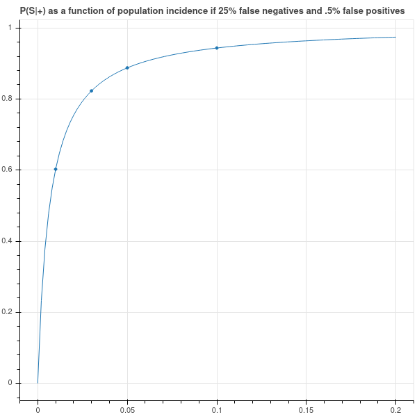
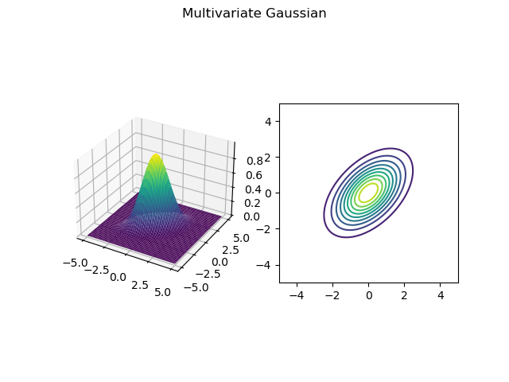
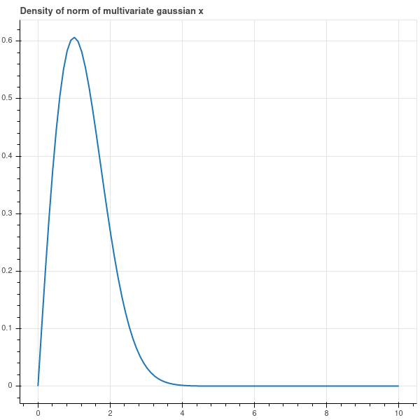
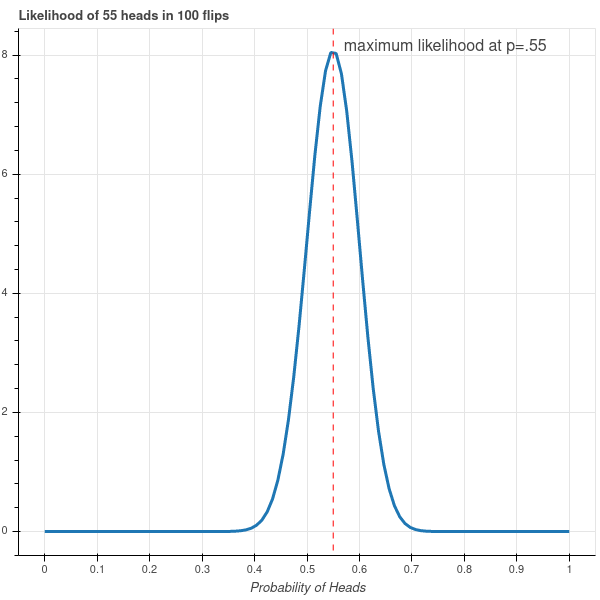
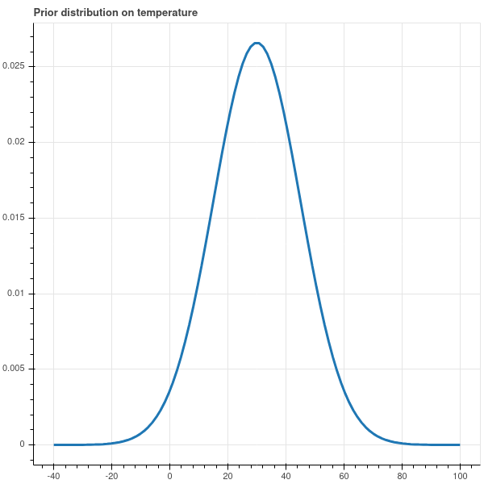
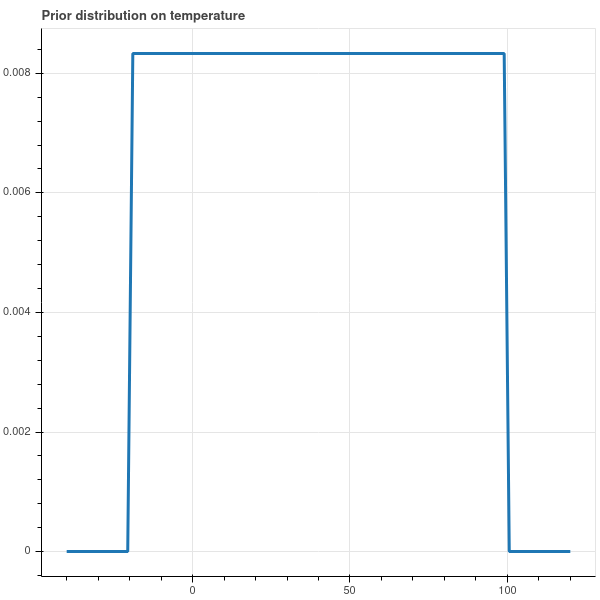
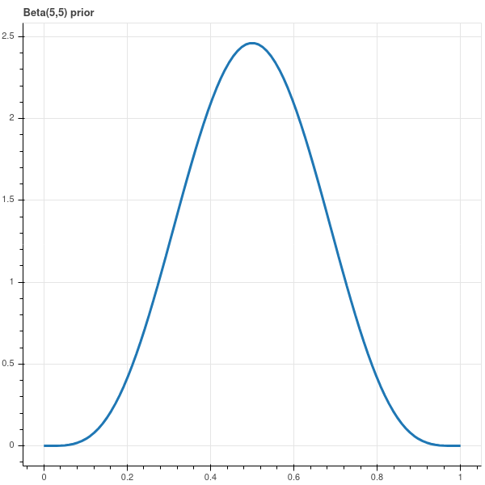

# Probability and Bayes Theorem

## Introduction

Probability theory is one of the three central mathematical tools in machine learning, along with
multivariable calculus and linear algebra.  Tools from probability allow us to manage the uncertainty
inherent in data collected from real world experiments, and to measure the reliability of predictions
that we might make from that data.  In these notes, we will review some of the basic terminology
of probability and introduce Bayesian inference as a technique in machine learning problems.

This will only be a superficial introduction to ideas from probability.  For a thorough treatment,
see [this open-source introduction to probability.](https://probability.oer.math.uconn.edu/3160-oer)
For a  more applied emphasis, I recommend the excellent online course
[Probabilistic Systems Analysis and Applied Probability](https://ocw.mit.edu/courses/electrical-engineering-and-computer-science/6-041-probabilistic-systems-analysis-and-applied-probability-fall-2010/) and its associated
text @Bertsekas.

## Probability Basics

The theory of probability begins with a set $X$ of possible events or outcomes, together with a
"probability" function $P$ on (certain)
subsets of $X$ that measures "how likely" that combination of events is to occur.

The set $X$ can be discrete or continuous. For example,
when flipping a coin, our set of possible events would be the discrete set $\{H,T\}$ corresponding to the
possible events of flipping heads or tails.  When measuring the temperature using a thermometer,
our set of possible outcomes might be the set of real numbers, or perhaps an interval in $\mathbb{R}$.
The thermometer's measurement is random because it
is affected by, say, electronic noise, and so its reading is the true temperature perturbed by a random amount.

The values of $P$ are between $0$, meaning that the event *will not* happen, and $1$, meaning that it is
certain to occur.  As part of our set up, we assume that the total chance of some event from $X$ occurring
is $1$, so that $P(X)=1$; and the chance of "nothing" happening is zero, so $P(\emptyset)=0$.
And if $U\subset X$ is some collection, then $P(U)$ is the chance of an event from $U$ occurring.

The last ingredient of this picture of probability is additivity.  Namely, we assume that
if $U$ and $V$ are subsets of $X$ that are disjoint, then
$$
P(U\cup V)=P(U)+P(V).
$$
Even more generally, we assume that this holds for (countably) infinite collections of disjoint subsets
$U_1,U_2,\ldots$, where
$$
P(U_1\cup U_2\cup\cdots)=\sum_{i=1}^{\infty} P(U_i)
$$

**Definition:** The combination of a set $X$ of possible outcomes and a probability function $P$
on subsets of $X$ that satisfies $P(X)=1$, $0\le P(U)\le 1$ for all $U$, and is additive on
countable disjoint collections of subsets of $X$ is called a (naive) probability space.  $X$ is called
the *sample space* and the subsets of $X$ are called *events*.

**Warning:** The reason for the term "naive" in the above definition is that, if $X$ is an uncountable
set such as the real numbers $\mathbb{R}$, then the conditions in the definition are self-contradictory.
This is a deep and rather surprising fact. To make a sensible definition of a probability space,
one has to restrict the domain of the probability function $P$ to certain subsets of $X$.  These ideas
form the basis of the mathematical subject known as measure theory.  In these notes we will work
with explicit probability functions and simple subsets such as intervals that avoid these technicalities.

### Discrete probability examples

The simplest probability space arises in the analysis of coin-flipping.
As mentioned earlier, the set $X$ contains two elements $\{H,T\}$.  The probability function
$P$ is determined by its value $P(\{H\})=p$,
where $0\le p\le 1$, which is the chance of the coin yielding a "head".  Since $P(X)=1$, we have
$P(\{T\})=1-p$.

Other examples of discrete probability spaces arise from dice-rolling and playing cards.  For
example, suppose we roll two six-sided dice.  There are $36$ possible outcomes from
this experiment, each equally likely.  If instead we consider the sum of the two values on the
dice, our outcomes range from $2$ to $12$ and the probabilities of these outcomes
are given by

|2  |3  |4  |5  |6  |7  |8  |9  |10 |11 |12 |
|---|---|---|---|---|---|---|---|---|---|---|
|1/36|1/18|1/12|1/9|5/36|1/6|5/36|1/9|1/12|1/18|1/36|

A traditional deck of $52$ playing cards contains $4$ aces.  Assuming that the chance
of drawing any card is the same (and is therefore equal to $1/52$), the probability of drawing an ace
is $4/52=1/13$ since
$$
P(\{A_{\clubsuit},A_{\spadesuit},A_{\heartsuit},A_{\diamondsuit}\}) = 4P(\{A_{\clubsuit}\})=4/52=1/13
$$

### Continuous probability examples

When the set $X$ is continuous, such as in the temperature measurement, we measure $P(U)$,
where $U\subset X$, by giving a "probability density function" $f:X\to \mathbb{R}$
and declaring that
$$
P(U) = \int_{U}f(x) dX.
$$
Notice that our function $f(x)$ has to satisfy the condition
$$
P(X)=\int_{X} f(x)dX = 1.
$$

For example, in our temperature measurement example, suppose the "true" outside temperature is $t_0$,
and our thermometer gives a reading $t$. Then a good model for the random error is to assume
that the error $x=t-t_0$ is governed by the density function
$$
f_\sigma(x) = \frac{1}{\sigma\sqrt{2\pi}}e^{-x^2/2\sigma^2}
$$
where $\sigma$ is a parameter.   In a continuous situation such as this one, the probability
of any particular outcome in $X$ is zero since
$$
P(\{t\})=\int_{t}^{t}f_{\sigma}(x)dx = 0
$$
Still, the shape of the density function does tell you where the values are concentrated -- values
where the density function is larger are more likely than those where it is smaller.

With this density function, and x=$t-t_0$, the error in our measurement is given by
$$
P(|t-t_0|<\delta)=\int_{-\delta}^{\delta} \frac{1}{\sigma\sqrt{2\pi}}e^{-x^2/2\sigma^2} dx
$${#eq-normal}

The parameter $\sigma$ (called the *standard deviation*) controls how tightly the thermometer's measurement
is clustered around the true value $t_0$; when $\sigma$ is large, the measurements are scattered widely,
when small, they are clustered tightly.   See @fig-density.

{#fig-density}

## Conditional Probability and Bayes Theorem

The theory of conditional probability gives a way to study how partial information about an event
informs us about the event as a whole.  For example, suppose you draw a card at random from a deck.
As we've seen earlier, the chance that card is an ace is $1/13$.  Now suppose that you learn that
(somehow) that the card is definitely not a jack, king, or queen.  Since there are 12 cards in the
deck that are jacks, kings, or queens, the card you've drawn is one of the remaining 40 cards,
which includes 4 aces.  Thus the chance you are holding an ace is now $4/40=1/10$.  

In terms of notation, if $A$ is the event "my card is an ace" and $B$ is the event "my card is not a jack,
queen, or king" then we say that *the probability of $A$ given $B$* is $1/10$.  The notation
for this is
$$
P(A|B) = 1/10.
$$

More generally, if $A$ and $B$ are events from a sample space $X$, and $P(B)>0$, then
$$
P(A|B) = \frac{P(A\cap B)}{P(B)},
$$
so that $P(A|B)$ measures the chance that $A$ occurs among those situations in which $B$ occurs.

### Bayes Theorem

Bayes theorem is a foundational result in probability.  

**Theorem:** Bayes Theorem says
$$
P(A|B) = \frac{P(B|A)P(A)}{P(B)}.
$$

If we use the definition of conditional probability given above, this is straightforward:
$$
\frac{P(B|A)P(A)}{P(B)} = \frac{P(B\cap A)}{P(B)} = P(A|B).
$$

### An example

To illustrate conditional probability, let's consider what happens when we administer
the most reliable COVID-19 test, the PCR test, to an individual drawn from the population
at large.    There are two possible test results (positive and negative) and two possible
true states of the person being tested (infected and not infected). Suppose I go to the doctor
and get a COVID test which comes back positive.  What is the probability that I actually have
COVID?  

Let's let $S$ and $W$ stand
for infected (sick)  and not infected (well), and let $+/-$ stand for test positive or negative.
Note that there are four possible outcomes of our experiment:

- test positive and infected (S+) -- this is a *true positive*.
- test positive and not infected (W+) -- this is a *false positive*.
- test negative and infected (S-) -- this is a *false negative*.
- test negative and not infected (W-) -- this is a *true negative*.

The [CDC says](https://www.icd10monitor.com/false-positives-in-pcr-tests-for-covid-19) that the chance
of a false positive
-- that is, the percentage of samples from well people that incorrectly yields a positive result
-- is about one-half of one percent, or 5 in 1000.

In other words,
$$
P(+|W) = P(W+)/P(W) = 5/1000=1/200
$$

On the other hand, the CDC tells us that chance of a false negative is 1 in 4, so
$$
P(-|S) = P(S-)/P(S) = .25.
$$
Since $P(S-)+P(S+)=P(S).$ since every test is either positive or negative, we have
$$
P(+|S) = .75.
$$

Suppose furthermore that the overall incidence of COVID-19 in the population is p.  In other
words, $P(S)=p$ so $P(W)=1-p$.  Then
$$P(S+)=P(S)P(+|S)=.75p$$
and
$$
P(W+)=P(W)P(+|W)=.005(1-p).
$$
Putting these together we get $P(+)=.005+.745p$

What I'm interested in is $P(S|+)$ -- the chance that I'm sick, given that my test result was positive.
By Bayes Theorem,
$$
P(S|+)=\frac{P(+|S)P(S)}{P(+)}=.75p/(.005+.745p)=\frac{750p}{5+745p}.
$$

As @fig-covidfn shows, if the population incidence is low then a positive test
is far from conclusive.  Indeed, if the overall incidence of COVID is one percent, then
a positive test result only implies a 60 percent chance that I am in fact infected.

Just to fill out the picture, we have
$$
P(-) = P(S-)+P(W-)=(P(S)-P(S+))+(P(W)-P(W+))
$$
which yields
$$
P(-)=1-.005+.005p-.75p = .995-.745p.
$$
Using Bayes Theorem, we obtain
$$
P(S|-) = \frac{P(-|S)P(S)}{P(-)} = .25p/(.995-.745p) =\frac{250p}{995-745p}.
$$
In this case, even though the false negative rate is pretty high (25 percent) overall,
if the population incidence is one percent, then the probability that you're sick given a negative result
is only about $.25$ percent.  So negative results  are very likely correct!

{#fig-covidfn}

## Independence

Independence is one of the fundamental concepts in probability theory.  Conceptually, two events
are independent if the occurrence of one has does not influence the likelihood of the occurrence of the
other.  For example, successive flips of a coin are independent events, since the result of the second
flip doesn't have anything to do with the result of the first.  On the other hand, whether or not it rains
today and tomorrow are not independent events, since the weather tomorrow depends (in a complicated way)
on the weather today.

We can formalize this idea of independence using the following definition.

**Definition:** Let $X$ be a sample space and let $A$ and $B$ be two events.  Then $A$ and $B$
are *independent* if $P(A\cap B)=P(A)P(B)$.  Equivalently, $A$ and $B$ are independent if
$P(A|B)=P(A)$ and $P(B|A)=P(B)$.  

### Examples

#### Coin Flipping

Suppose our coin has a probability of heads given by a real number $p$ between $0$ and $1$, and we flip
our coin $N$ times.  What is the chance of gettting $k$ heads, where $0\le k\le N$?  Any particular
sequence of heads and tails containing $k$ heads and $N-k$ tails has probability
$$
P(\hbox{a particular sequence of $k$ heads among $N$ flips}) = p^{k}(1-p)^{N-k}.
$$
In addition, there are $\binom{N}{k}$ sequences of heads and tails containing $k$ heads.  Thus
the probability $P(k,N)$ of $k$ heads among $N$ flips is
$$
P(k,N) = \binom{N}{k}p^{k}(1-p)^{N-k}.
$${#eq-binomial}

Notice that the binomial theorem gives us $\sum_{k=0}^{N} P(k,N) =1$ which is a reassuring check on our work.

The probability distribution on the set $X=\{0,1,\ldots,N\}$ given by $P(k,N)$ is called the *binomial distribution*
with parameters $N$ and $p$.

#### A simple 'mixture'

Now let's look at an example of events that are not independent.  Suppose that we have two coins,
with probabilities of heads $p_1$ and $p_2$ respectively; and assume these probabilities
are different.  We play the a game in which we first
choose one of the two coins (with equal chance) and then flip it twice.  Is the result of the
second flip independent of the first? In other words, is $P(HH)=P(H)^2$?

This type of situation is called a 'mixture distribution' because the probability of a head is a "mixture"
of the probability coming from the two different coins.

The chance that the first flip is a head is $(p_1+p_2)/2$ because it's the chance of picking the first
coin, and then getting a head, plus the chance of picking the second, and then getting a head.
The chance of getting two heads in a row is $(p_1^2+p_2^2)/2$ because it's the chance, having picked
the first coin, of getting two heads, plus the chance, having picked the second, of getting two heads.

Since
$$
\frac{p_1^2+p_2^2}{2}\not=\left(\frac{p_1+p_2}{2}\right)^2
$$
we see these events are not independent.

In terms of conditional probabilities, the chance that the second flip is a head, given that
the first flip is, is computed as:
$$
P(HH|H) = \frac{p_1^2+p_2^2}{p_1+p_2}.
$$
From the Cauchy-Schwartz inequality one can show that
$$
\frac{p_1^2+p_2^2}{p_1+p_2}>\frac{p_1+p_2}{2}.
$$

Why should this be?  Why should the chance of getting a head on the second flip go up given that the
first flip was a head? One way to think of this is that the first coin flip contains a little bit of
information about which coin we chose.  If, for example $p_1>p_2$, and our first flip is heads, then
it's just a bit more likely that we chose the first coin.  As a result, the chance of getting another
head is just a bit more likely than if we didn't have that information.  We can make this precise
by considering the conditional probability $P(p=p_1|H)$ that we've chosen the first coin given
that we flipped a head.  From Bayes' theorem:

$$
P(p=p_1|H) = \frac{P(H|p=p_1)P(p=p_1)}{P(H)}=\frac{p_1}{p_1+p_2}=\frac{1}{1+(p_2/p_1)}>\frac{1}{2}
$$
since $(1+(p_2/p_1))<2$.

**Exercise:** Push this argument a bit further.  Let $p_1=\max(p_1,p_2)$
Let $P_N$ be the conditional probability of getting
heads assuming that the first $N$ flips were heads.  Show that $P_N\to p_1$ as $N\to\infty$.
All those heads piling up make it more and more likely that you're flipping the first coin and
so the chance of getting heads approaches $p_1$.

#### An example with a continuous distribution

Suppose that we return to our example of a thermometer which measures the ambient temperature
with an error that is distributed according to the normal distribution, as in @eq-normal.
Suppose that we make 10 independent measurements $t_1,\ldots, t_{10}$ of the true temperature $t_0$.
What can we say about the
distribution of these measurements?

In this case, independence means that
$$
P=P(|t_1-t_0|<\delta,|t_2-t_0|<\delta,\ldots) = P(|t_1-t_0|<\delta)P(|t_2-t_0|<\delta)\cdots P(|t_{10}-t_{0}|<\delta)
$$
and therefore
$$
P = \left(\frac{1}{\sigma\sqrt{2\pi}}\right)^{10}\int_{-\delta}^{\delta}\cdots\int_{-\delta}^{\delta}
e^{-(\sum_{i=1}^{10} x_i^2)/2\sigma^2} dx_1\cdots dx_{10}
$$

One way to look at this is that the vector $\mathbf{e}$ of errors $(|t_1-t_0|,\ldots,|t_{10}-t_0|)$
is distributed according to a *multivariate gaussian distribution*:
$$
P(\mathbf{e}\in U) =\left(\frac{1}{\sigma\sqrt{2\pi}}\right)^{10}\int_{U}
e^{-\|x\|^2/2\sigma^2} d\mathbf{x}
$${#eq-multivariategaussian}

where $U$ is a region in $\mathbf{R}^{10}$.

The multivariate gaussian can also describe situations where independence does not hold.  For simplicity,
let's work in two dimensions and consider the probability density on $\mathbf{R}^{2}$ given by
$$
P(\mathbf{e}\in U) = A\int_{U} e^{-(x_1^2-x_1x_2+x_2^2)/2\sigma^2} d\mathbf{x}.
$$
where the constant $A$ is chosen so that
$$
A\int_{\mathbf{R}^{2}}e^{-(x_1^2-x_1x_2+x_2^2)/2\sigma^2}d\mathbf{x} = 1.
$$

This density function as a "bump" concentrated near the origin in $\mathbf{R}^{2}$, and its level curves
are a family of ellipses centered at the origin.  See @fig-multivariate for a plot of this function
with $\sigma=1$.

{#fig-multivariate}

In this situation we can look at the conditional probability of the first variable given the second,
and see that the two variables are not independent.  Indeed, if we fix  $x_2$, then
the distribution of $x_1$ depends on our choice of $x_2$.  We could see this by a calculation,
or we can just look at the graph: if $x_2=0$, then the most likely values of $x_1$ cluster near zero,
while if $x_2=1$, then the most likely values of $x_1$ cluster somewhere above zero.  

## Random Variables, Mean, and Variance

Typically, when we are studying a random process, we aren't necessarily accessing the underlying events,
but rather we are making measurements that provide us with some information about the underlying events.
For example, suppose our sample space $X$ is the set of throws of a pair of dice, so $X$ contains
the $36$ possible combinations that can arise from the throws.  What we are actually interested is
the sum of the values of the two dice -- that's our "measurement" of this system.  This rather
vague notion of a measurement of a random system is captured by the very general
idea of a *random variable*.

**Definition:** Let $X$ be a sample space with probability function $P$.  A *random variable* on $X$
is a function $f:X\to \mathbb{R}$.

Given a random variable $f$, we can use the probability measure to decide how likely $f$ is to take
a particular value, or values in a particular set by the formula
$$
P(f(x)\in U) = P(f^{-1}(U))
$$

In the dice rolling example, the random variable $S$
that assigns their sum to the pair of values obtained on two dice is a random variable.
Those values lie between $2$ and $12$ and we have
$$
P(S=k) = P(S^{-1}(\{k\}))=P(\{(x,y): x+y=k\})
$$
where $(x,y)$ runs through $\{1,2,\ldots,6\}^{2}$ representing the two values and $P((x,y))=1/36$
since all throws are equally likely.

Let's look at a few more examples, starting with what is probably the most fundamental of all.

**Definition:** Let $X$ be a sample space with two elements, say $H$ and $T$, and suppose that
$P(H)=p$ for some $0\le p\le 1$.  Then the random variable that satisfies $f(H)=1$ and $f(T)=0$
is called a Bernoulli random variable with parameter $p$.

In other words, a Bernoulli random variable gives the value $1$ when a coin flip is heads, and $0$ for tails.

Now let's look at what we earlier called the binomial distribution.

**Definition:** Let $X$ be a sample space consisting of strings of $H$ and $T$ of length $N$,
with the probability of a *particular string* $S$ with $k$ heads and $N-k$ tails given by
$$
P(S)=p^{k}(1-p)^{N-k}
$$
for some $0\le p\le 1$.  In other words, $X$ is the sample space consisting of $N$ independent flips
of a coin with probability of heads given by $p$.  

Let $f:X\to \mathbb{R}$ be the function which counts the number of $H$
in the string.  We can express $f$ in terms of Bernoulli random variables;
indeed,
$$
f=X_1+\ldots+X_N
$$
where each $X_i$ is a Bernoulli random variable with parameter $p$.  

Now
$$
P(f=k) = \binom{N}{k}p^{k}(1-p)^{N-k}
$$
since $f^{-1}(\{k\})$ is the number of elements in
the subset of strings of $H$ and $T$ of length $N$ containing exactly $k$ $H$'s.
This is our old friend the binomial distribution.  So *a binomial distribution is the distribution
of the sum of $N$ independent Bernoulli random variables.*

For an example with a continuous random variable, suppose our sample space is $\mathbf{R}^{2}$
and the probability density is the simple multivariate normal
$$
P(\mathbf{x}\in U) = \left(\frac{1}{\sqrt{2\pi}}\right)^2\int_{U} e^{-\|\mathbf{x}\|^2/2} d\mathbf{x}.
$$
Let $f$ be the random variable $f(\mathbf{x})=\|\mathbf{x}\|$.  The function $f$ measures the Euclidean distance
of a randomly drawn point from the origin.    The set $$U=f^{-1}([0,r))\subseteq\mathbf{R}^{2}$$ is the circle
of radius $r$ in $\mathbf{R}^{2}$.  The probability that a randomly drawn point lies in this circle
is
$$
P(f<r) = \left(\frac{1}{\sqrt{2\pi}}\right)^2\int_{U} e^{-\|\mathbf{x}\|^2/2} d\mathbf{x}.
$$

We can actually evaluate this integral in closed form by using polar coordinates.  We obtain
$$
P(f<r) = \left(\frac{1}{\sqrt{2\pi}}\right)^2\int_{\theta=0}^{2\pi}\int_{\rho=0}^{r} e^{-\rho^2/2}\rho d\rho d\theta.
$$
Since
$$
\frac{d}{d\rho}e^{-\rho^2/2}=-\rho e^{-\rho^2/2}
$$
we have
\begin{align*}
P(f<r)&=-\frac{1}{2\pi}\theta e^{-\rho^2/2}|_{\theta=0}^{2\pi}|_{\rho=0}^{r}\cr
&=1-e^{-r^2/2}\cr
\end{align*}

The probability density associated with this random variable is the derivative of $1-e^{-r^2/2}$
$$
P(f\in [a,b])=\int_{r=a}^{b} re^{-r^2/2} dr
$$
as you can see by the fundamental theorem of calculus.  This density is drawn in @fig-maxwell
where you can see that the points are clustered at a distance of $1$ from the origin.

{#fig-maxwell}

### Independence and Random Variables

We can extend the notion of independence from events to random variables.

**Definition:** Let $f$ and $g$ be two random variables on a sample space $X$ with probability $P$.
Then $f$ and $g$ are independent if, for all intervals $U$ and $V$ in $\mathbb{R}$, the
events $f^{-1}(U)$ and $g^{-1}(V)$ are independent.

For discrete probability distributions, this means that, for all $a,b\in\mathbb{R}$,
$$
P(f=a\hbox{\ and\ }g=b)=P(f=a)P(g=b).
$$

For continous probability distributions given by a density function $P(x)$, independence can
be more complicated to figure out.

### Expectation, Mean and Variance

The most fundamental tool in the study of random variables is the concept of "expectation",
which is a fancy version of average.  The word "mean" is a synonym for expectation -- the mean
of a random variable is the same as its expectation or "expected value."

**Definition:** Let $X$ be a sample space with probability measure $P$.  Let $f:X\to \mathbb{R}$
be a random variable.  Then the *expectation* or *expected value* $E[f]$ of $f$ is
$$
E[f] = \int_X f(x)dP.
$$
More specifically, if $X$ is discrete, then
$$
E[f] = \sum_{x\in X} f(x)P(x)
$$
while if $X$ is continuous with probability density function $p(x)dx$ then
$$
E[f] = \int_{X} f(x)p(x)dx.
$$

If $f$ is a Bernoulli random variable with parameter $p$, then
$$
E[f] = 1\cdot p+0\cdot (1-p) = p
$$

If $f$ is a binomial random variable with parameters $p$ and $N$, then
$$
E[f] = \sum_{i=0}^{N} i\binom{N}{i}p^{i}(1-p)^{N-i}
$$
One can evaluate this using some combinatorial tricks, but it's easier to apply this basic
fact about expectations.

**Proposition:** Expectation is linear: $E[aX+bY]=aE[X]+bE[Y]$ for random variables $X,Y$
and constants $a$ and $b$.

The proof is an easy consequence of the expression of $E$ as a sum (or integral).

Since a binomial random variable $Z$ with parameters $N$ and $p$ is the sum of $N$ Bernoulli random
variables, its expectation is
$$
E[X_1+\cdots+X_N]=Np.
$$

A more sophisticated property of expectation is that it is multiplicative when the random variables
are independent.

**Proposition:** Let $f$ and $g$ be two independent random variables.  Then $E[fg]=E[f]E[g]$.

**Proof:** Let's suppose that the sample space $X$ is discrete.  By definition,
$$
E[f]=\sum_{x\in X}f(x)P(x)
$$
and we can rewrite this as
$$
E[f]=\sum_{a\in\mathbf{R}} aP(\{x: f(x)=a\}).
$$
Let $Z\subset\mathbb{R}$ be the range of $f$.
Then
\begin{align*}
E[fg]&=\sum_{a\in Z} aP(\{x: fg(x)=a\}) \\
&=\sum_{a\in Z}\sum_{(u,v)\in\genfrac{}{}{0pt}{}{\mathbf{Z}^{2}}{uv=a}}aP(\{x:f(x)=u\hbox{\ and\ }g(x)=v\}) \\
&=\sum_{a\in Z}\sum_{\genfrac{}{}{0pt}{}{\mathbf{Z}^{2}}{uv=a}}uvP(\{x:f(x)=u\})P(\{x:g(x)=v\}) \\
&=\sum_{u\in Z}uP(\{x:f(x)=u\})\sum_{v\in Z}vP(\{x:f(x)=v\}) \\
&=E[f]E[g]
\end{align*}

#### Variance

The variance  of a random variable is a measure of its dispersion around its mean.

**Definition:** Let $f$ be a random variable.  Then the variance is the expression
$$
\sigma^2(f) = E[(f-E[f])^2]=E[f^2]-(E[f])^2
$$
The square root of the variance is called the "standard deviation."  

The two formulae for the variance arise from the calculation
$$
E[(f-E[f])^2]=E[(f^2-2fE[f]+E[f]^2)]=E[f^2]-2E[f]^2+E[f]^2=E[f^2]-E[f]^2.
$$

To compute the variance of the Bernoulli random variable $f$ with parameter $p$, we first
compute
$$
E[f^2]=p(1)^2+(1-p)0^2=p.
$$
Since $E[f]=p$, we have
$$
\sigma^2(f)=p-p^2=p(1-p).
$$

If $f$ is the binomial random variable with parameters $N$ and $p$, we can again use the fact
that $f$ is the sum of $N$ Bernoulli random variables $X_1+\cdots+X_n$ and compute

\begin{align*}
E[(\sum_{i}X_i)^2]-E[\sum_{i} X_{i}]^2 &=E[\sum_{i} X_i^2+\sum_{i,j}X_{i}X_{j}]-N^2p^2\\
&=Np+N(N-1)p^2-N^2p^2 \\
&=Np(1-p)
\end{align*}

where we have used the fact that the square $X^2$ of a Bernoulli random variable is equal to $X$.

For a continuous example, suppose that we consider a sample space $\mathbb{R}$ with the normal
probability density
$$
P(x) = \frac{1}{\sigma\sqrt{2\pi}}e^{-x^2/2\sigma^2}dx.
$$

The mean of the random variable $x$ is
$$
E[x] =\frac{1}{\sigma\sqrt{2\pi}}\int_{-\infty}^{\infty} xe^{-x^2/2\sigma^2}dx=0
$$

since the function being integrated is odd.  The variance is

$$
E[x^2] = \frac{1}{\sigma\sqrt{2\pi}}\int_{-\infty}^{\infty} x^2e^{-x^2/2\sigma^2}dx.
$$

The trick to evaluating this integral is to consider the derivative:

$$
\frac{d}{d\sigma}\left[\frac{1}{\sigma\sqrt{2\pi}}\int_{-\infty}^{\infty}e^{-x^2/(2\sigma^2)}dx\right]=0
$$

where the result is zero since the quantity being differentiated is a constant (namely $1$).  Sorting
through the resulting equation leads to the fact that

$$
E[x^2]=\sigma^2
$$

so that the $\sigma^2$ parameter in the normal distribution really *is* the variance of the associated
random variable.

## Models and Likelihood

A *statistical model* is a mathematical model that accounts for data via a process that
incorporates random behavior in a structured way. We have
seen several examples of such models in our discussion so far. For example, the Bernoulli process that
describes the outcome of a series of coin flips as independent choices of heads or tails with probability
$p$ is a simple statistical model; our more complicated mixture model in which we choose
 one of two coins at random and then flip that is a more complicated model.  
Our description of the variation in temperature measurements
as arising from perturbations from the true temperature by a normally distributed amount is
another example of a statistical model, this one involving a continuous random variable.

When we apply a mathematical model to understand data, we often have a variety of parameters
in the model that we must adjust to get the model to best "fit" the observed data.  For example,
suppose that we observe the vibrations of a block attached to a spring.  We know that the motion is
governed by a second order linear differential equation, but the dynamics depend on the mass of the block,
the spring constant, and the damping coefficient.  By measuring the dynamics of the block over time,
we can try to work backwards to figure out these parameters, after which we will be able to predict
the block's motion into the future.

### Maximum Likelihood (Discrete Case){#sec-mlcoin}

To see this process in a statistical setting, let's return to the simple example of a coin flip.
The only parameter in our model is the probability $p$ of getting heads on a particular flip.  Suppose
that we flip the coin $100$ times and get $55$ heads and $45$ tails.  What can we say about $p$?

We will approach this question via the "likelihood" function for our data.  We ask: for a particular
value of the parameter $p$, how likely is this outcome?  From @eq-binomial
we have
$$
P(55H,45T)=\binom{100}{55}p^{55}(1-p)^{45}.
$$

This function is plotted in @fig-beta.  As you can see from that plot, it is extremely unlikely that
we would have gotten $55$ heads if $p$ was smaller than $.4$ or greater than $.7$, while the *most likely*
value of $p$ occurs at the maximum value of this function, and a little calculus tells us that this
point is where $p=.55$. This *most likely* value of $p$ is called the *maximum likelihood estimate*
for the parameter $p$.

{#fig-beta}

### Maximum Likelihood (Continuous Case)

Now let's look at our temperature measurements where the error is normally distributed with variance
parameter $\sigma^2$. As we have seen earlier, the probability density of errors $\mathbf{x}=(x_1,\ldots,x_n)$
of $n$ independent measurements is
$$
P(\mathbf{x}) = \left(\frac{1}{\sigma\sqrt{2\pi}}\right)^{n}e^{-\|\mathbf{x}\|^2/(2\sigma^2)}d\mathbf{x}.
$$
(see @eq-multivariategaussian).
What should we use as the parameter $\sigma$?  We can ask which choice of $\sigma$ makes
our data *most likely*.  To calculate this, we think of the probability of a function of $\sigma$
and use Calculus to find the maximum.  It's easier to do this with the logarithm.

$$
\log P(\mathbf{x})=\frac{-\|\mathbf{x}\|^2}{2\sigma^2}-n\log{\sigma}+C
$$
where $C$ is a constant that we'll ignore.  Taking the derivative and setting it to zero, we obtain
$$
-\|\mathbf{x}\|^2\sigma^{-3}-n\sigma^{-1}=0
$$
which gives the formula
$$
\sigma^2=\frac{\|\mathbf{x}\|^2}{n}
$$

This should look familiar! The maximum likelihood estimate of the variance
is the  *mean-squared-error*.

### Linear Regression and likelihood {#sec-LRLike}

In our earlier lectures we discussed linear regression at length.  Our introduction of ideas
from probability give us new insight into this fundamental tool.  Consider a statistical model
in which certain measured values $y$ depend linearly on $x$ up to a normally distributed error:
$$
y=mx+b+\epsilon
$$
where $\epsilon$ is drawn from the normal distribution with variance $\sigma^2$.  

The classic regression setting has us measuring a collection of $N$ points $(x_i,y_i)$ and then
asking for the "best" $m$, $b$, and $\sigma^2$ to explain these measurements.  Using the
likelihood perspective, each value $y_i-mx_i-b$ is an independent draw from the normal distribution
with variance $\sigma^2$, exactly like our temperature measurements in the one variable case.

The likelihood (density) of those draws is therefore
$$
P = \left(\frac{1}{\sigma\sqrt{2\pi}}\right)^Ne^{-\sum_{i}(y_i-mx_i-b)^2/(2\sigma^2)}.
$$
What is the maximum likelihood estimate of the parameters $m$, $b$, and $\sigma^2$?

To find this we look at the logarithm of $P$ and take derivatives.
$$
\log(P) = -N\log(\sigma) -\frac{1}{2\sigma^2}\sum_{i}(y_i-mx_i-b)^2.
$$

As far as $m$ and $b$ are concerned, the minimum comes from the derivatives with respect to $m$ and $b$
of
$$
\sum_{i}(y_i-mx_i-b)^2.
$$
In other words, the maximum likelihood estimate $m_*$ and $b_*$ for $m$ and $b$ are *exactly the ordinary least squares estimates.*

As far as $\sigma^2$ is concerned, we find just as above that the maximum likelihood estimate $\sigma^2_*$ is
the mean squared error
$$
\sigma^2_*=\frac{1}{N}\sum_{i}(y_i-m_*x_i-b_*)^2.
$$

The multivariate case of regression proposes a model of the form
$$
Y=X\beta+\epsilon
$$
and a similar calculation again shows that the least squares estimates for $\beta$ are the maximum
likelihood values for this model.

## Bayesian Inference

We conclude our review of ideas from probability by examining the Bayesian perspective on data.

Suppose that we wish to conduct an experiment to determine the temperature outside our house.
We begin our experiment with a statistical model that is supposed to explain the variability in the
results.  The model depends on some parameters that we wish to estimate.  For example,
the parameters of our experiment might be the 'true'  temperature $t_*$ and the variance
$\sigma^2$ of the error.

From the Bayesian point of view, at the beginning of this experiment we have an initial
sense of what the temperature is likely to be, expressed in the form of a probability distribution.
This initial information is called the *prior* distribution.

For example, if we know that it's December in Connecticut, our prior distribution might say that the
temperature is more likely to be between 20 and 40 degrees Fahrenheit and is quite unlikely to be higher than
60 or lower than 0.  So our prior distribution might look like @fig-tempprior.

{#fig-tempprior}

If we really have no opinion about the temperature other than its between say, $-20$ and $100$ degrees,
our prior distribution might be uniform over that range, as in @fig-uniformprior.

{#fig-uniformprior}

The choice of a prior will guide the interpretation of our experiments in ways that we will see shortly.

The next step in our experiment is the collection of data.  Suppose we let
$\mathbf{t}=(t_1,t_2,\ldots, t_n)$ be a random variable representing $n$ independent measurements
of the temperature.  We consider the *joint distribution*
of the parameters $t_*$ and $\sigma^2$ and the possible measurements $\mathbf{t}$:
$$
P(\mathbf{t},t_*,\sigma^2)=\left(\frac{1}{\sigma\sqrt{2\pi}}\right)^{n}e^{-\|\mathbf{t}-t_*\mathbf{e}\|^2/(2\sigma^2)}
$$
where $\mathbf{e}=(1,1,\ldots, 1)$.  

The conditional probability $P(t_{*},\sigma^2|\mathbf{t})$ is the distribution of the values of $t_*$ and
$\sigma^2$*given*a value of the $\mathbf{t}$.  This is what we hope to learn by our experiment -- namely,
if we make a particular measurement, what does it tell us about $t_*$ and $\sigma^2$?

Now suppose that we actually make some measurements, and so we obtain a specific set of values $\mathbf{t}_0$
for $\mathbf{t}$.

By Bayes Theorem,
$$
P(t_{*},\sigma^2|\mathbf{t}=\mathbf{t}_0) = \frac{P(\mathbf{t}=\mathbf{t}_0|t_{*},\sigma^2)P(t_{*},\sigma^2)}{P(\mathbf{t}=\mathbf{t}_0)}
$$
We interpret this as follows:

- the left hand side $P(t_{*},\sigma^2|\mathbf{t}=\mathbf{t}_0)$ is called the *posterior distribution* and is
the distribution of $t_{*}$ and $\sigma^2$ obtained by *updating our prior knowledge with the results of our experiment.*
- The probability $P(\mathbf{t}=\mathbf{t}_{0}|t_{*},\sigma^2)$ is the probability of obtaining the
measurements we found for a particular value of the parameters $t_{*}$ and $\sigma^2$.
- The probability $P(t_{*},\sigma^2)$ is the *prior distribution* on the parameters that reflects our
initial impression of the distribution of these parameters.
- The denominator $P(\mathbf{t}=\mathbf{t}_{0})$ is the total probability of the results that we obtained,
and is the integral over the distribution of the parameters weighted by their prior probability:
$$
P(\mathbf{t}=\mathbf{t}_{0})=\int_{t_{*},\sigma^2}P(\mathbf{t}=\mathbf{t}_{0}|t_{*},\sigma^2)P(t_{*},\sigma^2)
$$

### Bayesian experiments with the normal distribution

To illustrate these Bayesian ideas, we'll consider the problem of measuring the temperature, but for simplicity
let's assume that we fix the variance in our error measurements at $1$ degree.  Let's use
the prior distribution on the true temperature that I proposed in @fig-tempprior, which is a normal
distribution with variance $15$ "shifted" to be centered at $30$:
$$
P(t_*)=\left(\frac{1}{\sqrt{2\pi}}\right)e^{-(t_*-30)^2/30}.
$$
The expected value $E[t]$ -- the mean of the this distribution -- is $30$.

Since the error in our measurements is normally distributed with variance $1$, we have
$$
P(t-t_{*})=\left(\frac{1}{\sqrt{2\pi}}\right)e^{-(t-t_{*})^2/2}
$$
or as a function of the absolute temperature, we have
$$
P(t,t_{*}) = \left(\frac{1}{\sqrt{2\pi}}\right)e^{-(t-t_*)^2/2}.
$$

Now we make a bunch of measurements to obtain $\mathbf{t}_0=(t_1,\ldots, t_n)$. We have
$$
P(\mathbf{t}=\mathbf{t}_0|t_{*}) = \left(\frac{1}{\sqrt{2\pi}}\right)^ne^{-\|\mathbf{t}-t_*\mathbf{e}\|^2/2}.
$$

The total probability $T=P(\mathbf{t}=\mathbf{t_0})$ is hard to calculate, so let's table that for a while.
The posterior probability is
$$
P(t_{*}|\mathbf{t}=\mathbf{t}_{0}) = \frac{1}{T}
\left(\frac{1}{\sqrt{2\pi}}\right)^ne^{-\|\mathbf{t}-t_*\mathbf{e}\|^2/2}
\left(\frac{1}{\sqrt{2\pi}}\right)e^{-(t_*-30)^2/30}.
$$

Leaving aside the multiplicative constants for the moment, consider the exponential
$$
e^{-(\|\mathbf{t}-t_{*}\mathbf{e}\|^2/2+(t_{*}-30)^2)/30}.
$$
Since $\mathbf{t}$ is a vector of constants -- it is a vector of our particular measurements --
the exponent
$$
\|\mathbf{t}-t_{*}\mathbf{e}\|^2/2+(t_{*}-30)^2/30 = (t_{*}-30)^2/30+\sum_{i} (t_{i}-t_{*})^2/2
$$
is a quadratic polynomial in $t_{*}$ that simplifies:
$$
(t_{*}-30)^2/30+\sum_{i} (t_{i}-t_{*})^2/2 = At_{*}^2+Bt_{*}+C.
$$
Here
$$
A=(\frac{1}{30}+\frac{n}{2}),
$$
$$
B=-2-\sum_{i} t_{i}
$$
$$
C=30+\frac{1}{2}\sum_{i} t_{i}^2.
$$

We can complete the square to write
$$
At_{*}^2+Bt_{*}+C = (t_{*}-U)^2/2V +K
$$
where
$$
U=\frac{2+\sum_{i}t_{i}}{\frac{1}{15}+n}
$$
and
$$
V=\frac{1}{\frac{1}{15}+n}.
$$
So up to constants that don't involve $t_{*}$, the posterior density is
of the form
$$
e^{(t_{*}-U)^2/2V}
$$
and since it is a probability density, the constants must work out to give total integral of $1$.
Therefore the posterior density is a normal distribution centered at $U$ and with variance $V$.
Here $U$ is called the*posterior mean*and $V$ the*posterior variance*.

To make this explicit, suppose $n=5$ and we measured the following temperatures:
$$
40, 41,39, 37, 44
$$
The mean of these observations is $40.2$ and the variance is $5.4$.

A calculation shows that the posterior mean is $40.1$ and the posterior variance is
$0.2$.  Comparing the prior with the posterior, we obtain the plot in @fig-comparison.
The posterior has a sharp peak at $40.1$ degrees.  This value is just a bit
smaller than the
mean of the observed temperatures which is $40.2$ degrees.  This difference is caused by the prior --
our prior distribution said the temperature was likely to be around $30$ degrees, and so the prior pulls
the observed mean a bit towards the prior mean taking into account past experience.  Because the
variance of the prior is large, it has a relatively small influence on the posterior.

The general version of the calculation above is summarized in this proposition.

**Proposition:** Suppose that our statistical model for an experiment proposes that
the measurements are normally distributed around an (unknown)  mean value of $\mu$ with a (fixed)
variance $\sigma^2$.  Suppose further that our prior distribution on the unknown mean $\mu$
is normal with mean $\mu_0$ and variance $\tau^2$.  Suppose we make measurements
$$
y_1,\ldots, y_n
$$
with mean $\overline{y}$.  Then the posterior distribution of $\mu$ is again normal,
with posterior variance
$$
\tau'^2 = \frac{1}{\frac{1}{\tau^2}+\frac{n}{\sigma^2}}
$$
and posterior mean
$$
\mu' = \frac{\frac{\mu_0}{\tau^2}+\frac{n}{\sigma^2}\overline{y}}{\frac{1}{\frac{1}{\tau^2}+\frac{n}{\sigma^2}}}
$$

So the posterior mean is a sort of weighted average of the sample mean and the prior mean; and as $n\to\infty$,
the posterior mean approaches the sample mean -- in other words, as you get more data, the prior has
less and less influence on the results of the experiment.

{#fig-comparison}

### Bayesian coin flipping

For our final example in this fast overview of ideas from probability, we consider the problem of deciding
whether a coin is fair.  Our experiment consists of $N$ flips of  a coin with unknown probability $p$ of heads,
so the data consists of the number $h$ of heads out of the $N$ flips.  To apply Bayesian reasoning,
we need a prior distribution on $p$.  Let's first assume that we have no reason to prefer one value of $p$
over another, and so we choose for our prior the uniform distribution on $p$ between $0$ and $1$.

We wish to analyze $P(p|h)$, the probability distribution of $p$ given $h$ heads out of $N$ flips.
Bayes Theorem gives us:
$$
P(p|h) = \frac{P(h|p)P(p)}{P(h)}
$$
where
$$
P(h|p) = \binom{N}{h}p^{h}(1-p)^{N-h}
$$
and
$$
P(h)=\int_{p=0}^{1} P(h|p)P(p) dp = \binom{N}{h}\int_{p=0}^{1} p^{h}(1-p)^{N-h}dp
$$
is a constant which insures that $$\int_{p}P(p|h)dp=1.$$

We see that the posterior distribution $P(p|h)$ is proportional to the polynomial function
$$
P(p|h)\propto p^{h}(1-p)^{N-h}.
$$
As in @sec-mlcoin, we see that this function peaks at $h/N$.  This is called the maximum *a posteriori estimate*
for $p$.  

Another way to summarize the posterior distribution $P(p|h)$ is to look at the expected value of $p$.
This is called the *posterior mean* of $p$.  To compute it, we need to know the normalization
constant in the expression for $P(p|h)$, and for that we can take advantage of the properties of a special
function $B(a,b)$ called the Beta-function:
$$
B(a,b) = \int_{p=0}^{1} p^{a-1}(1-p)^{b-1} dp.
$$

**Proposition:** If $a$ and $b$ are integers, then $B(a,b)=\frac{a+b}{ab}\frac{1}{\binom{a+b}{a}}$.

**Proof:**   Using integration by parts, one can show that
$$
B(a,b)=\frac{a-1}{b}B(a-1,b+1)
$$
and a simple calculation shows that
$$
B(1,b) = \frac{1}{b}.
$$
Let
$$
H(a,b)=\frac{a+b}{ab}\frac{1}{\binom{a+b}{a}} = \frac{(a-1)!(b-1)!}{(a+b-1)!}
$$
Then it's easy to check that $H$ satsifies the same recurrences as $B(a,b)$, and that
$H(1,b)=1/b$.  So the two functions agree by induction.

Using this Proposition, we see that
$$
P(p|h) = \frac{p^{h}(1-p)^{N-h}}{B(h+1,N-h+1)}
$$
and
$$
E[p] = \frac{\int_{p=0}^{1} p^{h+1}(1-p)^{N-h}dp}{B(h+1,N-h+1)}=\frac{B(h+2,N-h+1)}{B(h+1,N-h+1)}.
$$
Sorting through this using the formula for $B(a,b)$ we obtain
$$
E[p]=\frac{h+1}{N+2}.
$$

So if we obtained $55$ heads  out of $100$ flips, the maximum a posteriori estimate for $p$ is $.55$,
while the posterior mean is $56/102=.549$ -- just a bit less.

Now suppose that we had some reason to believe that our coin was fair.  Then we can choose a prior
probability distribution that expresses this.  For example, we can choose
$$
P(p) = \frac{1}{B(5,5)}p^{4}(1-p)^{4}.
$$
Here we use the Beta function to guarantee that $\int_{0}^{1}P(p)dp=1$.  We show this prior distribution
in @fig-betaprior.  

{#fig-betaprior}

If we redo our Bayes theorem calculation, we find that our posterior distribution is
$$
P(p|h) \propto p^{h+4}(1-p)^{N-h+4}
$$
and relying again on the Beta function for normalization we have
$$
P(p|h) = \frac{1}{B(h+5,N-h+5)}p^{h+4}(1-p)^{N-h+4}
$$
Here the maximum a posterior estimate for $p$ is $h+4/N+8$ while our posterior mean is
$$
\frac{B(h+6,N-h+5)}{B(h+5,N-h+5)} = \frac{h+5}{N+10}.
$$

In the situation of $55$ heads out of $100$, the maximum a posteriori estimate is $.546$ and
the posterior mean is $.545$.  These numbers have been pulled just a bit towards $.5$ because our
prior knowledge makes us a little bit biased towards $p=.5$.

### Bayesian Regression (or Ridge Regression)

In this chapter we return to our discussion of linear regression and introduce some Bayesian ideas.
The combination will lead us to the notion of "ridge" regression, which is a type of linear regression that
includes a prior distribution on the coefficients that indicates our preference for smaller rather than larger
coefficients. Introduction of this prior leads to a form of linear regression that is more resilient in situations
where the independent variables are less independent than we would hope.

Before introducing these Bayesian ideas, let us recall from @sec-LRLike that ordinary least squares yields the
parameters that give the "most likely" set of parameters for a model of the form
$$
Y=XM + \epsilon
$$
where the error $\epsilon$ is normally distributed with mean $0$ and variance $\sigma^2$, and the mean squared error becomes the maximum likelihood estimate of the variance $\sigma^2$.

To put this into a Bayesian perspective, we notice that the linear regression model views $Y-XM$
as normally distributed given $M$.  That is, we see the probability $P(Y-XM|M)$ as normal with variance
$\sigma^2$.  

Then we introduce a prior distribution on the coefficients $M$, assuming that they, too, are normally
distributed around zero with variance $\tau^2$.  This means that *ab initio* we think that the coefficients
are likely to be small.

From Bayes Theorem, we then have
$$
P(M|Y,X) = \frac{P(Y,X|M)P(M)}{P(Y,X)}
$$
and in distribution terms we have
$$
P(M|Y,X) = Ae^{\|Y-XM\|^2/\sigma^2}e^{-\|M\|^2/\tau^{2}}
$$
where $A$ is a normalizing constant.

The first thing to note from this expression is that the posterior distribution for the $M$ parameters for regression are 
themselves normally distributed. 

The maximum likelihood estimate $M_{r}$ for the parameters $M$ occurs when $P(M|Y,X)$ is maximum,
which we find by taking the derivatives.  Using the matrix algebra developed in our linear regression
chapter, we obtain the equation
$$
(X^{\intercal}Y-(X^{\intercal}X)M_r)/\sigma^2-M_r/\tau^{2}=0
$$
or
$$
(X^{\intercal}X+s)M_r=X^{\intercal}Y
$${#eq-ridgeformula}
where $s=\sigma^2/\tau^2$.

Therefore the ridge coefficients are given by the equation
$$
M_{r}=(X^{\intercal}X+s)^{-1}X^{\intercal}Y
$${#eq-ridgecoeffs}

#### Practical aspects of ridge regression

Using ridge regression leads to a solution to the least squares problem in which the regression coefficients
are biased towards being smaller.  Beyond this, there are a number of implications of the technique which
affect its use in practice.

First, we can put the Bayesian derivation of the ridge regression formulae in the background and focus our attention
on @eq-ridgecoeffs.  We can treat the  parameter $s$ (which must be non-negative) as "adjustable".  

One important consideration when using ridge regression is that @eq-ridgecoeffs is not invariant if we scale $X$ and $Y$ by a constant.  This is different from "plain"
regression where we consider the equation $Y=XM$.  In that case, rescaling $X$ and $Y$ by the same factor leaves the coefficients $M$ alone.  For this reason, ridge regression
is typically used on centered, standardized coordinates.  In other words, we replace each feature $x_i$ by $(x_i-\mu_i)/\sigma_i$ where $\mu_i$ and $\sigma_i$ are the sample mean and standard
deviation of the $i^{th}$ feature, and we replace our response variables $y_i$ similarly by $(y-\mu)/\sigma$ where $\mu$ and $\sigma$ are the mean and standard deviation of the $y$-values.
Then we find $M$ using @eq-ridgecoeffs, perhaps experimenting with different values of $s$, using our centered and standardized variables. 

To emphasize that we are using centered coordinates, we write $X_{0}$ for our data matrix instead
of $X$. Recall that the matrix $X_0^{\intercal}X_0$
that enters into @eq-ridgeformula is $ND_{0}$ where $D_{0}$ is the covariance matrix. Therefore in ridge regression we have replaced $ND_0$ by $ND_0+s$.
Since $D_0$ is a real symmetric matrix, as we've seen in Chapter 2 it is diagonalizable so that $AD_0A^{-1}$ is diagonal for
an orthogonal matrix $A$ and has eigenvalues $\lambda_1\ge \ldots\ge \lambda_k$ which are the variances of the data
along the principal directions.

One effect of using ridge regression is that the eigenvalues of $ND_{0}+s$ are always at least
$s>0$, so the use of ridge regression avoids the possibility that $D_{0}$ might not be invertible. 
In fact, a bit more is true.  Numerical analysis tells us that when considering the problem
of computing the inverse of  a matrix, we should look at its
*condition number*, which is the ratio $\lambda_1/\lambda_k$ of the largest to the smallest eigenvalue.

If the condition number of a matrix  is large, then results from numerical analysis show that it is *almost singular* and its inverse becomes very sensitive
to small changes in the entries of the matrix.  However, the eigenvalues of $ND_0+s$ are $N\lambda_{i}+s$ and so the condition number becomes $(N\lambda_1+s)/(N\lambda_k+s)$.
For larger values of $\lambda$, this condition number shrinks, and so the inverse of the matrix $ND_0+s$ becomes better behaved
than $ND_{0}$.  In this way, ridge regression helps to improve the numerical stability of the linear regression algorithm.

A second way to look at Ridge regression is to go back to the discussion of the singular value decomposition of the matrix $X_{0}$ in section @sec-svd.  There we showed that the SVD of
$X_{0}$ yields an expression
$$
X_{0}=U\tilde{\Lambda}P^{\intercal}
$$
where $U$ and $P$ are orthogonal matrices and $\Lambda$ is an $N\times k$ matrix whose upper block
is diagonal with eigenvalues $\sqrt{N\lambda_{i}}$.  The rows of $U$ gave us an orthonormal basis
that allowed us to write the predicted vector $\hat{Y}$ as a projection:
$$
\hat{Y}=\sum_{i=1}^{k} (u_j\cdot Y)u_{j}^{\intercal}.
$$

If we repeat this calculation, but using the ridge regression formula, we obtain
$$
\hat{Y}_{r}=X_{0}M_r = U\tilde{\Lambda}P^{\intercal}(P\tilde{\Lambda}^{\intercal}U^{\intercal}U\tilde{\Lambda}P^{\intercal}+s)^{-1}P\tilde{\Lambda}^{\intercal}U^{\intercal}Y.
$$
Since $P$ is orthogonal, $P^{\intercal}=P^{-1}$, so
$$
P^{\intercal}(P\tilde{\Lambda}^2P^{\intercal}+s)^{-1}P=P^{-1}(P(\Lambda+s)P^{-1})P=(\Lambda+s)^{-1}
$$
and $\Lambda+s$ is a $k\times k$ diagonal matrix with entries $N\lambda_{i}+s$.

Putting the pieces together we see that
$$
\hat{Y}_{r}=U\tilde{\Lambda}(\Lambda+s)^{-1}\tilde{\Lambda}U^{\intercal}Y.
$$

In the language of orthogonal projection, this means that
$$
\hat{Y}_{r} = \sum_{i=1}^{k} \frac{N\lambda_{i}}{N\lambda_{i}+s}(u_j\cdot Y)u_{j}^{\intercal}.
$$

In other words, the predicted value computed by ridge regression is obtained by projecting
$Y$ into the space spanned by the feature vectors, but weighting the different principal components 
by $N\lambda_{i}/(N\lambda_{i}+s)$.  With this weighting, the  principal components with smaller variances are weighted less than those with larger variances.  For this reason,
ridge regression is sometimes called a *shrinkage* method.

