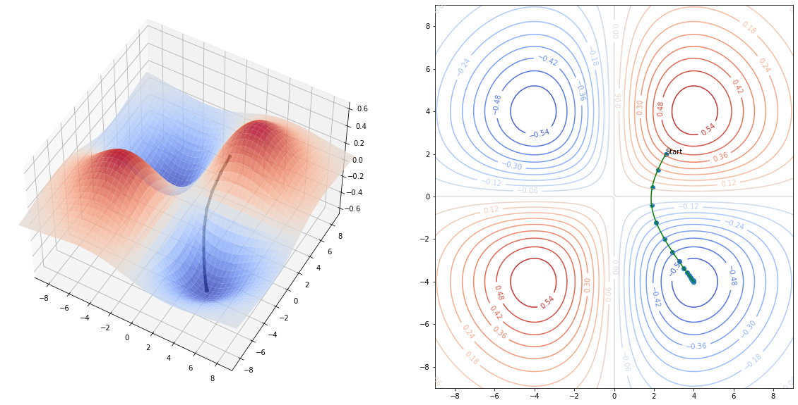

# Gradient Descent {#sec-gradient_descent}

Suppose that we have a function $f(x_0,\ldots, x_{k-1})$ and we wish to find its minimum value.  To apply gradient descent, we choose an initial starting point $c=(c_0,\ldots, c_{k-1})$
and we iteratively adjust the values of $c$ so that the values $f(c)$ decrease.  When we can no longer do that, we've found what is at least a local minimum of $f$.

How should we make these adjustments?  Let us remember the idea of the *directional derivative* from multivariate calculus.  The directional derivative $D_{v}f$ measures the rate of change of $f$ as one moves
with velocity vector $v$ from the point $x$ and it is defined as
$$
D_{v}f(x) = \frac{d}{dt}f(x+tv)|_{t=0}
$$
From the chain rule, we can compute that
$$
D_{v}f(x) = \sum_{i=0}^{k-1} \frac{\partial f}{\partial x_{i}}\frac{dx_{i}}{dt} = (\nabla f)\cdot v
$$
where
$$
\nabla f = \left[\frac{\partial f}{\partial x_{i}}\right]_{i=0}^{k-1}
$$
is the gradient of $f$.  This argument yields the following result.

**Proposition:** Let $f(x_0,\ldots, x_{k-1})$ be a smooth function from $\mathbb{R}^{k}\to\mathbb{R}$.
Then for every point $c=(c_0,\ldots, c_{k-1})$, if $\nabla f\not=0$ then $\nabla f$ is a vector pointing in 
the direction in which $f$ increases most rapidly, and $-\nabla f$ is a vector pointing
in the direction in which $f$ decreases most rapidly.  If $\nabla f = 0$, then $c$ is a critical
point of $f$. 

**Proof:** The directional derivative $D_{v}(f)=(\nabla f)\cdot v$ measures the rate of change of $f$ if we
travel with velocity $v$ from a point $x$.  To remove the dependence on the magnitude of $v$ (since obviously
$f$ will change more quickly if we travel more quickly in a given direction), we scale $v$ to be a unit vector. Then the dot product giving the rate is maximized when $v$ is parallel to $\nabla f$.

This observation about the gradient yields the algorithm for gradient descent.  

**Gradient Descent Algorithm:** Given a function $f:\mathbb{R}^{k}\to \mathbb{R}$, choose a point
$c^{(0)}$, a small constant $\nu$ (called the *learning rate*) and a small constant $\epsilon$ (the *tolerance*).  Then iteratively compute
$$
c^{(n+1)}=c^{(n)} -\nu\nabla f(c^{(n)})
$$
until $|c^{(n+1)}-c^{(n)}|<\epsilon$.  Then $c^{(n+1)}$ is an (approximate) critical point of $f$.

{#fig-graddescentillust width=50%}

The behavior of gradient descent is illustrated in @fig-graddescentillust  for the function
$$
f(x,y) = \frac{xy}{\sigma\sqrt{2\pi}}e^{(-x^2-y^2)/2\sigma^2}
$$
where $\sigma=4$. This function has two "upward" humps and two "downward" humps.  Starting on the inside
slope of one of the upward humps, gradient descent finds the bottom of an adjacent "downward" hump.

To get a little more perspective on gradient descent, consider the one-dimensional case, with $f(x)=4x^3-6x^2$.  This is a cubic polynomial whose graph has a local maximum and a local minimum, depicted in @fig-graddescentcubic.

{#fig-graddescentcubic width=50%}

In this case the gradient is just the derivative $f'(x)=12x^2-12x$ and the iteration is
$$
c^{(n+1)} = c^{(n)}-12\nu((c^{(n)})^2-c^{(n)}).
$$

Even from this simple example we can see the power and also the pitfalls of this method.  Suppose we choose
$x_0=2$, $\nu=.01$, and $\epsilon=.001$.  Then the iteration yields:

| Step | 0 | 1 | 2 | 3 | 4 | 5 | 6 | 
|---|---|---|---|---|---|---|---|
|x|2.0| 0.8       | 0.896     | 0.952 | 0.979|  0.991| 0.997|

: Gradient Descent Iterations {#tbl-graddescentiters}

As you can see, the points move quickly to the (local) minimum at $x=1$.    

There are two ways (at least) that things can go wrong, however.  First suppose we use $x_0=-1$, instead
of $x_0=2$, as our first guess.  Then we are on the downslope on the left side of the graph, and following
the gradient quickly takes us off to $-\infty$.

| Step | 0 | 1 | 2 | 3 | 4 | 5 |
|---|---|---|---|---|---|---|
|x| -1.00 |-2.20| -6.42| -35.04| -792.70| -378296.27 |

: Gradient Descent Iterations (first failure mode) {#tbl-graddescentfailone}

Second, suppose we choose $x_0=2$, but choose a somewhat larger learning rate -- say, $\nu=.1$.
In this case, initially things look good, but the addition of the gradient causes an overshoot
which once again takes us over the hump at $x=0$ and off to $-\infty$ heading to the left.

| Step | 0 | 1 | 2 | 3 | 4 | 5 |6|
|---|---|---|---|---|---|---|---|
|x|2.00|-0.11|-0.24|-0.56|-1.49|-5.42|-42.23|

: Gradient Descent Iterations (second failure mode) {#tbl-graddescentfailetwo}

Based on these considerations, we see that, for general functions, 
 *if gradient descent converges,* then it will converge
to a local minimum of the function.  But *it may not converge,* and even if it does, we can't conclude
anything about whether we've reached a *global* minimum.  
