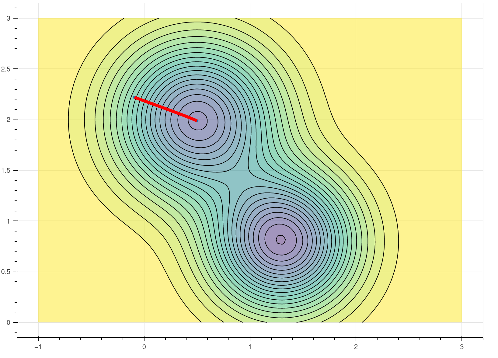
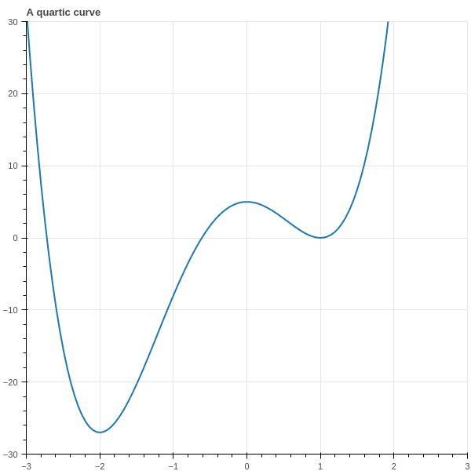
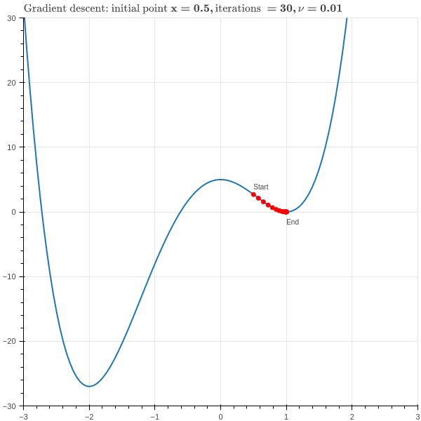

# Gradient Descent {#sec-gradient_descent}

## Introduction

A common mathematical theme throughout machine learning is the problem of finding the minimum or maximum value of a function.  For example, in linear regression, we find the "best-fitting" linear function by identifying the parameters that minimize the mean squared error.  In principal component analysis,
we try to identify the scores which have the greatest variation for the given set of data, and for
this we needed to maximize a function using Lagrange multipliers.  In later lectures, we will see many more examples where we construct the "best" function for a particular task by minimizing some kind of error between our constructed function and the true observed values. 

In our discussion of PCA and linear regression, we were able to give analytic formulae for the solution to our problems.  These solutions involved (in the case of linear regression) inverting a matrix,
and in the case of PCA, finding eigenvalues and eigenvectors.  These are elegant mathematical results,
but at that time we begged the question of how to actually *compute* these quantities of interest in an
efficient way.  In this section, we will discuss the technique known as gradient descent, which is perhaps the simplest approach to minimizing a function using calculus, and which is at the foundation of many practical machine learning algorithms.

## The Key Idea

Suppose that we have a function $f(x_0,\ldots, x_{k-1})$ and we wish to find its minimum value.  In Calculus classes, we are taught to take the derivates of the function and set them equal to zero, but for anything other than the simplest functions this problem is not solvable in practice.  In real life,
we use iterative methods to find the minimum of the function $f$.

The main tool in this approach is a fact from multivariate calculus.  

**Proposition:** Let $f(x_0,\ldots, x_{k-1})$ be a function and let $\nabla f$ be its gradient.
Then at each point $x$ in $\R^{k}$, the gradient $(\nabla f)(x)$ is a vector that points in
the direction in which $f$ is increasing most rapidly from $x$ and $(-\nabla f)(x)$ points
is a critical point of $f$. 

This fact arises from thinking about the *directional derivative* of a function.  
The directional derivative $D_{v}f$ measures the rate of change of $f$ as one moves
with velocity vector $v$ from the point $x$ and it is defined as
$$
D_{v}f(x) = \frac{d}{dt}f(x+tv)|_{t=0}
$$
From the chain rule, we can compute that
$$
D_{v}f(x) = \sum_{i=0}^{k-1} \frac{\partial f}{\partial x_{i}}\frac{dx_{i}}{dt} = (\nabla f)\cdot v
$$
where
$$
\nabla f = \left[\frac{\partial f}{\partial x_{i}}\right]_{i=0}^{k-1}
$$
is the gradient of $f$. 

The directional derivative $D_{v}(f)=(\nabla f)\cdot v$ measures the rate of change of $f$ if we
travel with velocity $v$ from a point $x$.  To remove the dependence on the magnitude of $v$ (since obviously
$f$ will change more quickly if we travel more quickly in a given direction), we scale $v$ to be a unit vector. Then, since
$$
\nabla f\cdot v=\|\nabla f\|\|v\|\cos\theta=\|\nabla f\|\cos \theta
$$
where $\theta$ is the angle between $v$ and $\nabla f$,  the dot product giving the rate is maximized when $v$ is parallel to $\nabla f$.  If $v$ is opposite to $\nabla f$, the dot product is minimized. 

## The Algorithm

To exploit the fact that the gradient points in the direction of most rapid increase of our function $f$,
we adopt the following strategy.  Starting from a point $x$, compute the gradient $\nabla f$ of $f$.
Take a small step in the direction of the gradient -- that should increase the value of $f$. Then do it again, and again; each time, you move in the direction of increasing $x$, but at some point the gradient becomes very small and you stop moving much.  At that moment, you quit. This is called "gradient ascent."

If we want to *minimize*, not maximize, our function, then we want to move *opposite* to the gradient in small steps. This is the more common formulation.

::: {#alg-gradient_descent}

### Gradient Descent Algorithm

Given a function $f:\mathbb{R}^{k}\to \mathbb{R}$, to find a point where it is mimized, choose:

- a starting point $c^{(0)}$, 
- a small constant $\nu$ (called the *learning rate*) 
- and a small constant $\epsilon$ (the *tolerance*).  

Iteratively compute
$$
c^{(n+1)}=c^{(n)} -\nu\nabla f(c^{(n)})
$$
until $|c^{(n+1)}-c^{(n)}|<\epsilon$.  

Then $c^{(n+1)}$ is an (approximate) critical point of $f$.

:::

::: {#fig-graddescentillust}

Gradient Descent Illustrated
:::

The behavior of gradient descent, at least when all goes well,
is illustrated in @fig-graddescentillust  for the function
$$
f(x,y) = 1.3e^{-2.5((x-1.3)^2+(y-0.8)^2))}-1.2e^{-2((x-1.8)^2)+(y-1.3)^2)}.
$$
@fig-graddescentillust is a contour plot, with the black lines at constant height and the colors
indicating the height of the function. 
This function has two "pits" or "wells" indicated by the darker, "cooler" colored regions.  The red line
shows the path that the gradient descent algorithm takes, from a higher, "hotter" region to a lower
cooler one. 

To get a little more perspective on gradient descent, consider the one-dimensional case, with 
$$
f(x)=3x^4+4x^3-12x^2+5.
$$ 
This is a quartic polynomial whose graph has two local minima and a local maximum, depicted in @fig-graddescentquartic.

{#fig-graddescentquartic width=50%}

In this case the gradient is just the derivative 
$$
f'(x)=12x^3+12x^2-24x
$$
 and the iteration is
$$
c^{(n+1)} = c^{(n)}-12\nu((c^{(n)})^3+(c^{(n)})^2-2c^{(n)}).
$$

From this simple example we can see the power and also the pitfalls of this method.  Suppose we choose
$x_0=.5$, $\nu=.01$, and do $30$ iterations of the main loop in our algorithm.  The result is shown in 
@fig-grad_descent_local_minimum .

{#fig-grad_descent_local_minimum}

As we hope, the red dots quickly descend to the bottom of the "valley" at the point $x=1$.  However,
this valley is only a *local minimum* of the function; the true minimum is at $x=-2$.  Gradient descent can't see that far away point and so we don't find the true minimum of the function.  One way to 
handle this is to *run gradient descent multiple times with random starting coordinates* and then look for the minimum value it finds among all of these tries.

## Linear Regression via Gradient Descent

In our discussion of Linear Regression in @sec-LinearRegression, we used Calculus to find the
values of the parameters that minimzed the squared difference to the desired values.  If our features were
stored in the matrix $X$ (with an additional column of $1$'s) and our target values in the vector $Y$, then we showed that that optimal parameters $M$ were given by

$$
M=D^{-1}X^{\intercal}Y
$$

where $D=X^{\intercal}X$. This set of parameters minimizes the "mean-squared-error"

$$
MSE = \frac{1}{N}\| Y-XM \|^2.
$$

See @eq-Msolution and @eq-projection.

One problem with this approach is the need to invert the matrix $D$, which is a serious computation in its own right.  We can avoid relying on matrix inversion by approaching this problem numerically
via gradient descent, using the computation of the gradient in @eq-gradient:

$$ 
\nabla E = \left[\begin{matrix} \df{M_1}E \\ \df{M_2}E \\ \vdots \\
\df{m_{M+1}}E\end{matrix}\right] = -2 X^{\intercal}Y + 2
X^{\intercal}XM 
$$

The gradient descent algorithm looks like this.

::: {#alg-graddescentLinearRegression}

### Gradient Descent Algorithm for Linear Regression

Set $M^{0}$ to a random vector in $\R^{k+1}$ for an 
initial guess and choose a learning rate parameter $\nu$.
Compute $A=X^{\intercal}Y$ (an element of $\R^{k+1}$ and $D=X^{\intercal}X$ (a $(k+1)\times (k+1)$ matrix).

Iteratively compute

$$
M^{(j+1)}=M^{(j)}-\nu(-2A+2DM^{(j)})
$$

until the entries a stopping condition is met. For example, stop if the mean squared error $\|Y-XM^{(k)}\|^2$ changes by less than some tolerance on each iteration, or the entries of $M^{(k)}$ change by less than some tolerance.

:::

Notice that this algorithm does not need computation of $D^{-1}$. 

## Stochastic Gradient Descent {#sec-sgd}

Using the numerical approach to  linear regression avoids computing $D^{-1}$, but still leaves
us the task of computing the matrix $D=X^{\intercal}X$.  Typically $X$ has many rows, and so this computation is time intensive.  We would like to avoid having to use *all* of the data for each iteration of our algorithm. 

Stochastic Gradient Descent is a method for numerical optimization that does not require use of all the data on each iteration; rather it uses each data point in succession.  Let's look at this 
in the context of linear regression.  Suppose we have an estimated value $M$ for the parameters.  We take one data point $x$ -- a single row
of the data matrix $X$ -- and the associated target value $y$.  The MSE error for this particular point is

$$
MSE = \| (y-xM)\|^2 = (y-xM)\cdot (y-xM).
$$

The gradient for this particular point is 

$$
\nabla MSE = -2(y-xM)x
$$

Notice that $y-xM$ is just a scalar so this is a scalar multiple of the vector $x$. 

Now we iterate over the data, adjusting the parameters $M$ by this partial gradient.  Each pass
through the entire set is sometimes called an "epoch."

::: {#alg-stochastic-sgd}

### Stochastic Gradient Descent for Linear Regression

Set $M^{0}$ to a random starting vector in $\R^{k+1}$ as an initial guess and choose a learning rate
parameter.

For each data point $x$ and target value $y$, adjust the parameters by the gradient of the error
associated with this point:

$$
M^{(j+1)} = M^{(j)}-\nu(-2x(y-xM)) = M^{(j)}+2\nu(y-xM)x
$$

Run through the data set multiple times and track the $MSE$ $\|(y-xM)\|^2$ for each pair $(x,y)$.
These will bounce around but trend overall downward.  When they vary by less than some threshold, stop.

**Note:** To minimize the bias introduced by the particular order in which you read the data, it's often
worthwhile to shuffle the order in which you consider the points $(x,y)$ in each epoch.

:::

