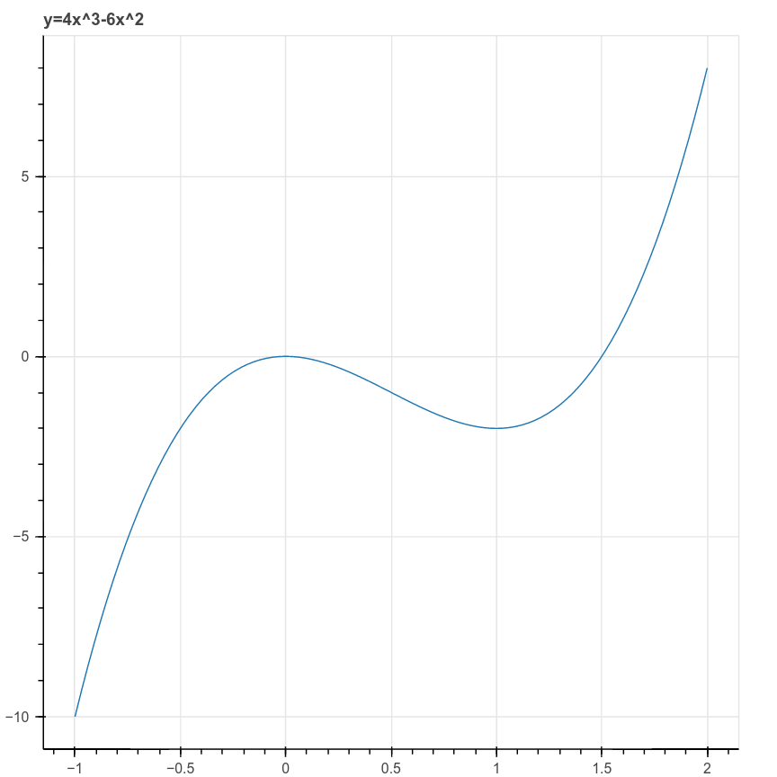

# Gradient Descent {#sec-gradient_descent}

## Introduction

A common mathematical theme throughout machine learning is the problem of finding the minimum or maximum value of a function.  For example, in linear regression, we find the "best-fitting" linear function by identifying the parameters that minimize the mean squared error.  In principal component analysis,
we try to identify the scores which have the greatest variation for the given set of data, and for
this we needed to maximize a function using Lagrange multipliers.  In later lectures, we will see many more examples where we construct the "best" function for a particular task by minimizing some kind of error between our constructed function and the true observed values. 

In our discussion of PCA and linear regression, we were able to give analytic formulae for the solution to our problems.  These solutions involved (in the case of linear regression) inverting a matrix,
and in the case of PCA, finding eigenvalues and eigenvectors.  These are elegant mathematical results,
but at that time we begged the question of how to actually *compute* these quantities of interest in an
efficient way.  In this section, we will discuss the technique known as gradient descent, which is perhaps the simplest approach to minimizing a function using calculus, and which is at the foundation of many practical machine learning algorithms.

## The Key Idea

Suppose that we have a function $f(x_0,\ldots, x_{k-1})$ and we wish to find its minimum value.  In Calculus classes, we are taught to take the derivates of the function and set them equal to zero, but for anything other than the simplest functions this problem is not solvable in practice.  In real life,
we use iterative methods to find the minimum of the function $f$.

The main tool in this approach is a fact from multivariate calculus.  

**Proposition:** Let $f(x_0,\ldots, x_{k-1})$ be a function and let $\nabla f$ be its gradient.
Then at each point $x$ in $\R^{k}$, the gradient $(\nabla f)(x)$ is a vector that points in
the direction in which $f$ is increasing most rapidly from $x$ and $(-\nabla f)(x)$ points
in the direction in which $f$ is decreasing most rapidly.  If $\nabla f=0$ at $x$ then $x$
is a critical point of $f$. 

This fact arises from thinking about the *directional derivative* of a function.  
The directional derivative $D_{v}f$ measures the rate of change of $f$ as one moves
with velocity vector $v$ from the point $x$ and it is defined as
$$
D_{v}f(x) = \frac{d}{dt}f(x+tv)|_{t=0}
$$
From the chain rule, we can compute that
$$
D_{v}f(x) = \sum_{i=0}^{k-1} \frac{\partial f}{\partial x_{i}}\frac{dx_{i}}{dt} = (\nabla f)\cdot v
$$
where
$$
\nabla f = \left[\frac{\partial f}{\partial x_{i}}\right]_{i=0}^{k-1}
$$
is the gradient of $f$. 

The directional derivative $D_{v}(f)=(\nabla f)\cdot v$ measures the rate of change of $f$ if we
travel with velocity $v$ from a point $x$.  To remove the dependence on the magnitude of $v$ (since obviously
$f$ will change more quickly if we travel more quickly in a given direction), we scale $v$ to be a unit vector. Then, since
$$
\nabla f\cdot v=\|\nabla f\|\|v\|\cos\theta=\|\nabla f\|\cos \theta
$$
where $\theta$ is the angle between $v$ and $\nabla f$,  the dot product giving the rate is maximized when $v$ is parallel to $\nabla f$.  If $v$ is opposite to $\nabla f$, the dot product is minimized. 

## The Algorithm

To exploit the fact that the gradient points in the direction of most rapid increase of our function $f$,
we adopt the following strategy.  Starting from a point $x$, compute the gradient $\nabla f$ of $f$.
Take a small step in the direction of the gradient -- that should increase the value of $f$. Then do it again, and again; each time, you move in the direction of increasing $x$, but at some point the gradient becomes very small and you stop moving much.  At that moment, you quit. This is called "gradient ascent."

If we want to *minimize*, not maximize, our function, then we want to move *opposite* to the gradient in small steps. This is the more common formulation.

::: {#alg-gradient_descent}

### Gradient Descent Algorithm

Given a function $f:\mathbb{R}^{k}\to \mathbb{R}$, to find a point where it is mimized, choose:

- a starting point $c^{(0)}$, 
- a small constant $\nu$ (called the *learning rate*) 
- and a small constant $\epsilon$ (the *tolerance*).  

Iteratively compute
$$
c^{(n+1)}=c^{(n)} -\nu\nabla f(c^{(n)})
$$
until $|c^{(n+1)}-c^{(n)}|<\epsilon$.  

Then $c^{(n+1)}$ is an (approximate) critical point of $f$.

:::

::: {#fig-graddescentillust}

Gradient Descent Illustrated
:::

The behavior of gradient descent, at least when all goes well,
is illustrated in @fig-graddescentillust  for the function
$$
f(x,y) = 1.3e^{-2.5((x-1.3)^2+(y-0.8)^2))}-1.2e^{-2((x-1.8)^2)+(y-1.3)^2)}.
$$
@fig-graddescentillust is a contour plot, with the black lines at constant height and the colors
indicating the height of the function. 
This function has two "pits" or "wells" indicated by the darker, "cooler" colored regions.  The red line
shows the path that the gradient descent algorithm takes, from a higher, "hotter" region to a lower
cooler one. 

To get a little more perspective on gradient descent, consider the one-dimensional case, with $f(x)=4x^3-6x^2$.  This is a cubic polynomial whose graph has a local maximum and a local minimum, depicted in @fig-graddescentcubic.

{#fig-graddescentcubic width=50%}

In this case the gradient is just the derivative $f'(x)=12x^2-12x$ and the iteration is
$$
c^{(n+1)} = c^{(n)}-12\nu((c^{(n)})^2-c^{(n)}).
$$

Even from this simple example we can see the power and also the pitfalls of this method.  Suppose we choose
$x_0=2$, $\nu=.01$, and $\epsilon=.001$.  Then the iteration yields:

| Step | 0 | 1 | 2 | 3 | 4 | 5 | 6 | 
|---|---|---|---|---|---|---|---|
|x|2.0| 0.8       | 0.896     | 0.952 | 0.979|  0.991| 0.997|

: Gradient Descent Iterations {#tbl-graddescentiters}

As you can see, the points move quickly to the (local) minimum at $x=1$.    

There are two ways (at least) that things can go wrong, however.  First suppose we use $x_0=-1$, instead
of $x_0=2$, as our first guess.  Then we are on the downslope on the left side of the graph, and following
the gradient quickly takes us off to $-\infty$.

| Step | 0 | 1 | 2 | 3 | 4 | 5 |
|---|---|---|---|---|---|---|
|x| -1.00 |-2.20| -6.42| -35.04| -792.70| -378296.27 |

: Gradient Descent Iterations (first failure mode) {#tbl-graddescentfailone}

Second, suppose we choose $x_0=2$, but choose a somewhat larger learning rate -- say, $\nu=.1$.
In this case, initially things look good, but the addition of the gradient causes an overshoot
which once again takes us over the hump at $x=0$ and off to $-\infty$ heading to the left.

| Step | 0 | 1 | 2 | 3 | 4 | 5 |6|
|---|---|---|---|---|---|---|---|
|x|2.00|-0.11|-0.24|-0.56|-1.49|-5.42|-42.23|

: Gradient Descent Iterations (second failure mode) {#tbl-graddescentfailetwo}

Based on these considerations, we see that, for general functions, 
 *if gradient descent converges,* then it will converge
to a local minimum of the function.  But *it may not converge,* and even if it does, we can't conclude
anything about whether we've reached a *global* minimum.  
