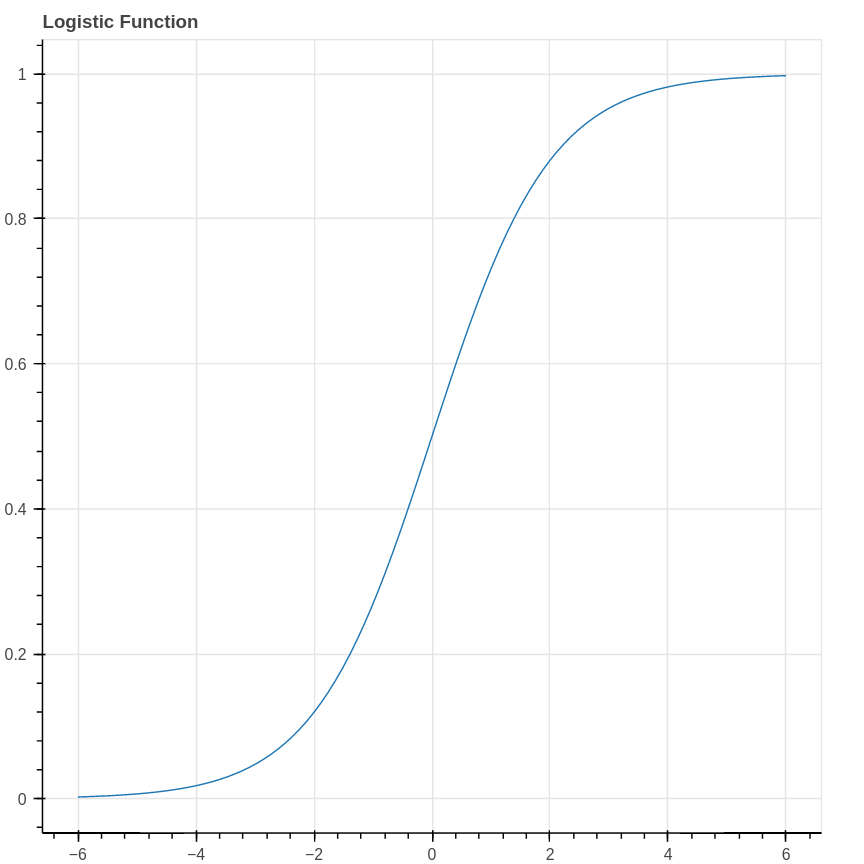
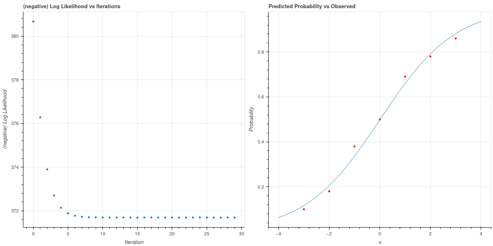
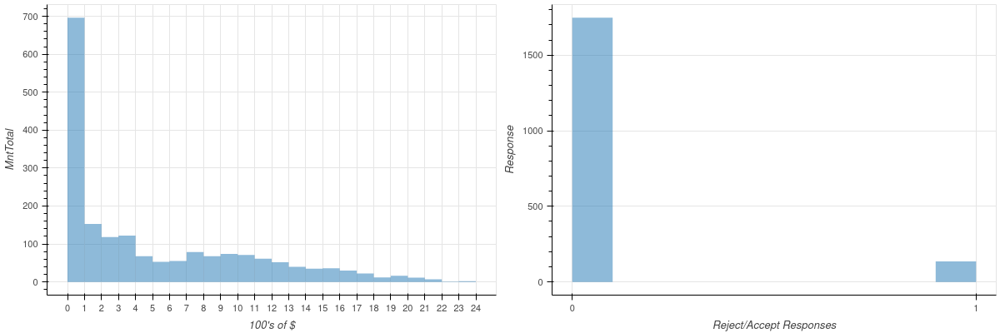
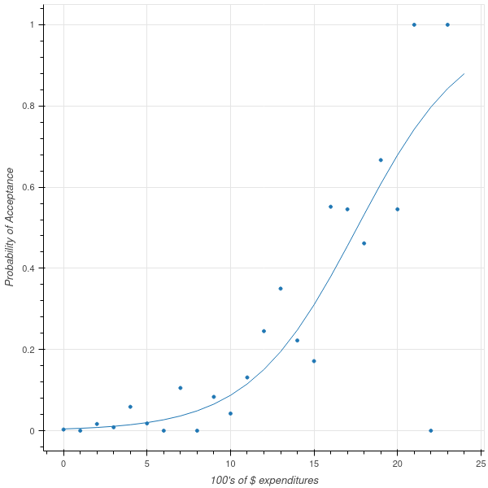
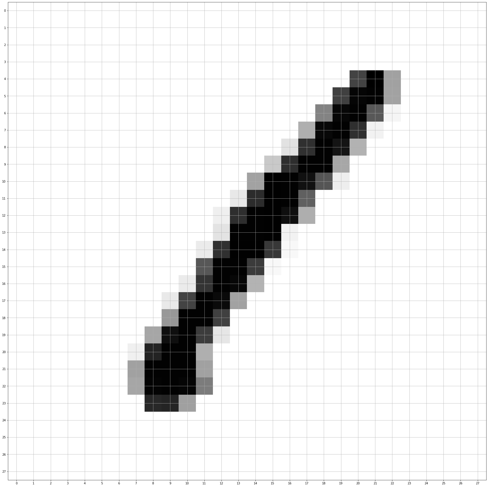
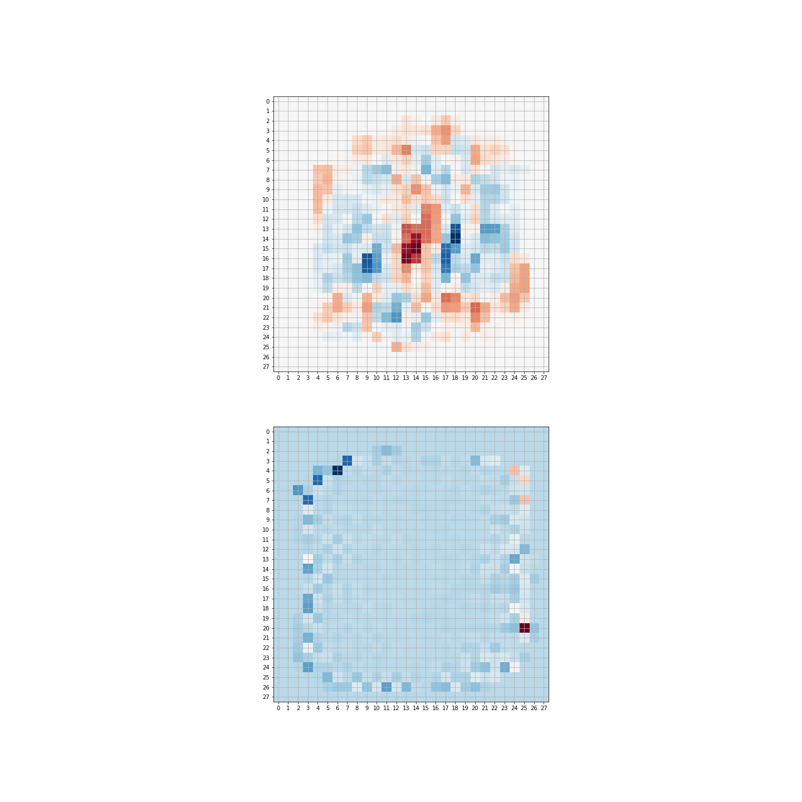

---
format:
   pdf:
      include-in-header:
         - macros.tex
---

# Logistic Regression

Suppose that we are trying to convince customers to buy our product by showing them advertising.  Our experience teaches
us that there is no deterministic relationship between how often a potential customer sees one of our ads and whether or not
they purchase our product, nevertheless it is the case that as they see more ads they become more likely to make a purchase.
Logistic regression is a statistical model that  captures this idea.

To formulate this situation mathematically, let's imagine that we are trying to model a random event that depends on a parameter.
The random event might be a user deciding to make  a purchase from a website, which, in our very simple model,
depends on how many times the user saw an advertisement for the product in question.  But we could imagine other situations where
the chance of an event happening depends on a parameter.  For example, we could imagine that a student's score on a certain test depends on how much studying they
do, with the likelihood of passing the test increasing with the amount of studying.  

To construct this model, we assume that the probability of a certain event $p$ is related to some parameter $x$ by the following relationship:

$$
\log\frac{p}{1-p} = ax+b 
$${#eq-logistic_1}

where $a$ and $b$ are constants.  The quantity $\frac{p}{1-p}$ is the "odds" of the event occurring.  We often use this quantity colloquially; if
the chance of our team winning a football game is $1$ in $3$, then we would say the odds of a win are $1$-to-$2$, which we can interpret as meaning they 
are twice as likely to lose as to win.  The quantity $\log\frac{p}{1-p}$ is, for obvious reasons, called the log-odds of the event.
The logistic model in @eq-logistic_1 means that an increase by $1$ in the parameter $x$ increases the log-odds of the event happening by $a$.  

The assumption in @eq-logistic_1 can be written
$$
\frac{p}{1-p} = e^{ax+b}
$$
and we interpret this as telling us that if the parameter $x$ increases by $1$, the odds of our event happening go up by a factor of $e^{a}$. 
So, to be even more concrete, if $a=\log 2$, then our logistic model would say that an increase of $1$ in our parameter $x$ doubles the odds of
our event taking place. 

In terms of the probability $p$, @eq-logistic_1 can be rewritten
$$
p = \frac{1}{1+e^{-ax-b}}
$$
This proposed relationship between the probability $p$ and the parameter $x$ is called the *logistic model.*  The function
$$
\sigma(x) = \frac{1}{1+e^{-x}}
$$
is called the *logistic function* and yields an S-shaped curve. 

{#fig-logistic_curve width=50%}

To put the logistic model in perspective, let's choose some explicit parameters and look at what data arising from such a model
would look like.  Imagine therefore that $a=\log 2$ and $b=0$, so that the probability of the event we are interested occurring is given by the
formula
$$
p(x) = \frac{1}{1+e^{-(\log 2)x}} = \frac{1}{1+(.5)^x}.
$$
Our data consists of counts of how often our event happened for a range of values of $x$.  To generate this data, we can pick $x$ values from the
set $\{-3,-2,-1,0,1,2,3\}$ yielding probabilities $\{.11,.2,.33,.4,.56,.67,.8\}$.  Now our data consists of,  for each value of $x$, the result of $100$ independent
Bernoulli trials with probability $p(x)$.  For example, we might find that our event occurred $\{10, 18, 38, 50, 69, 78, 86\}$ times respectively for each of the $x$ values.  As you can see, the event occurs more frequently when $x$ is large, although the number of occurrences is still random.

## Likelihood and Logistic Regression

In applications, our goal is to choose the parameters of a logistic model to accurately predict the likelihood of the event under study occurring as a function
of the measured parameter.  Let's imagine that we collected the data that we generated above, without knowing that it's source was a logistic model.  So
@tbl-logistic_data shows the number of times the event occurred, for each of the measured values of the $x$ parameter.

|$x$ |-3 | -2 | -1 | 0 | 1 | 2 | 3 |
|---|---|---|---|---|---|---|---|
|Occurrences (out of 100)|10  |18 | 38 | 50 | 69 | 78 | 86|

: Sample Data {#tbl-logistic_data}

Our objective now is to find a logistic model which best explains this data. Concretely, we need to estimate the coefficients $a$ and $b$ that yield 
$$
p(x) = \frac{1}{1+e^{-ax-b}}
$${#eq-logistic_a_b}

where the resulting probabilities best estimate the data. As we have seen, this notion of "best" can have different interpretations.
For example, we could approach this from a Bayesian point of view, adopt a prior distribution on the parameters $a$ and $b$, and use the data to obtain
this prior and obtain a posterior distribution on $a$ and $b$.  For this first look at logistic regression, we will instead adopt a "maximum likelihood"
notion of "best" and ask what is the most likely choice of $a$ and $b$ to yield this data.

To apply the maximum likelihood approach, we need to ask "for (fixed, but unknown) values of $a$ and $b$, what is the likelihood that a logistic model
with those parameters would yield the data we have collected?" Each column in @tbl-logistic_data represents $100$ Bernoulli trials with a fixed probability
$p(x)$.  So, for example,  the chance $q$ of obtaining $10$ positive results with $x=-3$ is given by
$$
q(-3)=C p(-3)^{10}(1-p(-3))^{90}
$$
where $C$ is a constant (it would be a binomial coefficient).  Combining this for different values of $x$, we see that the likelihood of the data is
the product
$$
L(a,b) = C' p(-3)^{10}(1-p(-3))^{90}p(-2)^{18}(1-p(-2))^{82}\cdots p(3)^{86}(1-p(3))^{14}
$$
where $C'$ is another constant.  Each $p(x)$ is a function of the parameters $a$ and $b$, so all together this is a function of those two parameters.
Our goal is to maximize it. 

One step that simplifies matters is to consider the logarithm of the likelihood:
$$
\log L (a,b)= \sum_{i=0}^{6} \left[ x_{i}\log(p(x_{i})) + (100-x_{i})\log(1-p(x_{i}))\right] +C''
$$
where $C''$ is yet another constant.  Since our ultimate goal is to maximize this, the value of $C''$ is irrelevant and we can drop it.

### Another point of view on logistic regression

In @tbl-logistic_data we summarize the results of our experiments in groups by the value of the $x$ parameter.  We can think of the data somewhat differently,
by instead considering each event separately, corresponding to a parameter value $x$ and an outcome $0$ or $1$.  From this point of view the data summarized in @tbl-logistic_data
would correspond to a vector with  $700$ rows.  The first $100$ rows (corresponding to the first column of the table) would have first entry $-3$, the next $100$ would have $-2$, or so on.
So our parameter values form a  vector $X$. Meanwhile, the outcomes form a vector $Y$ with entries $0$ or $1$. 

More generally,  imagine we are studying our advertising data and, for each potential customer, we record how many times they saw our ad.  We create a vector $X$ whose entries are
these numbers.  Then we create another vector $Y$, of the same length, whose entries are 
either $0$ or $1$ depending of whether or not the customer purchased our product.  

One way to think about logistic regression in this setting is that we are trying to fit a function that, given the value $x_i$, tries to yield the corresponding value $y_i$.
However, instead of finding a deterministic function, as we did in linear regression,
instead we try to fit a logistic function that captures the likelihood that the $y$-value is a $1$ given the $x$-value.  This "curve-fitting perspective" is why this is considered
a regression problem.

If, as above, we think of each row of the matrix as an independent trial, then the chance that $y_i=1$ is $p(x_i)$ and the chance that $y_i=0$ is $1-p(x_i)$, where $p(x)$ is given by the logistic 
function as in @eq-logistic_a_b. 
The likelihood of the results we obtained is therefore:
$$
L(a,b) = C \prod_{i=0}^{N-1} p(x_i)^{y_i}(1-p(x_i))^{(1-y_i)}
$$
where $C$ is a constant and we are exploiting the trick that, since $y_i$ is either zero or one, $1-y_i$ is correspondingly one or zero.  Thus only $p(x_i)$ or $1-p(x_i)$
occurs in each term of the product.  If we group the terms according to $x_i$ we obtain our earlier formula for $L(a,b)$.

This expresssion yields an apparently similar formula for the log-likelihood (up to an irrelevant constant):
$$
\log L(X,a,b) = \sum_{i=0}^{N-1} y_i\log p(x_i) + (1-y_i)\log (1-p(x_i)).
$$
Using vector notation, this can be further simplified, where again we drop irrelevant constants:
$$
\log L(X,a,b) = Y\cdot\log p(X) + (1-Y)\cdot \log(1-p(X)).
$$
To be absolutely concrete, in this formula, $p(X)$ is a vector 
$$
p(X)=[p(x_i)]_{i=0}^{N-1} = \left[\frac{1}{1+e^{-ax_i-b}} \right]_{i=0}^{N-1}
$$
so its entries are functions of the unknown parameters $a$ and $b$. 

We might naively try to maximize this by taking the derivatives with respect to $a$ and $b$ and setting them to zero, but this turns out to be impractical.
So we need a different approach to finding the parameters $a$ and $b$ which maximize this likelihood function.  We will return to this problem later, but before
we do so we will look at some generalizations and broader applications of the logistic model.

### Logistic regression with multiple features

The next generalization we can consider of the logistic model is the situation where the log-odds of our event of interest depend linearly on multiple parameters.
In other words, we have
$$
\log\frac{p}{1-p} = m_0 x_0 + m_1 x _1 + \cdots + m_{k-1} x_{k-1} + b 
$$
where the $a_i$ and $b$ are constants.  Under this model, notice that *the incremental effects of changes to the different parameters $x_i$ have independent effects on the probability.*
So, for example, if $x_1$ were the number of times our potential customer saw an online advertisement and $x_2$ were the number of times they saw a print advertisement, by adopting this model
we are assuming that the impact of seeing more online ads is completely unrelated to the impact of seeing more print ads.

The probability is again given by a sigmoid function
$$
p(x_1,\ldots, x_k) = \frac{1}{1+e^{-\sum_{i=0}^{k-1} m_i x_i +b}}
$$

This model has an $N\times k$ feature matrix whose rows are the values $x_0,\ldots, x_{k-1}$ for each sample.  The outcome of our experimemt is recorded in an $N\times 1$ column vector $Y$ whose entries
are $0$ or $1$.  The likelihood function is formally equivalent to what we computed in the case of a single feature, but it will be useful to be a bit careful about vector notation.  

Following the same pattern we adopted for linear regression, let $X$ be the $N\times (k+1)$ matrix whose first $k$ columns contain the values $x_i$ for each sample, and whose last column is all $1$.
Rename the "intercept" variable as $a_{k+1}$ and organize these parameters into a $(k+1)\times 1$ matrix $M$.  Then
$$
p(X)=\sigma(XM)
$$
and our likelihood becomes
$$
\log L(M) = Y\cdot \log\sigma(XM) + (1-Y)\cdot(1-\log\sigma(XM)).
$${#eq-logisticregressionlikelihood}

## Finding the maximum likelihood solution by gradient descent

Given a set of features $X$ and targets $Y$ for a logistic model, we now want to find the values $M$ so that the log-likelihood of the model for those paramters, given
the data, is maximized.  While in linear regression we could find a nice closed form solution to this problem, the presence of the non-linear function $\sigma(x)$ in the
likelihood makes that impossible for logistic regression.  Thus we need to use a numerical approximation.  The most straightforward such method is called gradient descent.
It is at the foundation of many numerical optimization algorithms, and so while we will develop it here for logistic regression we will have other opportunities to apply it and we will discuss it more thoroughly on its own later.

## Gradient Descent and Logistic Regression

We can use gradient descent, as discussed in @sec-gradient_descent,  to find the maximum likelihood set of parameters for our logistic model.
As we saw earlier, in @eq-logisticregressionlikelihood, we have the log likelihood function
$$
\log L(M) = Y\cdot \log\sigma(XM) + (1-Y)\cdot\log(1-\sigma(XM))
$$
where $Y$ are the target $0/1$ values, $X$ is our $N\times (k+1)$ data matrix whose last column
is all ones, and $M$ is the $k+1\times 1$ column vector of unknown parameters.
Since gradient descent is naturally a *minimizing* algorithm, we will minimize the function $-L(M)$.

The key piece of information that we need is the gradient $-\nabla L$, where the variables are the entries
of $M$.  The complicating features is the presence of the nonlinear function $\sigma$, so let's start
with a simple observation about this function.

**Lemma:** The logistic function $\sigma(x)$ satisfies the differential equation
$$
\frac{d\sigma}{dx} = \sigma(x)(1-\sigma(x)).
$$

**Proof:** Since 
$$
\sigma(x)= \frac{1}{1+e^{-x}},
$$
$$
1-\sigma(x) = \frac{e^{-x}}{1+e^{-x}}.
$$
Then we calculate
$$\begin{aligned}
\frac{d\sigma}{dx}&=\left(\frac{1}{(1+e^{-x})}\right)^2e^{-x} \\
                  &= \left(\frac{1}{1+e^{-x}}\right)\left(\frac{e^{-x}}{1+e^{-x}}\right)\\
                  &=\sigma(x)(1-\sigma(x)) \\
\end{aligned}
$$
which is what we claimed.

We apply this differential equation to compute the gradient of $L$.

::: {#thm-logisticgradient}

**Proposition:** The gradient $-\nabla L(M)$ is given by 
$$
-\nabla \log L(M) = X^{\intercal}(\sigma(XM)-Y).
$$
Notice that the right side of this equation yields a $(k+1)\times 1$ column vector.  The entries of this
vector are the partial derivatives with respect to the coefficients $m_{i}$ for $i=0,\ldots, k$.
:::

**Proof:** This is yet another exercise in the chain rule and keeping track of indices.
Let's first look at the term $Y\cdot \log\sigma(XM)$.  Writing it out, we have
$$
Y\cdot \log\sigma(XM)=\sum_{i=0}^{N-1}y_{i}\log\sigma(\sum_{j=0}^{k}x_{ij}m_{j}).
$$
Applying $\partial/\partial m_{s}$ to this yields
$$
\sum_{i=0}^{N-1}y_{i}(1-\sigma(\sum_{j=0}^{k}x_{ij}m_{j}))x_{is}
$$
where we've used the chain rule and the differential equation for $\sigma$ discussed above. At the same
time, we can apply $\partial/\partial m_{s}$ to the second term $(1-Y)\cdot\log(1-\sigma(XM))$
and obtain
$$
-\sum_{i=0}^{N-1}(1-y_{i})\sigma(\sum_{j=0}^{k}x_{ij}m_{j})x_{is}.
$$
The term $\sum_{i=0}^{N-1} y_{i}\sigma(\sum_{j=0}^{k}x_{ij}m_{j})x_{is}$ cancels, yielding
$$
\frac{\partial L(M)}{m_{s}} = -\sum_{i=0}^{N-1} (y_{i}-\sigma(\sum_{j=0}^{k}x_{ij}m_{j}))x_{is}.
$$  
Since our weights $M$ are naturally a $(k+1)\times 1$ column vector, 
looked at properly this is our desired formula:
$$
-\nabla \log L(M) = X^{\intercal}(\sigma(XM)-Y).
$$
Since the right side is an $(k+1)\times N$ matrix times an $N\times 1$ column vector, the result
is a $(k+1)\times 1$ column vector whose entries are the partial derivatives of $-\log L(M)$ with respect
to the weights $m_{s}$. 

### Gradient Descent on our synthetic data

Now we can apply gradient descent to find a maximum likelihood logistic model 
for the sample data that we generated from the logistic model and reported in @tbl-logistic_data.
With the probability given as
$$
p(x) = \frac{1}{1+e^{-ax-b}}
$$
we make an initial guess of $a=1$ and $b=0$ set a learning rate $\nu=.001$, and run the
gradient descent algorithm for $30$ iterations.  We plot the negative log-likelihood 
for this algorithm one the left in @fig-logisticloglike, where we see that it drops swiftly to a minimum value.
The corresponding parameter values are $a=.6717$ and $b=-.0076$, and the fit of the the corresponding
logistic curve to the observed data is shown on the right in @fig-logisticloglike.

{#fig-logisticloglike width=100%}

The parameters used to generate the data are close to this; they were $a=log(2)=$.6931$ and $b=0$.

### Gradient Descent and Logistic Regression on "real" data

We conclude this first look at logistic regression and gradient descent by analyzing some simple real data.
This dataset consists of about $2200$ customers who patronize a certain food store.  Among the features in the data set is a field giving the total dollars spent at the store by a customer; we will study that
feature and its relationship to the question of whether or not the customer accepted a special offer from the store. (see @KaggleFoodData for the original data source).

{#fig-fooddataplot width=100%}

The two plots in @fig-fooddataplot summarize the data.  The first plot is a histogram showing the amounts
spent by the customers; the second shows the distribution of responses.   

We would like to know how expenditures increase the likelihood of customers accepting our offer.
We therefore fit a logistic model to the data.  The result is shown in @fig-foodlogisticfit.

{#fig-foodlogisticfit width=50%}

## Logistic Regression and classification

Beyond the kind of probability prediction that we have discussed up to this point, logistic regression is one of the most powerful
techniques for attacking the classification problem.  Let's start our discussion with a sample problem that is a simplified version of one
of the most famous machine learning benchmark problems, the MNIST (Modified National Institute of Science
and Technology) dataset of handwritten numerals.  This dataset consists of $60000$ labelled grayscale 
images of handwritten digits from $0$ to $9$.  Each image is stored as a $28x28$ array of integers from $0$ to $255$.  Each
cell of the array corresponds to a "pixel" in the image, and the contents of that cell is a grayscale value.  See @MNISTDatabase
for the a more detailed description of how the dataset was constructed.

In @fig-MNISTOne is a picture of a handwritten "1" from the MNIST dataset.  

{#fig-MNISTOne width=100%}

**Classification Problem for MNIST:** Given a $28x28$ array of grayscale values, determine which digit is represented. 

At first glance, this does not look like a logistic regression problem.  To make the connection clearer, let's simplify the problem
and imagine that our database contains only labelled images of zeros and ones -- we'll worry about how to handle the full problem later.
So now our task is to determine which images are zeros, and which are ones.  

Our approach will be to view each image as a vector of length $784=28*28$ by stringing the pixel values row by row into a one dimensional vector,
which following our conventions yields a matrix of size $N\times 784$ where $N$ is the number of images.   Since we may also need an "intercept",
we add a column of $1$'s to our images yielding a data matrix $X$ of size $N\times 785$. The labels $y$ form a column vector 
of size $N$ containing zeros and ones.

We will also simplify the data but converting the gray-scale images to monochrome by converting gray levels
up to $128$ as "white" and beyond $128$ as "black".

The logistic regression approach asks us to find the "best" vector $M$ so that, for a given image vector $x$ (extended by adding a one at the end), the function
$$
p(x)=\frac{1}{1+e^{-xM}}
$$ 
is close to $1$ if $x$ represents a one, and is close to zero if $x$ represents zero.  Essentially we think of $p(x)$ as giving the probability that the vector $x$
represents an image of a one.  If we want a definite choice, then we can set a threshold value $p_0$ and say that the image $x$ is a one if $p(x)>p_0$ and
zero otherwise.  The natural choice of $p_0=.5$ amounts to saying that we choose the more likely of the two options under the model.

 Since we are applying the logistic model we are assuming:

-  that the value of each pixel in the image contributes something towards the chance of the total
image being one;
-  and the different pixels have independent, and additive effects on the odds of getting a one. 

If we take this point of view, then we can ask for the vector
$M$ that is *most likely* to account for the labellings, and we can use our maximum likelihood gradient descent method to find $M$.

This approach is surprisingly effective.  With the MNIST zeros and ones, and the gradient descent method discussed above,
one can easily find $M$ so that the logistic model predicts the correct classification with accuracy in the high 90% range. 

### Weights as filters

One interesting aspect of using logistic regression on images for classification is that the we can interpret the optimum set of coefficients $M$
as a kind of filter for our images.  Remember that $M$ is a vector with $785$ entries, the last of which is an "intercept".  
The logistic model
says that, for an image vector $x$, the log-odds that the image is a one is
given by
$$
\log \frac{p}{1-p} = \sum_{i=0}^{783} M_{i}x_{i} + M_{784}.
$$
This means that if the value of $M_{i}$ is positive, then large values in the $i^{th}$ pixel *increase* the chance that our image is a one;
while if $M_{i}$ is negative, large values *decrease* the chance.  If $M_{i}$ is negative, the reverse is true.  However, the values $x_{i}$ are
the gray scale "darkness" of the image, so the entries of $M$ emphasize or de-emphasize dark pixels according to whether that dark pixel is more or less
likely to occur in a one compared to a zero. 

This observation allows us to interpret the weights $M$ as a kind of "filter" for the image.  In fact, if we rescale the entries of $M$ (omitting the intercept) so that they lie between $0$ and $255$,
we can arrange them as a $28\times 28$ array and plot them as an image.  The result of doing this for a selection of MNIST zeros and ones is shown on the left in @fig-weights.  The red (or positive) weights in the middle of the image tell us that if those pixels are dark, the image is more likely to be a one;
the blue (or negative) weights scattered farther out tell us that if those pixels are dark, the image is more likely to be a zero. 

{#fig-weights width=100%}

What's important to notice here is that we did not design this "filter" by hand, based on our understanding of the differences between a handwritten zero and one; instead, the algorithm "learned"
the "best" filter to optimize its ability to distinguish these digits.

Here's another example.  Suppose we redo the MNIST problem above, but we try to distinguish 3's from 8's.  
We have about 4500 of each digit, and we label the 3's with zero and the 8's with one.  Then we use our
maximum likelihood optimization.  In this case, the filter is shown on the bottom in @fig-weights.

## Multiclass Logistic Regression

One could attack the problem of classifying the ten distinct classes of digits by,  for example,
labelling all of the zeros as class zero and everything else as class one, and finding a set of weights
that distinguishes zero from everything else.  Then, in turn, one could do the same for each of the other digits.
Given an unknown image, this would yield a set of probabilities from which one could choose the most likely
class.  This type of classification is called "one vs rest", for obvious reasons.  It seems more natural,
however, to construct a model that, given an image, assigns a probability that it belongs to each of the
different possibilities.  It is this type of multiclass logistic regression that we will study now.

Our goal is to build a model that, given an unknown image, returns a vector of ten probabilities,
each of which we can interpret as the chance that our unknown image is in fact of a particular digit.
If we *know* the image's class, then it's probability vector *should* be nine zeros with a single one
in the position corresponding to the digit.  So, for example, if our image is of a two, then
the vector of probabilities

$$
\left[ \begin{matrix} p_0 & p_1 & p_2 &\cdots & p_8 & p_9\\\end{matrix}\right]=\left[\begin{matrix} 0 &0 & 1 & \cdots & 0 & 0\\\end{matrix}\right]
$$

where $p_i$ is the probability that our image is the digit $i$. Notice also that the probabilities $p_i$ must sum to one.  We encode the class membership of our samples by constructing an $N\times r$ matrix $Y$,
each row of which has a one in column $j$ if that sample belongs to class $j$, and zeros elsewhere.
This type of representation is sometimes called "one-hot" encoding. 

So let's  assume we have $N$ data points, each with $k$ features, and a one-hot encoded, $N\times r$
matrix of labels $Y$ encoding the data into $r$ classes.  As usual, we add an "extra" feature, which
is the constant $1$ for each sample, to account for the "intercept".
So our data matrix will be $N\times (k+1)$.  

Our goal will be to find a $(k+1)\times r$ matrix of "weights" $M$ so that, for each sample, we compute
$r$ values, given by the rows of the matrix $XM$.
These $r$ values are linear functions of the features, but we need probabilities.  In the one-dimensional
case, we used the logistic function $\sigma$ to convert our linear function to probabilities.  In
this higher dimensional case we use a generalization of $\sigma$ called the "softmax" function.

**Definition:** Let $F:\mathbf{R}^r\to\mathbf{R}^{r}$ be the function
$$
F(z_1,\ldots, z_r) = \sum_{j=1}^{r} e^{z_{i}}
$$
and let $\sigma:\mathbf{R}^{r}\to \mathbf{R}^{r}$ be the function
$$
\sigma(z_1,\ldots, z_n) = \left[\begin{matrix} \frac{e^{z_1}}{F} & \cdots & \frac{e^{z_{r}}}{F}\end{matrix}\right].
$$
Notice that the coordinates of the vector $\sigma(z_1,\ldots,z_n)$ are all between $0$ and $1$, and their
sum is one.

Our multiclass logistic model will say that the probability vector that gives the probabilities
that a particular sample belongs to a particular class is given by the rows of the matrix
$\sigma(XM)$, where $\sigma(XM)$ means applying the function $\sigma$ to each row of the $N\times r$ matrix $XM$.  For later computation, if:

-  $x=X[i,:]$ is the $k+1$-entry feature vector of a single sample -- a row of the data matrix $X$ 
-  $m_{j}=M[:,j]$ is the $k+1$-entry column vector corresponding to the $j^{th}$ column of $M$, 

then the probability vector
$[p_{t}]_{t=1}^{r}$ has entries
$$
p_{t}(x;M) = \frac{e^{x\cdot m_{t}}}{\sum_{s=1}^{r} e^{x\cdot m_{s} }}.
$$

### Multiclass logistic regression - the likelihood

The probability vector $[p_{t}(x;M)]$ encodes the probabilities that the $x$-value
belongs to each of the possible classes.  That is,
$$
p_{j}(x;M)=\hbox{The chance that x is in class j}.
$$

We have captured the class membership of the samples in a $(k+1)\times r$ matrix $Y$
which is "one-hot" encoded.  Each row of this matrix has is zero in each place, except in the "correct" class, where it is one.  Let $y=Y[i,:]$ be the $i^{th}$ row
of this matrix, so it is an $r$-entry row vector which is $1$ in the position
giving the "correct" class for our sample $x$. 

So we can represent the chance that sample $j$ belongs to class $i$
as
$$
P(\hbox{ sample i in class j})=\prod_{s=1}^{r} p_{s}(x;M)^{y_{s}}.
$$
Taking the logarithm, we find

$$
\log P = \sum_{s=1}^{r} y_{s}\log p_{s}(x;M).
$${#eq-multiclasslikelihood}

Since each sample is independent, the total likelihood is the product of these probabilites, and the log-likelihood the corresponding sum:
$$
\log L(M) = \sum_{X,Y} \sum_{s=1}^{r} y_{s}\log p_{s}(x;M).
$$
where the sum is over the $N$ rows of $X$ and $Y$.  This is equivalent to the matrix expression
$$
\log L(M) = \mathrm{trace}(Y^{\intercal}\log P)=\mathrm{trace}(Y^{\intercal}\log\sigma(XM))
$$

This is the multiclass generalization of @eq-logisticregressionlikelihood.  To see the connection,
notice that, in the case where we have only two
classes, $y_1=1-y_0$ and
$p_{1}(x;M)=1-p_{0}(x;M)$, so this sum is the same as in the two class situation.

### Multiclass logistic regression - the gradient.

To find the "best-fitting" multiclass logistic model by gradient descent, we need an expression for the gradient of the likelihood $L(M)$.  As with all of these calculations,
this is an exercise in the chain rule.    We start with the formula
$$
p_{s}(x;M) = \frac{e^{x\cdot m_s}}{\sum_{t=1}^{r} e^{x\cdot m_{t}}}
$$
The gradient of this is made up of the derivatives with respect to the $m_{bq}$
where $b=0,\ldots, k$ and $q=1,\dots, r$ so its natural to think of this
gradient as a $(k+1)\times r$ matrix, the same shape as $M$.  Remember that each $m_s$ is
the $s^{th}$ column of $M$ so is made up of $m_{bs}$ for $b=0,\ldots, k$.

Looking at 
$$
\frac{\partial p_{s}}{\partial m_{bq}}
$$
there are two cases to consider.  The first is when $q$ and $s$ are different,
so the numerator of $p_{s}$ doesn't involve $m_{pq}$.  In this case the derivative
is
$$
\frac{\partial p_{s}}{\partial m_{bq}}=-\frac{e^{x\cdot m_{s}}e^{x\cdot m_{q}}x_b}{(\sum_{t=1}^{r} e^{x\cdot m_{t}})^2}=-p_{s}p_{q}x_{b}
$$
In vector terms:
$$
[\frac{\partial p_{s}}{\partial m_{bq}}]_{b=1}^{k}=-p_{q}p_{s}[x_{b}]_{b=1}^{k}
$$ 
as an equality of $k+1$-entry row vectors. This can be written more simply as a vector equation:
$$
\frac{\partial p_{s}}{\partial m_{q}}=-p_{q}p_{s}x.\qquad (q\not=s).
$$
When $q=s$, we have
$$
\frac{\partial p_{s}}{\partial m_{bs}}
=\frac{e^{x\cdot m_{bs}}x_b}{\sum_{t=1}^{r}e^{x\cdot m_{t}}}-\frac{e^{x\cdot m_{s}}e^{x\cdot m_{s}}x_b}{(\sum_{t=1}^{r} e^{x\cdot m_{t}})^2}=p_{s}(1-p_{s})x_b
$$
or in vector terms
$$
\frac{\partial p_{s}}{\partial m_{s}}=p_{s}(1-p_{s})x^{\intercal}.
$$

**Important:** The gradient on the left is properly seen as a column vector (because $m_{s}$ is a column of the matrix $M$, with $k+1$ entries), and since $x$ is a row of the data matrix, so to keep the indices
straight, we  need $x^{\intercal}$ on the right.

Now we can use these formulae together with the expression for $\log L(M)$ to 
obtain the gradient. Using the vector form, we have
$$
\frac{\partial \log L(M)}{\partial m_{q}} = \sum_{X,Y}\sum_{s=1}^{r} y_{s}\frac{\partial \log p_{s}}{m_{q}}.
$$
Using our computations above, the chain rule, and the derivative of the logarithm,
this  is the sum
$$
\frac{\partial \log L(M)}{\partial m_{q}} =\sum_{X,Y}\sum_{s=1}^{r} y_{s}(I_{qs}-p_{q})x^{\intercal}
$$
where $I_{qs}=1$ if $q=s$ and zero otherwise. 

Now $y_{s}I_{qs}$ is zero unless $s=q$, and the sum $\sum_{s=1}^{r} y_{s}=1$,
so this simplifies further to 
$$
\frac{\partial \log L(M)}{\partial m_{q}} = \sum_{X,Y} (y_{q}-p_{q})x^{\intercal}.
$$
This is equivalent to the matrix expression
$$
\nabla \log L(M) = X^{\intercal}(Y-P)=X^{\intercal}(Y-\sigma(XM)).
$${#eq-multiclassgradient}

Compare @eq-multiclassgradient to @thm-logisticgradient and we see that the form is identical whether in the two-class or multi-class case if we set things up properly.

::: {#alg-graddescent}

### Multiclass Gradient Descent

Given:

-  an $N\times(k+1)$ data matrix $X$ whose last column is all $1$, 
-  an $N\times r$ matrix $Y$ that "one-hot" encodes the labels of the classification problem;
- a random $(k+1)\times r$ matrix $M$ of initial guesses for the parameters
- a "learning rate" $\nu$, 

Iterate:
$$
M^{(j+1)}=M^{(j)}+\nu X^{\intercal}(Y-\sigma(XM^{(j)}))
$$
until $M$ changes by less than some tolerance.

::: 

## Stochastic Gradient Descent for Logistic Regression

The gradient descent process for logistic regression suffers from the same limitation as for linear regression that we discussed in @sec-sgd.  Each iteration requires us to compute the matrix product
$X^{\intercal}(Y-\sigma(XM^{(j)}))$ which uses all of the data and is therefore time- and even more importantly memory-intensive.

Therefore logistic regression is also a candidate for stochastic gradient descent, in which we
iterate over each data point $x$ and associated target $y$ and make adjustments point by point. 
To do this we use the gradient from @eq-multiclassgradient in the much simpler case where $X$
is a single row of the data matrix and $Y$ is a row vector that is zero except for a one in the
spot corresponding to the target class for $X$.

