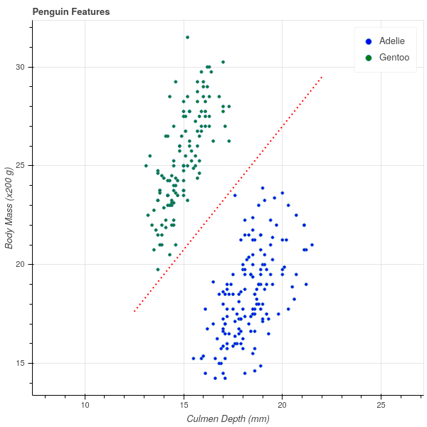
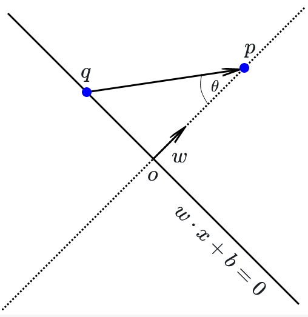
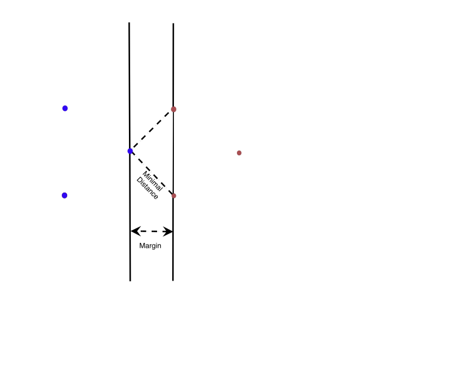
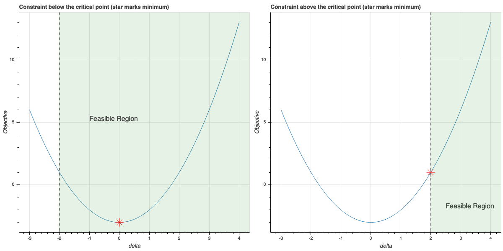
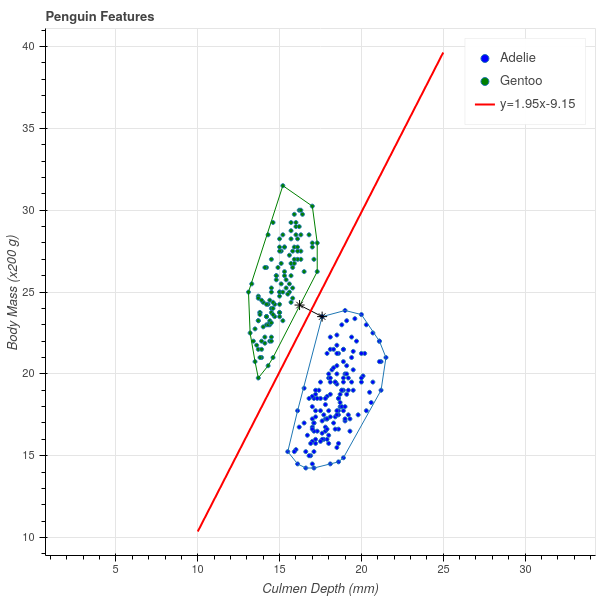

# Support Vector Machines

## Introduction

Suppose that we are given a collection of data made up of samples from two different classes,
and we would like to develop an algorithm that can distinguish between the two classes.  For example,
given a picture that is either a dog or a cat,  we'd like to be able to say which
of the pictures are dogs, and which are cats.  For another example, we might want to be able to distinguish
"real" emails from "spam."  This type of problem is called a *classification* problem. 

Typically, one approaches a classification problem by beginning with a large set of data for which
you know the classes, and you use that data to *train* an algorithm to correctly distinguish
the classes for the test cases where you already know the answer.  For example, you start with a few thousand
pictures labelled "dog" and "cat" and you build your algorithm so that it does a good job distinguishing
the dogs from the cats in this initial set of *training data*.  Then you apply your algorithm to pictures
that aren't labelled and rely on the predictions you get, hoping that whatever let your algorithm distinguish
between the particular examples will generalize to allow it to correctly classify images that aren't
pre-labelled.

Because classification is such a central problem, there are many approaches to it.  We will see several
of them through the course of these lectures.  We will begin with 
a particular classification algorithm called "Support Vector Machines" (SVM)
that is based on linear algebra.  The SVM algorithm is widely used in practice and has a beautiful
geometric interpretation, so it will serve as a good beginning for later discussion of more complicated
classification algorithms.

Incidentally, I'm not sure why this algorithm is called a "machine"; the algorithm
was introduced in the paper @vapnik92 where it is called the "Optimal Margin Classifier" and as we shall
see that is a much better name for it.

My presentation of this material was heavily influenced by the beautiful paper @bennettDuality.

## A simple example

Let us begin our discussion with a very simple dataset (see @penguins and @penguindata).  This data
consists of various measurements of physical characteristics of 344 penguins of 3 different species:
Gentoo, Adelie, and Chinstrap.  If we focus our attention for the moment on the Adelie and Gentoo
species, and plot their body mass against their culmen depth, we obtain the following scatterplot.

{#fig-penguins width=50%}

Incidentally, a bird's *culmen* is the upper ridge of their beak, and the *culmen depth* is a measure
of the thickness of the beak.  There's a nice picture at @penguindata for the penguin enthusiasts.

A striking feature of this scatter plot is that there is a clear separation between the clusters of
Adelie and Gentoo penguins.  Adelie penguins have deeper culmens and less body mass than Gentoo penguins.
These characteristics seem like they should provide a way to classify a penguin between these two
species based on these two measurements.

One way to express the separation between these two clusters is to observe that one can draw
a line on the graph with the property that all of the Adelie penguins lie on one side of that
line and all of the Gentoo penguins lie on the other. In @fig-penguinsline I've drawn in
such a line (which I found by eyeballing the picture in @fig-penguins).  The line has the equation
$$
Y = 1.25X+2.
$$

{#fig-penguinsline width=50%}

The fact that all of the Gentoo penguins lie above this line means that, for the Gentoo penguins,
their body mass in grams is at least $400$ more than $250$ times their culmen depth in mm. (Note
that the $y$ axis of the graph is scaled by $200$ grams).

$$
\mathrm{Gentoo\ mass}> 250(\mathrm{Gentoo\ culmen\ depth})+400
$$

while

$$
\mathrm{Adelie\ mass}<250(\mathrm{Adelie\ culmen\ depth})+400.
$$

Now, if we measure a penguin caught in the wild, we can compute $250(\mathrm{culmen\ depth})+400$
for that penguin and if this number is greater than the penguin's mass, we say it's an Adelie; otherwise, a Gentoo.
Based on the experimental data we've collected -- the *training* data -- this seems likely to work
pretty well.

## The general case

To generalize this approach, let's imagine now that we have $n$ samples and $k$ features (or measurements)
for each sample. As before, we can represent this data as an $n\times k$ data matrix $X$.  In the penguin
example, our data matrix would be $344\times 2$, with one row for each penguin and the columns
representing the mass and the culmen depth.  In addition to this numerical data, we have a classification
that assigns each row to one of two classes.  Let's represent the classes by a $n\times 1$ vector
$Y$, where $y_{i}=+1$ if the $i^{th}$ sample is in one class, and $y_{i}=-1$ if that $i^{th}$ sample
is in the other.   Our goal is to predict $Y$ based on $X$ -- but unlike in linear regression,
$Y$ takes on the values of $\pm 1$.

In the penguin case, we were able to find a line that separated the two classes and then classify
points by which side of the line the point was on.  We can generalize
this notion to higher dimensions. Before attacking that generalization, let's recall
a few facts about the generalization to $\mathbf{R}^{k}$ of the idea of a line.

### Hyperplanes

The correct generalization of a line given by an equation
$w_1 x_1+ w_2 w_2+b=0$ in $\mathbf{R}^{2}$ is an equation $f(x)=0$ where $f(x)$ is a  degree one polynomial
$$
f(x) = f(x_1,\ldots, x_k) = w_1 x_1 + w_2 x_2 +\cdots + w_k x_k + b 
$${#eq-degreeone}

It's easier to understand the geometry of an equation like $f(x)=0$ in @eq-degreeone if we think of the coefficients
$w_i$ as forming a *nonzero* vector $w = (w_1,\ldots, w_k)$ in $\mathbf{R}^{k}$ and writing the formula for $f(x)$
as 
$$
f(x) = w\cdot x +b
$$.

**Lemma:** Let $f(x)=w\cdot x+b$ with $w\in\mathbf{R}^{k}$ a nonzero vector and $b$ a constant in $\mathbf{R}$.

- The inequalities $f(x)>0$ and $f(x)<0$ divide up $\mathbf{R}^{k}$ into two disjoint subsets (called half spaces), in the way that a line
in $\mathbf{R}^{2}$ divides the plane in half. 
- The vector $w$ is normal vector to the hyperplane $f(x)=0$.  Concretely this means that if $p$ and $q$ are any two
points in that hyperplane, then $w\cdot (p-q)=0$. 
- Let $p=(u_1,\ldots,u_k)$ be a point in $\mathbf{R}^{k}$. Then the perpendicular distance $D$ from $p$ to the hyperplane $f(x)=0$ is
$$
D = \frac{f(p)}{\|w\|}
$$

**Proof:** The first part is clear since the inequalities are mutually exclusive. For the secon part, 
suppose that $p$ and $q$ satisfy $f(x)=0$.  Then $w\cdot p+b = w\cdot q+b=0$. Subtracting these two
equations gives $w\cdot (p-q)=0$, so $p-q$ is orthogonal to $w$.

For the third part, consider @fig-triangle.  The point $q$ is an arbitrary point on the hyperplane defined by the equation
$w\cdot x+b=0$.  The distance from the hyperplane to $p$ is measured along the dotted line perpendicular to the hyperplane.
The dot product $w\cdot (p-q) = \|w\|\|p-q\|\cos(\theta)$ where $\theta$ is the angle between $p-q$ and $w$ -- which is complementary
to the angle between $p-q$ and the hyperplane. The
distance $D$ is therefore 
$$
D=\frac{w\cdot(p-q)}{\|w\|}.
$$
However, since $q$ lies on the hyperplane, we know that $w\cdot q+b=0$ so $w\cdot q = -b$.  Therefore $w\cdot(p-q)=w\cdot p+b=f(p)$,
which is the formula we seek.

{#fig-triangle width=30%}

### Linear separability and Margins {#sec-linearseparable}

Now we can return to our classification scheme.  The following definition generalizes our two dimensional picture
from the penguin data.

**Definition:** Suppose that we have an $n\times k$ data matrix $X$ and a set of labels $Y$ that assign the
$n$ samples to one of two classes.  Then the labelled data is said to be *linearly separable* if there
is a vector $w$ and a constant $b$ so that, if $f(x)=w\cdot x+b$, then 
$f(x)>0$ whenever $x=(x_1,\ldots, x_k)$ is a row of $X$ -- a sample -- belonging to the $+1$ class,
and $f(x)<0$ whenever $x$ belongs to the $-1$ class.  The solutions to the equation $f(x)=0$ in this situation
form a hyperplane that is called a *separating hyperplane* for the data.

In the situation where our data falls into two classes that are linearly separable, 
our classification strategy  is to find a 
separating hyperplane $f$ for our training data. Then, given a point $x$ whose class we don't know,
we can evaluate $f(x)$ and assign $x$ to a class depending on whether $f(x)>0$ or $f(x)<0$.

This definition begs two questions about a particular dataset:

1.  How do we tell if the two classes are linearly separable?
2.  If the two sets are linearly separable, there are infinitely many separating hyperplanes. To see this,
look back at the penguin example and notice that we can 'wiggle' the red line a little bit and it will
still separate the two sets.  Which is the 'best' separating hyperplane?

Let's try to make the first of these two questions concrete.  We have two sets of points $A$ and $B$ in $\mathbf{R}^{k}$,
and we want to (try to) find a vector $w$ and a constant $b$ so that $f(x)=w\cdot x+b$ takes strictly positive values
for $x\in A$ and strictly negative ones for $x\in B$.  Let's approach the problem by first choosing $w$
and then asking whether there is a $b$ that will work.  In the two dimensional case, this is equivalent to choosing
the slope of our line, and then asking if we can find an intercept so that the line passes between the two classes.

In algebraic terms, we are trying to solve the following system of inequalities: given $w$, find $b$ so that:
$$
w\cdot x+b>0 \hbox{ for all $x$ in A}
$$
and
$$
w\cdot x+b<0\hbox{ for all $x$ in B}.
$$
This is only going to be possible if there is a gap between the smallest value of $w\cdot x$ for $x\in A$ and the largest
value of $w\cdot x$ for $x\in B$.  In other words, given $w$ there is a $b$ so that $f(x)=w\cdot x+b$ separates $A$ and $B$
if
$$
\max_{x\in B}w\cdot x < \min_{x\in A} w\cdot x.
$$
If this holds, then choose $b$ so that $-b$ lies in this open interval and you will obtain a separating hyperplane.

**Proposition:** The sets $A$ and $B$ are linearly separable if there is a $w$ so that
$$
\max_{x\in B}w\cdot x < \min_{x\in A} w\cdot x
$$
If this inequality holds for some $w$, and $-b$ within this open interval, then $f(x)=w\cdot x+b$ is a separating hyperplane 
for $A$ and $B$.

*@fig-penguinhwy2 is an illustration of this argument for a subset of the penguin data.  Here, we have fixed $w=(1.25,-1)$
coming from the line $y=1.25x+2$ that we eyeballed earlier.  For each Gentoo (green) point $x_{i}$, we computed $-b=w\cdot x_{i}$ 
and drew the line $f(x) = w\cdot x - w\cdot x_{i}$ giving a family of parallel lines through each of the green points. 
Similarly for each Adelie (blue) point we drew the corresponding line.  The maximum value of $w\cdot x$ for the blue points
turned out to be $1.998$ and the minimum value of $w\cdot x$ for the green points turned out to be $2.003$.  Thus we have
two lines with a gap between them, and any parallel line in that gap will separate the two sets. 

Finally, among all the lines *with this particular $w$*, it seems that the **best** separating line is the one running
right down the middle of the gap between the boundary lines.  Any other line in the gap will be closer to either the blue
or green set that the midpoint line is.

{#fig-penguinhwy2 width=50%}

Let's put all of this together and see if we can make sense of it in general.

Suppose that $A^{+}$ and $A^{-}$ are finite point sets in $\mathbf{R}^{k}$ and 
$w\in\mathbf{R}^{k}$
such that
$$
B^{-}(w)=\max_{x\in A^{-}}w\cdot x < \min_{x\in A^{+}}w\cdot x=B^{+}(w).
$$
Let $x^{-}$ be a point in $A^{-}$ with $w\cdot x^{-}=B^{-}(w)$ and $x^{+}$ be a point in $A$ with $w\cdot x^{+}=B^{+}(w)$.
The two hyperplanes $f^{\pm}(x) = w\cdot x - B^{\pm}$ have the property that:
$$
f^{+}(x)\ge 0\hbox{ for }x\in A^{+}\hbox{ and }f^{+}(x)<0\hbox{ for }x\in A^{-}
$$
and
$$
f^{-}(x)\le 0\hbox{ for }x\in A^{-}\hbox{ and }f^{-}(x)>0\hbox{ for }x\in A^{+}
$$

Hyperplanes like $f^{+}$ and $f^{-}$, which "just touch" a set of points, are called supporting hyperplanes.

**Definition:** Let $A$ be a set of points in $\mathbf{R}^{k}$. A hyperplane $f(x)=w\cdot x+b=0$ is called a 
*supporting hyperplane* for $A$ if $f(x)\ge 0$ for all $x\in A$ and $f(x)=0$ for at least one point in $A$,
or if $f(x)\le 0$ for all $x\in A$ and $f(x)=0$ for at least one point in $A$.

The gap between the two supporting hyperplanes $f^{+}$ and $f^{-}$ is called the *margin* between $A$ and $B$
for $w$.

**Definition:** Let $f^{+}$ and $f^{-}$ be as in the discussion above for point sets $A^{+}$ and $A^{-}$ and
vector $w$.  Then the orthogonal distance between the two  hyperplanes $f^{+}$ and $f^{-}$ is called
the geometric margin $\tau_{w}(A^{+},A^{-})$ (along $w$) between $A^{+}$ and $A^{-}$.  We have
$$
\tau_{w}(A^{+},A^{-})=\frac{B^{+}(w)-B^{-}(w)}{\|w\|}.
$$

Now we can propose an answer to our second question about the best classifying hyperplane.

**Definition:** The *optimal margin* $\tau(A^{+},A^{-})$ between $A^{+}$ and $A^{-}$ is the largest value of $\tau_{w}$
over all possible $w$ for which $B^{-}(w)<B^{+}(w)$:
$$
\tau(A^{+},A^{-}) = \max_{w} \tau_{w}(A^{+},A^{-}).
$$
If $w$ is such that $\tau_{w}=\tau$, then the hyperplane $f(x)=w\cdot x - \frac{(B^{+}+B^{-})}{2}$
is the  *optimal margin classifying hyperplane*.  

The optimal classifying hyperplane runs "down the middle" of the gap between the two supporting hyperplanes $f^{+}$
and $f^{-}$ that give the sides of the optimal margin.

We can make one more observation about the maximal margin.    If we find a vector $w$ so that
$f^{+}(x) = w\cdot x -B^{+}$ and $f^{-}(x) = w\cdot x-B^{-}$ are the two supporting hyperplanes such that
the gap between them is the optimal margin, then this gap gives us an estimate on how close together
the points in $A^{+}$ and $A^{-}$ can be.  This is visible in @fig-penguinhwy2, where it's clear that
to get from a blue point to a green one, you have to cross the gap between the two supporting hyperplanes.

**Proposition:** The closest distance between points in $A^{+}$ and $A^{-}$ is greater than or equal
to the optimal margin:
$$
\min_{p\in A^{+},q\in A^{-}} \|p-q\|\ge \tau(A^{+},A^{-})
$$.

**Proof:** We have $f^{+}(p) = w\cdot p - B^{+}\ge 0$ and $f^{-}(q) = w\cdot q -B^{-}\le 0$.
These two inequalities imply that 
$$
w\cdot (p-q)\ge B^{+}-B^{-}>0.
$$
Therefore
$$
\|p-q\|\|w\|\ge |w\cdot (p-q)|\ge |B^{+}-B^{-}|
$$
and so
$$
\|p-q\| \ge \frac{B^{+}-B^{-}}{\|w\|} = \tau(A^{+},A^{-})
$$

If this inequality were always *strict* -- that is, if the optimal margin equalled the minimum distance
between points in the two clusters -- then this would give us an approach to finding this optimal margin.

Unfortunately, that isn't the case.  In @fig-nonstrict, we show a very simple case involving only
six points in total in which the distance between the closest points in $A^{+}$ and $A^{-}$ is larger than the optimal margin.

{#fig-nonstrict height=3in}

At least now our problem is clear.  Given our two point sets $A^{+}$ and $A^{-}$, find $w$ so that $\tau_{w}(A^{+},A^{-})$
is maximal among all $w$ where $B^{-}(w)<B^{+}(w)$.   This is an optimization problem, but unlike the optimization
problems that arose in our discussions of linear regression and principal component analysis, it does not have a closed
form solution.  We will need to find an algorithm to determine $w$ by successive approximations.  Developing that algorithm
will require thinking about a new concept known as *convexity.*

## Convexity, Convex Hulls, and Margins

In this section we introduce the notion of a *convex set* and the particular case of the *convex hull*
of a finite set of points.  As we will see, these ideas will give us a different interpretation of the
margin between two sets and will eventually lead to an algorithm for finding the optimal margin classifier.

**Definition:**  A subset $U$ of $\mathbf{R}^{k}$ is *convex* if, for any pair of points $p$ and $q$ in $U$,
every point $t$ on the line segment joining $p$ and $q$ also belongs to $U$.  In vector form, for every
$0\le s\le 1$, the point $t(s) = (1-s)p+sq$ belongs to $U$.  (Note that $t(0)=p$, $t(1)=q$, and
so $t(s)$ traces out the segment joining $p$ to $q$.)

*@fig-convexnotconvex illustrates the difference between convex sets and non-convex ones.

{#fig-convexnotconvex height=3in}

The key idea from convexity that we will need to solve our optimization problem and find the optimal margin is the
idea of the *convex hull* of a finite set of points in $\mathbf{R}^{k}$.

**Definition:** Let $S=\{q_1,\ldots, q_{N}\}$ be a finite set of $N$ points in $\mathbf{R}^{k}$.  The *convex hull* $C(S)$ of $S$
is the set of points
$$
p = \sum_{i=1}^{N} \lambda_{i}q_{i}
$$
as $\lambda_{1},\ldots,\lambda_{N}$ runs over all positive real numbers such that
$$
\sum_{i=1}^{N} \lambda_{i} = 1.
$$

There are a variety of ways to think about the convex hull $C(S)$ of a set of points $S$, but perhaps the most useful is that
it is the smallest convex set that contains all of the points of $S$.  That is the content of the next lemma.

**Lemma:** $C(S)$ is  convex.  Furthermore, let $U$ be any convex set containing all of the points of $S$.  Then $U$ contains $C(S)$.

**Proof:** To show that $C(S)$ is convex, we apply the definition.  Let $p_1$ and $p_2$ be two points in $C(S)$,
so that let $p_{j}=\sum_{i=1}^{N} \lambda^{(j)}_{i}q_{i}$ where $\sum_{i=1}^{N}\lambda^{(j)}_{i} = 1$ for $j=1,2$.  Then
a little algebra shows that
$$
(1-s)p_1+sp_{2} = \sum_{i=1}^{N} (s\lambda^{(1)}_{i}+(1-s)\lambda^{(2)}_{i})q_{i}
$$
and $\sum_{i=1}^{N} (s\lambda^{(1)}_{i}+(1-s)\lambda^{(2)}_{i}) = 1$.  Therefore all of the points $(1-s)p_{1}+sp_{2}$ belong to $C(S)$,
and therefore $C(S)$ is convex.

For the second part, we proceed by induction.  Let $U$ be a convex set containing $S$.  Then by the definition of convexity,
$U$ contains all sums $\lambda_{i}q_{i}+\lambda_{j}q_{j}$ where $\lambda_i+\lambda_j=1$.  Now suppose that $U$ contains
all the sums $\sum_{i=1}^{N} \lambda_{i}q_{i}$  where exactly $m-1$ of the $\lambda_{i}$ are non-zero for some $m<N$.  
Consider a sum
$$
q = \sum_{i=1}^{N}\lambda_{i}q_{i}
$$
with exactly $m$ of the $\lambda_{i}\not=0$.  For simplicity let's assume that $\lambda_{i}\not=0$ for $i=1,\ldots, m$.
Now let $T=\sum_{i=1}^{m-1}\lambda_{i}$ and set
$$
q' = \sum_{i=1}^{m-1}\frac{\lambda_{i}}{T}q_{i}.
$$
This point $q'$ belongs to $U$ by the inductive hypothesis. Also, $(1-T)=\lambda_{m}$.  Therefore by convexity of $U$, 
$$
q = (1-T)q_{m}+Tq'
$$
also belongs to $U$.  It follows that all of $C(S)$ belongs to $U$.

In @fig-convexhull we show our penguin data together with the convex hull of points corresponding
to the two types of penguins.  Notice that the boundary of each convex hull
is a finite collection of line segments that join the "outermost" points in the point set.  

{#fig-convexhull width=50%}

One very simple example of a convex set is a half-plane.  More specifically,
if $f(x)=w\cdot x+b=0$ is a hyperplane, then the two "sides" of the hyperplane, meaning
the subsets $\{x: f(x)\ge 0\}$ and $\{x: f(x)\le 0\}$, are both convex. (This is exercise 1 in @sec-exercises ).

As a result of this observation, and the Lemma above, we can conclude that if $f(x)=w\cdot x+b=0$
is a supporting hyperplane for the set $S$ -- meaning that either $f(x)\ge 0$ for all $x\in S$, or $f(x)\le 0$ for all
$x\in S$, with at least one point $x\in S$ such that $f(x)=0$ -- then $f(x)=0$ is a supporting hyperplane for the entire
convex hull. After all, if $f(x)\ge 0$ for all points $x\in S$, then $S$ is contained in the convex set of points where
$f(x)\ge 0$, and therefore $C(S)$ is contained in that set as well.

Interestingly, however, the converse is true as well -- the supporting hyperplanes of $C(S)$ are exactly the same
as those for $S$.

**Lemma:** Let $S$ be a finite set of points in $\mathbf{R}^{k}$ and 
let $f(x)=w\cdot x +b=0$ be a supporting hyperplane for $C(S)$.  Then $f(x)$ is a supporting hyperplane for $S$.

**Proof:** Suppose $f(x)=0$ is a supporting hyperplane for $C(S)$.  Let's assume that  $f(x)\ge 0$ for all $x\in C(S)$ and $f(x^{*})=0$ 
for a point $x^{*}\in C(S)$, since the case where $f(x)\le 0$ is identical.  Since $S\subset C(S)$, we have $f(x)\ge 0$ for all $x\in S$.
To show that $f(x)=0$ is a supporting hyperplane, we need to know that $f(x)=0$ for at least one point $x\in S$.  
Let $x'$ be the point in $S$ where $f(x')$ is minimal among all $x\in S$.  Note that $f(x')\ge 0$. Then
the hyperplane $g(x) = f(x)-f(x')$ has the property that $g(x)\ge 0$ on all of $S$, and $g(x')=0$.  Since the halfplane
$g(x)\ge 0$ is convex and contains all of $S$, we have $C(S)$ contained in that halfplane.  So, on the one hand we have
$g(x^{*})=f(x^{*})-f(x')\ge 0$. On the other hand $f(x^{*})=0$, so $-f(x')\ge 0$, so $f(x')\le 0$.  Since $f(x')$ is also
greater or equal to zero, we have $f(x')=0$, and so we have found a point of $S$ on the hyperplane $f(x)=0$. Therefore $f(x)=0$
is also a supporting hyperplane for $S$.

This argument can be used to give an alternative description of $C(S)$ as the intersection of all halfplanes containing $S$ arising
from supporting hyperplanes for $S$. This is exercise 2 in @sec-exercises.  It also has as a corollary that
$C(S)$ is a closed set.

**Lemma:**  $C(S)$ is compact.

**Proof:** Exercise 2 in @sec-exercises shows that it is the intersection of closed sets in $\mathbf{R}^{k}$, so it is closed.
Exercise 3 shows that $C(S)$ is bounded.  Thus it is compact.

Now let's go back to our optimal margin problem, so that we have linearly separable sets of points $A^{+}$ and $A^{-}$.
Recall that we showed that the optimal margin was at most the minimal distance between points in $A^{+}$ and $A^{-}$,
but that there could be a gap between the minimal distance and the optimal margin -- see @fig-nonstrict for a reminder.

It turns out that by considering the minimal distance between $C(A^{+})$ and $C(A^{-})$, we can "close this gap." The following
proposition shows that we can change the problem of finding the optimal margin into the problem of finding the closest
distance between the convex hulls of $C(A^{+})$ and $C(A^{-})$.   The following proposition generalizes the Proposition 
at the end of @sec-linearseparable.

**Proposition:** Let $A^{+}$ and $A^{-}$ be linearly separable sets in $\mathbf{R}^{k}$.  Let $p\in C(A^{+})$
and $q\in C(A^{-})$ be any two points.  Then 
$$
\|p-q\|\ge \tau(A^{+},A^{-}).
$$

**Proof:** As in the earlier proof, choose supporting hyperplanes $f^{+}(x)=w\cdot x-B^{+}=0$ and $f^{-}(x)=w\cdot x-B^{-}$ for $A^{+}$
and $A^{-}$. By our discussion above, these are also supporting hyperplanes for $C(A^{+})$ and $C(A^{-})$.  Therefore
if $p\in C(A^{+})$ and $q\in C(A^{-})$, we have $w\cdot p-B^{+}\ge 0$ and $w\cdot q-B^{-}\le 0$.  As before
$$
w\cdot(p-q)\ge B^{+}-B^{-}>0
$$
and so 
$$
\|p-q\|\ge\frac{B^{+}-B^{-}}{\|w\|}=\tau_{w}(A^{+},A^{-})
$$
Since this holds for any $w$, we have the result for $\tau(A^{+},A^{-})$.

The reason this result is useful is that, as we've seen,  if we restrict $p$ and $q$ to $A^{+}$ and $A^{-}$, then there
can be a gap between the minimal distance and the optimal margin.  If we allow $p$ and $q$ to range over the convex hulls
of these sets, then that gap disappears.

One other consequence of this is that if $A^{+}$ and $A^{-}$ are linearly separable then their convex hulls are disjoint.

**Corollary:** If $A^{+}$ and $A^{-}$ are linearly separable then $\|p-q\|>0$ for all $p\in C(A^{+})$ and $q\in C(A^{-})$

**Proof:** The sets are linearly separable precisely when $\tau>0$. 

Our strategy now is to show that if $p$ and $q$ are points in $C(A^{+})$ and $C(A^{-})$ respectively that are at minimal distance $D$,
and if we set $w=p-q$, then we obtain supporting hyperplanes with margin equal to $\|p-q\|$.  Since this margin
is the *largest possible margin*, this $w$ must be the optimal $w$.  This transforms the problem of finding
the optimal margin into the problem of finding the closest points in the convex hulls.

**Lemma:**  Let 
$$
D=\min_{p\in C(A^{+}),q\in C(A^{-})} \|p-q\|.
$$
Then there are points $p^*\in C(A^{+})$ and $q^{*}\in C(A^{-})$ with $\|p^{*}-q^{*}\|=D$. If $p_1^{*},q_1^{*}$ and $p_2^{*},q_2^{*}$
are two pairs of points satisfying this condition, then $p_1^{*}-q_1^{*}=p_2^{*}-q_{2}^{*}$.

**Proof:** Consider the set of differences
$$
V = \{p-q: p\in C(A^{+}),q\in C(A^{-})\}.
$$

- $V$ is compact.  This is because it is the image of the compact set $C(A^{+})\times C(A^{-})$ in $\mathbf{R}^{k}\times\mathbf{R}^{k}$
under the continuous map $h(x,y)=x-y$.  

- the function $d(v)=\|v\|$ is continuous and satisfies $d(v)\ge D>0$ for all $v\in V$.

Since $d$ is a continuous function on a compact set, it attains its minimum $D$ and so there is a $v=p^{*}-q^{*}$ with
$d(v)=D$.  

Now suppose that there are two distinct points $v_1=p_1^*-q_1^*$ and $v_2=p_2^*-q_2^*$ with $d(v_1)=d(v_2)=D$.  Consider the line segment 
$$
t(s) = (1-s)v_1+sv_2\hbox{ where }0\le s\le 1
$$
joining $v_1$  and $v_2$.  
Now
$$
t(s) = ((1-s)p_1^*+sp_2^*)-((1-s)q_1^*+sq_2^*).
$$
Both terms in this difference belong to $C(A^{+})$ and $C(A^{-})$ respectively, regardless of $s$, by convexity,
and therefore $t(s)$ belongs to $V$ for all $0\le s\le 1$.  

This little argument shows that $V$ is convex.
In geometric terms, $v_1$ and $v_2$ are two points in the set $V$ equidistant from the origin and the segment
joining them is a chord of a circle; as @fig-chord shows,
in that situation there must be a point on the line segment joining them that's closer to the origin than they are.
Since all the points on that segment are in $V$ by convexity, this would 
contradict the assumption that $v_1$ is the closet point in $V$ to the origin.

{#fig-chord width=3in}

In algebraic terms, 
since $D$ is the minimal value of $\|v\|$ for all $v\in V$,
we must have $t(s)\ge D$.  
On the other hand
$$
\frac{d}{ds}\|t(s)\|^2 = \frac{d}{ds}(t(s)\cdot t(s)) =t(s)\cdot \frac{dt(s)}{ds} = t(s)\cdot(v_2-v_1).
$$
Therefore
$$
\frac{d}{ds}\|t(s)\|^2|_{s=0} = v_{1}\cdot(v_{2}-v_{1})=v_{1}\cdot v_{2}-\|v_{1}\|^2\le 0
$$
since $v_{1}\cdot v_{2}\le D^{2}$ and $\|v_{1}\|^2=D^2$. If $v_{1}\cdot v_{2}<D^{2}$, then
this derivative would be negative, which would mean that there is a value of
$s$ where $t(s)$ would be less than $D$.  Since that can't happen, we conclude that $v_{1}\cdot v_{2}=D^{2}$
which means that $v_{1}=v_{2}$ -- the vectors have the same magnitude $D$ and are parallel.
This establishes uniqueness.  

**Note:** The essential ideas of this argument show that a compact convex set in $\mathbf{R}^{k}$ has a unique
point closest to the origin.  The convex set in this instance, 
$$
V=\{p-q:p\in C(A^{+}),q\in C(A^{-})\},
$$
is called the difference $C(A^{+})-C(A^{-})$, and it is generally true that the difference of convex sets is convex.

Now we can conclude this line of argument.

**Theorem:** Let  $p$ and $q$ be points in  $C(A^{+})$ and $C(A^{-})$
respectively are such that $\|p-q\|$ is minimal among all such pairs.  Let $w=p-q$ and set
$B^{+}=w\cdot p$ and $B^{-}=w\cdot q$.  Then $f^{+}(x)=w\cdot x-B^{+}=0$ and $f^{-}(x)=w\cdot x-B^{-}$
are supporting hyperplanes for $C(A^{+})$ and $C(A^{-})$ respectively and the
associated margin 
$$
\tau_{w}(A^{+},A^{-})=\frac{B^{+}-B^{-}}{\|w\|} = \|p-q\|
$$
is optimal.

**Proof:** First we show that $f^{+}(x)=0$ is a supporting hyperplane for $C(A^{+})$.  Suppose not.
Then there is a point $p'\in C(A^{+})$ such that $f^{+}(x)<0$.  Consider the line segment
$t(s) = (1-s)p+sp'$ running from $p$ to $p'$.  By convexity it is entirely contained in 
$C(A^{+})$.  Now look at the distance from points on this segment to $q$:
$$
D(s)=\|t(s)-q\|^2.
$$
We have
$$
\frac{dD(s)}{ds}|_{s=0} = 2(p-q)\cdot (p'-p) = 2w\cdot (p'-p) = 2\left[(f^{+}(p')+B^{+})-(f^{+}(p)+B^{+})\right]
$$
so 
$$
\frac{dD(s)}{ds}|_{s=0} = 2(f^{+}(p')-f^{+}(p))<0
$$
since $f(p)=0$. This means that $D(s)$ is decreasing along $t(s)$ and so 
there is a point $s'$ along $t(s)$ where $\|t(s')-q\|<D$.  This contradicts the fact that $D$ is the minimal
distance.  The same argument shows that $f^{-}(x)=0$ is also a supporting hyperplane.

Now the margin for this $w$ is 
$$
\tau_{w}(A^{+},A^{-}) = \frac{w\cdot (p-q)}{\|w\|} = \|p-q\|=D
$$
and as $w$ varies we know this is the largest possible $\tau$ that can occur.  Thus this is the maximal margin.

*@fig-strict shows how considering the closest point in the convex hulls "fixes" the problem
that we saw in @fig-nonstrict.  The closest point occurs at a point on the boundary of the convex hull that
is not one of the points in $A^{+}$ or $A^{-}$.  

{#fig-strict width=50%}

## Finding the Optimal Margin Classifier

Now that we have translated our problem into geometry, we can attempt to develop an algorithm for solving
it.  To recap, we have two sets of points 
$$
A^{+}=\{x^+_1,\ldots, x^+_{n_{+}}\}
$$ and 
$$
A^{-}=\{x^-_1,\ldots, x^-_{n_{-}}\}
$$
in $\mathbf{R}^{k}$ that are linearly separable.

We wish to find points $p\in C(A^{+})$ and $q\in C(A^{-})$ such that 
$$
\|p-q\|=\min_{p'\in C(A^{+}),q'\in C(A^{-})} \|p'-q'\|.
$$

Using the definition of the convex hull we can express this more concretely.  Since
$p\in C(A^{+})$, there are coefficients $\lambda^{+}_{i}\ge 0$ for $i=1,\ldots,n_{+}$ and
$\lambda^{-}_{i}\ge 0$ for $i=1,\ldots, n_{-}$ so that
$$
\begin{aligned}
p&=&\sum_{i=1}^{n_{+}}\lambda^{+}_{i} x^{+}_{i} \\
q&=&\sum_{i=1}^{n_{-}}\lambda^{-}_{i} x^{-}_{i} \\
\end{aligned}
$$
where $\sum_{i=1}^{n_{\pm}} \lambda_{i}^{\pm}=1$.

We can summarize this as follows:

**Optimization Problem 1:** Write $\lambda^{\pm}=(\lambda^{\pm}_{1},\ldots, \lambda^{\pm}_{n_{\pm}})$
Define
$$
w(\lambda^+,\lambda^-) = \sum_{i=1}^{n_{+}}\lambda^{+}_{i}x^{+}_{i} - \sum_{i=1}^{n_{-}}\lambda^{-}x^{-}_{i}
$$
To find the supporting hyperplanes that define the optimal margin between $A^{+}$ and $A^{-}$,
find $\lambda^{+}$ and $\lambda^{-}$ such that $\|w(\lambda^{+},\lambda^{-})\|^2$ is minimal among
all such $w$ where all $\lambda^{\pm}_{i}\ge 0$ and $\sum_{i=1}^{n_{\pm}} \lambda^{\pm}_{i}=1$.

This is an example of a *constrained optimization problem.*   It's worth observing that
the *objective function* $\|w(\lambda^{+},\lambda^{-})\|^2$ is just a quadratic function in the $\lambda^{\pm}.$
Indeed we can expand
$$
\|w(\lambda^{+},\lambda^{-})\|^2 = (\sum_{i=1}^{n_{+}}\lambda^{+}_{i}x_{i}- \sum_{i=1}^{n_{-}}\lambda^{-}x^{-}_{i})\cdot(\sum_{i=1}^{n_{+}}\lambda^{+}_{i}x_{i}- \sum_{i=1}^{n_{-}}\lambda^{-}x^{-}_{i})
$$
to obtain
$$
\|w(\lambda^{+},\lambda^{-})\|^2 = R -2S +T
$$
where
$$
\begin{aligned}
R &=& \sum_{i=1}^{n_{+}}\sum_{j=1}^{n_{+}}\lambda^{+}_{i}\lambda^{+}_{j}(x^{+}_{i}\cdot x^{+}_{j}) \\
S &=& \sum_{i=1}^{n_{+}}\sum_{j=1}^{n_{-}}\lambda^{+}_{i}\lambda^{-}_{j}(x^{+}_{i}\cdot x^{-}_{j}) \\
T &=& \sum_{i=1}^{n_{-}}\sum_{j=1}^{n_{-}}\lambda^{-}_{i}\lambda^{-}_{j}(x^{-}_{i}\cdot x^{-}_{j}) \\
\end{aligned}
$${#eq-kernel}
Thus the function we are trying to minimize is relatively simple.  

On the other hand, unlike optimization problems we have seen earlier in these lectures,
in which we can apply Lagrange multipliers, in this case
some of the constraints are inequalities -- namely
the requirement that all of the $\lambda^{\pm}\ge 0$ -- rather than equalities.  There is an extensive theory of such problems that derives from the idea of Lagrange multipliers.  However, in these notes, we will not dive into that
theory but will instead construct an algorithm for solving the problem directly.

### Relaxing the constraints

Our first step in attacking this problem is to adjust our constraints and our objective function
slightly so that the problem becomes easier to attack.  

**Optimization Problem 2:** This is a slight revision of problem 1 above.   We minimize:
$$
Q(\lambda^{+},\lambda^{-}) = \|w(\lambda^{+},\lambda^{-})\|^2-\sum_{i=1}^{n_{+}}\lambda^{+}_{i}-\sum_{i=1}^{n_{-}}\lambda^{-}_{i}
$$
subject to the constraints that all $\lambda^{\pm}_{i}\ge 0$ and 
$$
\alpha = \sum_{i=1}^{n_{+}}\lambda^+_{i} = \sum_{i=1}^{n_{-}}\lambda^{-}_{i}.
$$
  
Problem 2 is like problem 1, except we don't require the sums of the $\lambda^{\pm}_{i}$ to be 
one, but only that they be equal to each other; and we modify the objective function slightly.
It turns out that the solution to this optimization problem easily yields the solution to our original one.

**Lemma:**  Suppose $\lambda^{+}$ and $\lambda^{-}$ satisfy the constraints of problem 2 and
yield the minimal value for the objective function $Q(\lambda^{+},\lambda^{-})$.  Then $\alpha\not=0$.
Rescale the
$\lambda^{\pm}$ to have sum equal to one by dividing by $\alpha$, yielding 
$\tau^{\pm}=(1/\alpha)\lambda^{\pm}$.  Then $w(\tau^{+},\tau^{-})$ is a solution to optimization problem 1.

**Proof:**  To show that $\alpha\not=0$, suppose that $\lambda^{\pm}_{i}=0$ for all $i\not=1$ and
$\lambda=\lambda^{+}_{1}=\lambda^{-}_{1}$.  The one-variable quadratic function $Q(\lambda)$ takes
its minimum value at $\lambda=1/\|x_{1}^{+}-x_{1}^{-}\|^2$ and its value at that point is negative.  Therefore
the minimum value of $Q$ is negative, which means $\alpha\not=0$ at that minimum point. 

For the equivalence, notice that $\tau^{\pm}$ still satisfy the constraints of problem 2.
Therefore
$$
Q(\lambda^{+},\lambda^{-}) = \|w(\lambda^{+},\lambda^{-})\|^2-2\alpha\le \|w(\tau^{+},\tau^{-})\|^2-2.
$$
On the other hand, suppose that $\sigma^{\pm}$ are a solution to problem 1.
Then 
$$
\|w(\sigma^{+},\sigma^{-})\|^2\le \|w(\tau^{+},\tau^{-})\|^2.
$$
Therefore
$$
\alpha^2 \|w(\sigma^{+},\sigma^{-})\|^2 = \|w(\alpha\sigma^{+},\alpha\sigma^{-})\|^2\le \|w(\lambda^{+},\lambda^{-})\|^2
$$
and finally
$$
\|w(\alpha\sigma^{+},\alpha\sigma^{-})\|^2-2\alpha\le Q(\lambda^{+},\lambda^{-})=\|w(\alpha\tau^{+},\alpha\tau^{-})\|^2-2\alpha.
$$
Since $Q$ is the minimal value, we have
$$
\alpha^{2}\|w(\sigma^{+},\sigma^{-})\|^2 = \alpha^{2}\|w(\tau^{+},\tau^{-})\|^2
$$
so that indeed $w(\tau^{+},\tau^{-})$ gives a solution to Problem 1.

### Sequential Minimal Optimization

Now we outline an algorithm for solving Problem 2 that is called Sequential Minimal Optimization
that was introduced by John Platt in 1998 (See @plattSMO and Chapter 12 of @KernelMethodAdvances).
The algorithm is based on the principle of "gradient ascent", where we exploit the fact that the
negative gradient of a function points in the direction of its most rapid decrease and we take small steps 
in the direction of the negative gradient until we reach the minimum.

However, in this case simplify this idea a little.  Recall that the objective function $Q(\lambda^{+},\lambda^{-})$
is a quadratic function in the $\lambda$'s and that we need to preserve the condition that
$\sum \lambda^{+}_{i}=\sum\lambda^{-}_{i}$.  So our approach is going to be to take, one at a time,
a pair $\lambda^{+}_{i}$ and $\lambda^{-}_{j}$ and change them *together* so that the equality of the sums
is preserved and the change reduces the value of the objective function.  Iterating this will take us
to a minimum.

So, for example, let's look at $\lambda^{+}_i$ and $\lambda^{-}_{j}$ and, for the moment, think
of all of the other $\lambda$'s as constants.  Then our objective function reduces to a quadratic function
of these two variables that looks something like:
$$
Q(\lambda_{i}^{+},\lambda_{j}^{-}) = a(\lambda^{+}_i)^2+b\lambda^{+}_i\lambda^{-}_j+c(\lambda^{-}_{i})^2+d\lambda^{+}_i+e\lambda^{-}_{j}+f.
$$
The constraints that remain are $\lambda^{\pm}\ge 0$, and we are going to try to minimize $Q$ by changing
$\lambda_{i}^{+}$ and $\lambda_{j}^{-}$ *by the same amount* $\delta$.    Furthermore, since we still must have
$\lambda_{i}^{+}+\delta\ge 0$ and $\lambda_{j}^{-}+\delta\ge 0$, we have

$$
\delta\ge M=\max\{-\lambda_{i}^{+},-\lambda_{j}^{-}\}
$${#eq-delta}

In terms of this single variable
$\delta$, our optimization problem becomes the job of finding the minimum of a quadratic polynomial in one
variable subject to the constraint in @eq-delta. This is easy!  There are two cases: the critical
point of the quadratic is to the left of $M$, in which case the minimum value occurs at $M$; or the critical
point of the quadratic is to the right of $M$, in which case the critical point occurs there.
This is illustrated in @fig-quadratics.

{#fig-quadratics width=50%}

Computationally,  let's write 
$$
w_{\delta,i,j}(\lambda^{+},\lambda^{-}) = w(\lambda^{+},\lambda^{-})+\delta(x^{+}_{i}-x^{-}_{j}).
$$
Then
$$
\frac{d}{d\delta}(\|w_{\delta,i,j}(\lambda^{+},\lambda^{-})\|^2-2\alpha)  = 2w_{\delta,i,j}(\lambda^{+},\lambda^{-})\cdot(x^{+}_{i}-x^{-}_{j})-2
$$
and using the definition of $w_{\delta,i,j}$ we obtain the following formula for the critical value of 
$\delta$ by setting this derivative to zero:
$$
\delta_{i,j} = \frac{(1-w(\lambda^{+},\lambda^{-})\cdot(x_{i}^{+}-x_{j}^{-})}{\|x^+_{i}-x^{-}_{j}\|^2}
$$

Using this information we can describe the SMO algorithm.

**Algorithm (SMO, see @plattSMO):**

**Given:** Two linearly separable sets of points $A^{+}=\{x_{1}^{+},\ldots,x_{n_{+}}^{+}\}$ and
$A^{-}=\{x_{1}^{-},\ldots, x_{n_{-}}^{-}\}$ in $\mathbf{R}^{k}$.

**Find:** Points $p$ and $q$ belonging to $C(A^{+})$ and $C(A^{-})$ respectively such that
$$
\|p-q\|^2=\min_{p'\in C(A^{+}),q'\in C(A^{-})} \|p'-q'\|^2
$$

**Initialization:** Set $\lambda_{i}^{+}=\frac{1}{n_{+}}$ for $i=1,\ldots, n_{+}$ and
$\lambda_{i}^{-}=\frac{1}{n_{-}}$ for $i=1,\ldots, n_{-}$.  Set 
$$
p(\lambda^{+})=\sum_{i=1}^{n_{+}}\lambda^{+}_{i}x^{+}_{i}
$$
and
$$
q(\lambda^{-})=\sum_{i=1}^{n_{-}}\lambda^{-}_{i}x^{-}_{i}
$$
Notice that $w(\lambda^{+},\lambda^{-})=p(\lambda^{+})-q(\lambda^{-})$.
Let $\alpha=\sum_{i=1}^{n_{+}}\lambda^{+}=\sum_{i=1}^{n_{-}}\lambda^{-}$.  These sums
will remain equal to each other throughout the operation of the algorithm.

Repeat the following steps until maximum value of  $\delta^{*}$ computed
in each iteration is smaller than some tolerance (so that the change in all of the $\lambda$'s
is very small):

- For each pair $i,j$ with $1\le i\le n_{+}$ and $1\le j\le n_{-}$, compute
$$
M_{i,j} = \max\{-\lambda_{i}^{+},-\lambda_{j}^{-}\}
$$
and 
$$
\delta_{i,j} = \frac{1-(p(\lambda^{+})-q(\lambda^{-}))\cdot(x_{i}^{+}-x_{j}^{-})}{\|x^+_{i}-x^{-}_{j}\|^2}.
$$
If $\delta_{i,j}\ge M$ then set $\delta^{*}=\delta_{i,j}$; otherwise set $\delta^{*}=M$.  Then update
the $\lambda^{\pm}$ by the equations:
$$
\begin{aligned}
\lambda^{+}_{i}&=&\lambda^{+}_{i}+\delta_{i,j}^{*} \\
\lambda^{+}_{j}&=&\lambda^{-}_{j}+\delta_{i,j}^{*} \\
\end{aligned}
$$

When this algorithm finishes, $p\approx p(\lambda^{+})$ and $q\approx q(\lambda^{-})$ will be very good approximations
to the desired closest points.

Recall that if we set $w=p-q$, then the optimal margin classifier is

$$
f(x)=w\cdot x - \frac{B^{+}+B^{-}}{2}=0
$$

where $B^{+}=w\cdot p$ and $B^{-}=w\cdot q$.  Since $w=p-q$ we can simplify this to obtain

$$
f(x)=(p-q)\cdot x -\frac{\|p\|^2-\|q\|^2}{2}=0.
$$

In @fig-penguinsolution, we show the result of applying this algorithm to the penguin data
and illustrate the closest points as found by an implementation of the SMO algorithm, together
with the optimal classifying line.

Bearing in mind that the y-axis is scaled by a factor of 200, we obtain the following rule for distinguishing
between Adelie and Gentoo penguins -- if the culmen depth and body mass put you above the red line,
you are a Gentoo penguin, otherwise you are an Adelie.

{#fig-penguinsolution width=50%}

## Inseparable Sets

Not surprisingly, real life is often more complicated than the penguin example we've discussed at length
in these notes.  In particular, sometimes we have to work with sets that are not linearly separable.
Instead, we might have two point clouds, the bulk of which are separable, but because of some outliers
there is no hyperplane we can draw that separates the two sets into two halfplanes.  

Fortunately, all is not lost.  There are two common ways to address this problem, and while we won't take
the time to develop the theory behind them, we can at least outline how they work.

### Best Separating Hyperplanes

If our sets are not linearly separable, then their convex hulls overlap and so our technique
for finding the closest points of the convex hulls won't work.  In this case, we can "shrink" the
convex hull by considering combinations of points $\sum_{i}\lambda_{i}x_{i}$ where
$\sum\lambda_{i}=1$ and  $C\ge\lambda_{i}\ge 0$ for some $C\le 1$.  For $C$ small enough, reduced
convex hulls will be linearly separable -- although some outlier points from each class will
lie outside of them -- and we can find hyperplane that separates the reduced hulls.  
In practice, this means we allow a few points to lie on the "wrong side" of the hyperplane.
Our tolerance for these mistakes depends on $C$, but we can include $C$ in the optimization problem to try to
find the smallest $C$ that "works".

### Nonlinear kernels

The second option is to look not for separating hyperplanes but instead for separating curves -- perhaps polynomials
or even more exotic curves.  This can be achieved by taking advantage of the form of @eq-kernel.  As you see
there, the only way the points $x_{i}^{\pm}$ enter in to the function being minimized is through the
inner products $x_{i}^{\pm}\cdot x_{j}^{\pm}$.  We can adopt a different inner product than the usual
Euclidean one, and reconsider the problem using this different inner product.  This amounts to embedding
our points in a higher dimensional space where they are more likely to be linearly separable.  Again,
we will not pursue the mathematics of this further in these notes.

## Exercises{#sec-exercises}

1.  Prove that, if $f(x)=w\cdot x+b=0$ is a hyperplane in $\mathbf{R}^{k}$, then the two "sides" of this hyperplane, consisting
of the points where $f(x)\ge 0$ and $f(x)\le 0$, are both convex sets.

2.  Prove that $C(S)$ is the intersection of all the halfplanes $f(x)\ge 0$ as $f(x)=w\cdot x+b$ runs through all supporting hyperplanes
for $S$ where $f(x)\ge 0$ for all $p\in S$.  

3.  Prove that $C(S)$ is bounded.  Hint: show that $S$ is contained in a sphere of sufficiently large radius centered
at zero, and then that $C(S)$ is contained in that sphere as well.

4. Confirm the final formula for the optimal margin classifier at the end of the lecture.
