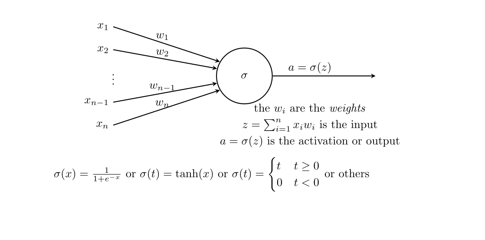
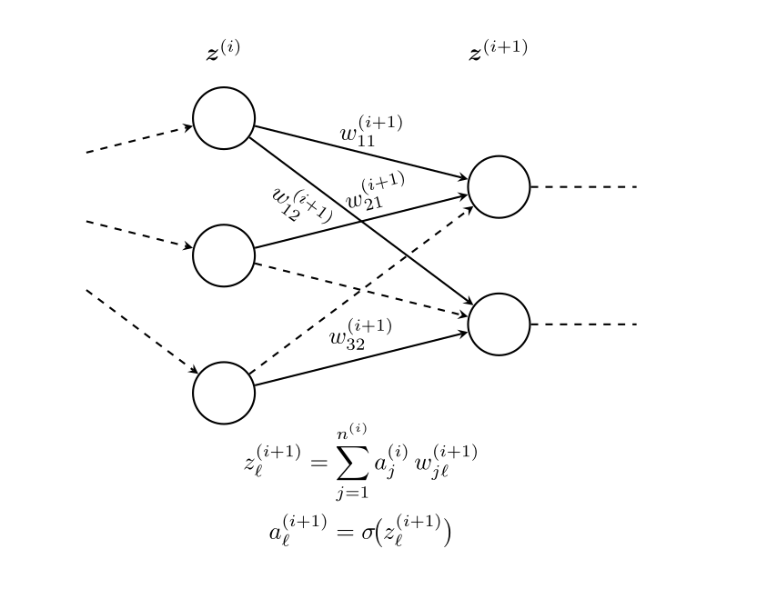
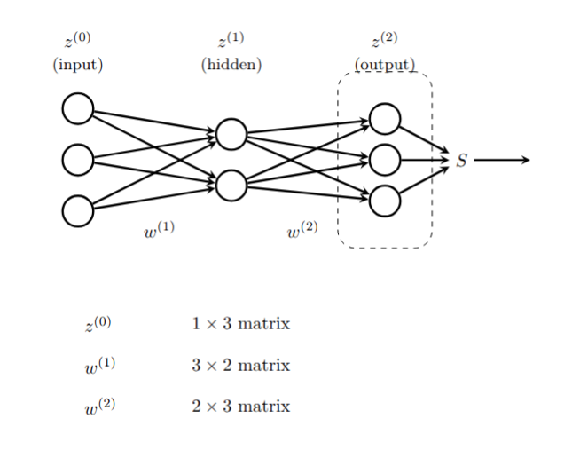
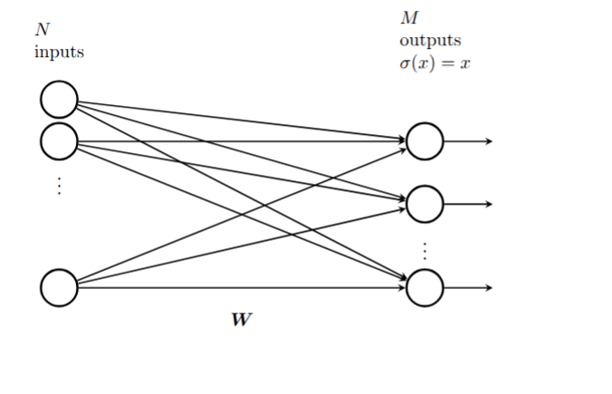
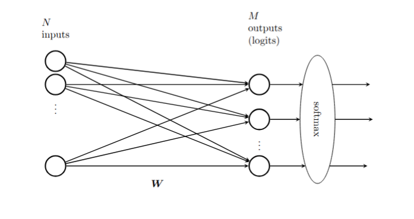
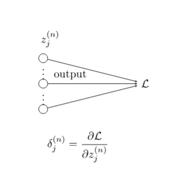
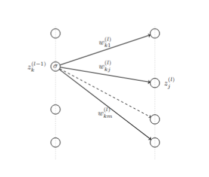
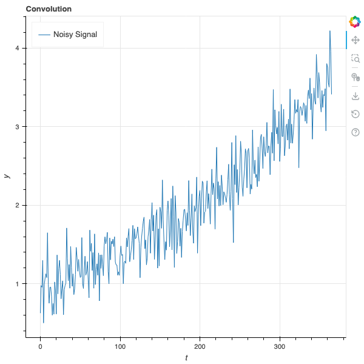
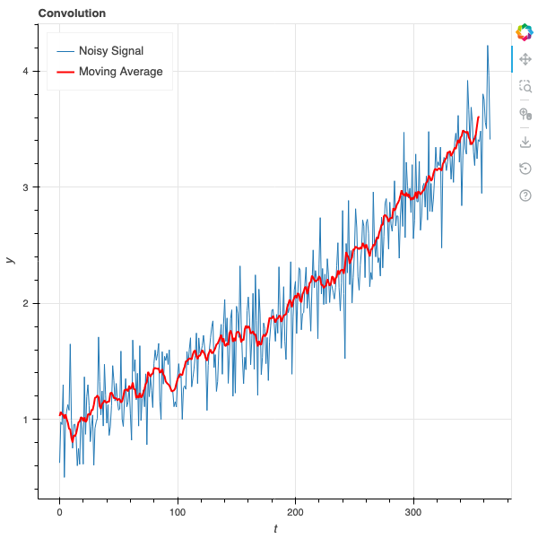
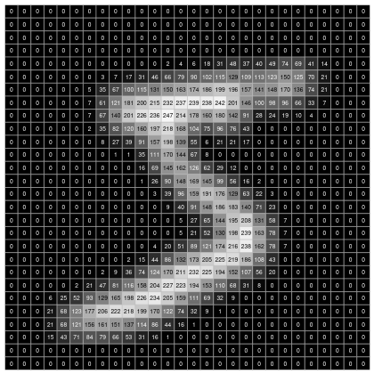

# Neural Networks

## Introduction

Many of the most impressive achievements in machine learning stem from the development of "artificial neural networks."
The earliest ideas for building algorithms based on models of neurons go back to the 1940s and peaked in the late 1950s and
early 1960s with the development of the "perceptron," an early example of what we now call a multi-layer neural net.
Hardware limitations, along with a tendency to overstate the power of these early techniques, led to the abandonment
of these ideas for nearly 50 years until Geoffrey Hinton and others returned to them, supported by dramatic improvements
in computing power, specialized hardware such as GPUs, and several crucial advances in optimization algorithms. Since then neural networks have demonstrated an amazing
ability to "learn" and have overcome challenges in image recognition and other classic problems in artificial intelligence,
culminating in the invention of the attention mechanism, the transformer, and the modern LLM.

## Basics of Neural Networks

At its heart, a neural network is a function $F$ that is built out of two simple components:
    
- linear maps (matrices)
- simple non-linear maps (activation functions).

The function $F$ is the composition of these types of functions so that $F(x) = \cdots \sigma_2\circ M_2\circ\sigma_1\circ M_1$.

The structure of the different layers, the shape of the matrices $M_{i}$, and the choice of non-linear transition functions make up the *architecture* of the neural network. 

Suppose we want to build a neural network that recognizes pictures of cats. We begin with a large collection of images (a training set) $x_i$ and labels $y_i$ indicating whether $x_i$ is a
"cat" (1) or "not-cat" (0). Our goal is to learn a function $F$ that assigns to each image a probability between $0$ and $1$ measuring how likely it is that the picture is a cat.

To do this, we choose an architecture for our neural network $F$ and initialize its weight matrices randomly. Then we compute $F(x_i)$ and compare it to $y_i$. Using an optimization algorithm, we adjust the weights until $F(x_i)$ is close to $1$ when $y_i = 1$
and close to $0$ when $y_i = 0$. Eventually, we obtain a function that, hopefully, can recognize images that were not in its training set, assigning high probabilities
to pictures of cats and low probabilities to pictures of non-cats.

In fact, both linear and logistic regression fit into this framework and are very simple examples of neural networks. In the case of linear regression,
we have training data $(x_i,y_i)$ and our goal is to find a matrix $M$ so that the function $Y=MX$ is a good approximation to the relationship $y_i\approx Mx_i$.
The error is measured by the mean squared error, and we can find $M$ either analytically or by gradient descent. In this case the neural network is purely linear,
with no nonlinear maps involved. 

In the case of (simple) logistic regression, we have a collection of data $(x_i,y_i)$ where $y_i$ is $0$ or $1$ and the $x_i$ are vectors of length $n$. Here we use the logistic function $\sigma$ together with a weight vector $w\in\mathbb{R}^n$ and consider $F(x_i) = \sigma(w\cdot x_i)$. The error we measure is the negative log-likelihood of the data given the probabilities $F(x_i)$,
which works out to 

$$
L = -\sum_i \big(y_{i}\log F(x_i) + (1-y_i)\log(1-F(x_i))\big)
$$

and we find $w$ by iteratively minimizing this $L$.

## Graphical Representation of Neural Networks

It is traditional, when working with neural networks, to take advantage of a graphical
representation of the structure of the network. @fig-neuron shows the fundamental
element of such a graphical representation—a single "neuron." Here, the inputs $x_{i}$
flow into the neuron along the arrows from the left, where they are multiplied by the weights $w_{i}$. Then these values $x_{i}w_{i}$ are summed, yielding $z=\sum_{i} x_{i}w_{i}$, and the nonlinear "activation"
function $\sigma$ is applied; the result is $a=\sigma(z)$.

{#fig-neuron}

A full-fledged neural network is built up from "layers." Each layer consists of a collection of neurons with input connections from the previous layer and output connections to the next layer.  This structure is illustrated in @fig-layers.

{#fig-layers}

A multi-layer neural network with specified weights and activation functions defines a function called the "inference"
or "feed-forward" function.   Consider the simple
example shown in @fig-feedforward.

{#fig-feedforward}

The input layer has 3 components, which we can represent as a $1\times 3$ row vector with entries $(z_{1}^{(0)},z_{2}^{(0)},z_{3}^{(0)})$.  The middle "hidden layer" has two nodes.  The 6 weights
$w_{ij}^{(1)}$ connecting node $z^{(0)}_{i}$ to  $z^{(1)}_{j}$
form a $3\times 2$ matrix $W^{(1)}$ where
$$
z^{(1)}_{j} = \sum_{i=1}^{3} z^{(0)}_{i} w_{ij}^{(1)}.
$$

The outputs of the hidden layer are obtained by applying the activation function $\sigma$ to each of the $z^{(1)}_{j}$:
$$
a^{(1)}_{j} = \sigma(z^{(1)}_{j})
$$
for $j=1,2$.  These activations are the inputs to the final layer, which has 3 nodes.  The weights $w_{jk}^{(2)}$ connecting the hidden layer to the output layer form a $2\times 3$ matrix $W^{(2)}$, where
$$
z^{(2)}_{k} = \sum_{j=1}^{2} a^{(1)}_{j} w_{jk}^{(2)}.
$$

The last step is to apply an output function to the vector $z^{(2)}$.
While activation functions are typically applied element-wise, the output function often uses all of
the values in the layer.

Putting this together, the feed-forward function $F$ looks like
$$
F(z^{(0)}) = S(\sigma(z^{(0)}W^{(1)})W^{(2)})
$$

Here, the function $\sigma$ is applied element-wise to the vector $z^{(0)}W^{(1)}$, while the output function $S$ is applied to the entire vector $z^{(2)}$.

#### Linear Regression as a Neural Network

A simple linear regression problem takes an $N$-dimensional input vector $x$ (which we write as a $1\times N$ row vector) and produces an $M$-dimensional output vector $y$ (which we write as a $1\times M$ row vector) by multiplying by a weight matrix $W$ so that $y=xW$. 

This is a neural network with no activation function, just a single layer with weight matrix $W$ and the identity as the output function.

{#fig-linear-regression-network}

#### Logistic Regression as a Neural Network

While linear regression can be represented as a trivial neural network, logistic regression is a more interesting example.  Consider the problem of multi-class logistic regression, where the input vector is an $N$-dimensional row vector $x$ and the output is a probability distribution over $M$ classes, represented as an $M$-dimensional row vector $y$ with non-negative entries summing to one. 

From our earlier work, we know that this model relies on an $N\times M$ weight matrix, and the output of the logistic model
is $F(x) = S(xW)$, where $S$ is the softmax function defined by
$$
S(z)_{i} = \frac{e^{z_{i}}}{\sum_{j=1}^{M} e^{z_{j}}}.
$$

The graphical representation of this neural network is shown in @fig-logistic-network.

{#fig-logistic-network}

## Loss functions and training

Given a large collection of data $(x^{[i]},y^{[i]})$, where $x$ is the input and $y$ the target output, the goal
of training a neural network $F_{W}$ on this data is to adjust the weights $W$ in $F_{W}$ so that $F(x^{[i]})$ is "approximately" $y^{[i]}$.   To make sense of this, we need to quantify how close $F(x^{[i]})$ is to $y^{[i]}$ by means of a function $L_{W}$ called the "loss function."

The choice of a loss function is based on the ultimate purpose of the neural network.  We have seen two widely used examples.  The first, which arises in linear regression, is the "mean squared error".  On a single data point
$(x^{[i]},y^{[i]})$, this loss function is 

$$
L_{W}(F_{W}(x^{[i]}),y^{[i]}) =  \|F_{W}(x^{[i]})-y^{[i]}\|^2
$$

and the overall loss is

$$
L_{W}=\frac{1}{M}\sum_{i=1}^{M} \|F_{W}(x^{[i]})-y^{[i]}\|^2.
$$

In the case of multi-class classification (with, say, $n$ classes), the loss function is usually the "cross entropy".  In this case the output vectors $y^{[i]}$ are $(y_{1}^{[i]},\ldots, y_{n}^{[i]})$ where the $y_j^{[i]}$ are all zero except for a $1$ in the $j$th position where the proper class assignment is class $j$.  (This is called one-hot encoding).
The output layer of a classification network consists of $(z_{1},\ldots, z_{n})$ which are passed through the softmax function yielding
$$
(\frac{e^{z_1}}{H},\ldots, \frac{e^{z_{n}}}{H})
$$
where $H=\sum_{j=1}^{n} e^{z_{j}}.$  If we write $p_{j}=e^{z_{j}}/H$, then the loss for a single data point
$(x^{[i]},y^{[i]})$ is 

$$
L_{W}(x^{[i]},y^{[i]}) = -\sum_{j=1}^{n} y^{[i]}_{j}\log(p_{j})
$$

and the total loss would be 

$$
L_{W} = \frac{1}{M}\sum_{i=1}^{M} L_{W}(x^{[i]},y^{[i]})
$$

It is important to recognize that the loss *is a function of the weights* of the network; the data $(x,y)$ are fixed.

The goal of training is to minimize $L_{W}$ by varying $W$.  From a mathematical point of view, we do this by gradient descent.  That is to say, for the fixed collection of data, we iteratively calculate $\partial L_{W}/\partial W^{(j)}_{kl}$ for all the weights $W^{(j)}_{kl}$ in the network,
and then make a small adjustment 
$$
W^{(j)}_{kl} = W^{(j)}_{kl} - \lambda \frac{\partial L_{W}}{\partial W^{(j)}_{kl}}
$$
until the loss function changes by less than some threshold amount on each iteration.

Computing the partial derivatives $\partial L_{W}/\partial W^{(j)}_{kl}$ is a miraculous application of the chain rule
that exploits the architecture of the neural network.  The algorithm for this computation is called "backpropagation"
and we will discuss it in the next section.

## Backpropagation
pwd
Our neural network is made up of $n$ layers, with the output of the final $n$th layer serving as input to the loss function. The nodes at the $j$th layer have values $z^{(j)}_{k}$. The idea behind backpropagation is, for each data point $(x^{[i]},y^{[i]})$,  to compute vectors
$$
\delta^{(j)}_{k} = \frac{\partial L_{W}}{\partial z^{(j)}_{k}}
$$
inductively starting with $j=n$ and working backwards. From these $\delta^{(j)}$ we can then compute
the partials $\partial L_{W}/\partial W^{(j)}_{rs}$.

Since the total loss is accumulated as a sum over the data points, we can sum the $\delta^{(j)}_{k}$ obtained from
successive data points to compute the gradient of the loss over all the data or over some portion of the data, and
use these accumulated gradients to adjust the weights.  

The term "backpropagation" comes from the fact that we compute the $\delta$ starting at the output end of the network and working backwards toward the input end, in contrast with the inference or forward pass which goes from the input to the output.

### Backpropagation: first step

The first step of the backpropagation algorithm comes from the output layer of the neural network.  The elements of the last layer
$z^{(n)}$ are fed directly into the loss function $L_{W}$ as shown in @fig-backprop-1.
Therefore, 
$$
\delta^{(n)}_j = \frac{\partial L_{W}}{\partial z^{(n)}_{j}}
$$
depends on the loss function $L_{W}$.  Let's look at the two cases we considered above separately.

#### Mean Squared Error

In this case, as we've seen, the loss function is given by the squared Euclidean distance
between the output vector $z^{(n)}$ and the target vector $y^{[i]}$.
$$
L_{W}(x^{[i]},y^{[i]}) = \|z^{(n)}-y^{[i]}\|^2
$$
and therefore the derivative is just
$$
\frac{\partial L_{W}}{\partial z^{(n)}_{j}} = 2(z_{j}^{(n)}-y_{j}^{[i]}).
$$

In other words, since we are going to adjust the scaling anyway when we do gradient descent, we can set
$$
\delta^{(n)} = z^{(n)}-y^{[i]}.
$$

#### Cross Entropy

In the classification problem we saw that
$$
L_{W}(x^{[i]},y^{[i]}) = -\sum y^{[i]}_{j}\log\frac{e^{z^{(n)_{j}}}}{H}
$$
where $H=\sum_{j} e^{z^{(n)}_{j}}$. Therefore
$$
\delta^{(n)}_{j} = \frac{\partial L_{W}}{\partial z_{j}^{(n)}} = -y^{[i]}_{j}+\frac{\partial \log H}{\partial z_{j}^{(n)}}
$$
which gives
$$
\delta^{(n)}_{j} = -y_{j}^{[i]}+p_{j}
$$
where 
$$
p_{j}=\frac{e^{z_{j}^{(n)}}}{H}
$$

Putting this together yields
$$
\delta^{(n)} = -y^{[i]}+p
$$
where $p$ is the vector of probabilities with entries $p_{j} = e^{z^{(n)}_{j}}/H$.

{#fig-backprop-1}

### Backpropagation - inductive steps

{#fig-backprop-2}

To continue the backpropagation steps, we are going to compute $\delta^{(i-1)}$ from $\delta^{(i)}$ for $i<n$ inductively.
Again, the key is the chain rule:
$$
\delta^{(i-1)}_k = \frac{\partial L_{W}}{\partial z^{(i-1)}_{k}} = \sum_{t}\frac{\partial L_{W}}{\partial z^{(i)}_{t}}\frac{\partial z^{(i)}_{t}}{\partial z^{(i-1)}_{k}}
$$

The structure of the neural network tells us that
$$
z_{t}^{(i)} = \sum_{j} \sigma(z_{j}^{(i-1)})w_{jt}^{(i)}.
$${#eq-z-computation}

Therefore
$$
\frac{\partial z^{(i)}_{t}}{\partial z^{(i-1)}_{k}}= \sigma'(z_{k}^{(i-1)})w_{kt}^{(i)}.
$$

Putting this in the chain rule sum yields
$$
\frac{\partial L_{W}}{\partial z^{(i-1)}_{k}} = \sum_{t}\frac{\partial L_{W}}{\partial z^{(i)}_{t}}\sigma'(z_{k}^{(i-1)})w_{kt}^{(i)}.
$$

In other words
$$
\delta^{(i-1)}_{k} = \sigma'(z_{k}^{(i-1)})w_{kt}^{(i)}\delta^{(i)}_{t}
$$
or, in vector form,

$$
\delta^{(i-1)} = \sigma'(z^{(i-1)})W^{(i)}\delta^{(i)}
$$
where the multiplication by the vector $(\sigma'(z^{(i-1)}_{j}))$ is done componentwise.

### Backpropagation - putting it together

As we've seen, by a backward pass through the network we can compute the 
$\delta^{(i)}$, which are essentially the gradients of $L_{W}$ with respect to the
variables making up the $i$th layer.

Of course, what we *really* want are the gradients with respect to the weights, and that requires one more use of the chain rule.  We see that
$$
\frac{\partial L_{W}}{\partial w^{(i)}_{jk}} = \sum \frac{\partial L_{W}}{\partial z^{(i)}_{k}}\frac{\partial z^{(i)}_{k}}{\partial w^{(i)}_{jk}}
$$
and from @eq-z-computation we have

$$
\frac{\partial z^{(i)}_{k}}{\partial w^{(i)}_{jk}} = \sigma(z^{(i-1)}_{j}).
$$

As a result,
$$
\frac{\partial L_{W}}{\partial w^{(i)}_{jk}} =  \delta^{(i)}_{k}\sigma(z^{(i-1)}_{j}).
$$

The gradient $\nabla W^{(i)}$ of $W^{(i)}$ is therefore a matrix whose $jk$ entry is given by
$$
\frac{\partial L_{W}}{\partial w^{(i)}_{jk}}=\sigma(z^{(i-1)}_{j})\delta^{(i)}_{k}.
$$
This is sometimes called the outer product of the vectors $\sigma(z^{(i-1)})$ and
$\delta^{(i)}$ or just the matrix product of the column vector $\delta^{(i)}$ and the
row vector $\sigma(z^{(i-1)})$ (in that order).

### Training

The training process for a neural network uses successive forward (inference) passes and backward (backpropagation) passes to iteratively move the weights of the network in a way that reduces the loss function.

More specifically, begin by setting all
the $\delta^{(i)}$ and $\nabla W^{(i)}$ to zero, and initialize the weights of the network randomly. Then, for each $(x,y)$ in the dataset:

- make a forward pass through the network, computing and saving the inputs $z^{(i)}$ for each layer. 

- make a backward pass through the network, computing the $\delta^{(i)}$ and the $\nabla W^{(i)}$ at each layer using the backpropagation formulae.  Accumulate the $\delta^{(i)}$ and $\nabla W^{(i)}$
from each pass into variables $\delta^{(i)}_{*}$ and $\nabla W^{(i)}_{*}$.

- periodically (after each iteration, after a fixed number of data points, or after a complete pass through the data), update the weights using your chosen version of gradient descent; the simplest approach is:
$$
W^{(i)} \leftarrow W^{(i)}-\lambda \nabla W^{(i)}_{*}
$$
for a learning rate $\lambda$.  Then reset all of the accumulators $\delta^{(i)}_{*}$ and $\nabla W^{(i)}_{*}$ to zero.

Once every data point in the dataset has been considered, you have completed one *training epoch*.  Repeat until the loss stops decreasing meaningfully.

## Convolution

In this section, we will look at convolution, an important idea in mathematics generally that plays a key role in neural networks, especially in image recognition.  Before
looking at its application there we will first talk about it more generally.

Let's start with a function $f(t)$ of one variable that represents some underlying trend together with random fluctuations.  For example, $f(t)$
might be the price of the stock of a company that is overall growing but that bounces up and down in response to short-term events.  We show a sample graph of such a function in @fig-signal_with_noise .

{#fig-signal_with_noise}

We are interested in identifying the underlying trend, and filtering out the noise.  One standard method for doing this is to use a "moving average" -- that is, to replace each value $f(t)$ by the average of the values of $f$ in a window near $t$.  More formally we choose a step size $\delta$ and a "window size" $k$ and let
$$
\hat{f}(t) = \frac{1}{2k+1}\sum_{i=-k}^{k} f(t+i\delta)
$$

We have to make some decisions here about what to do at the beginning and end
of the domain of $f$, but this is mainly a detail so let's ignore this problem for now. 
In many applications, we have $f$ given to us as a discrete series of numbers, such as the daily prices of a stock, and in that case the moving average is just the average over some number of days around the given day. 

The effect of the moving average is, in general, to shrink the random variability in the signal, since the average of a random signal will, in general, have lower variance then the original random signal.  

In our graph above, if we take $\delta=1$ and $k=5$, we get the result shown in
@fig-smoothed_signal .  As you can see, the red line bounces around much less than the blue one. 

{#fig-smoothed_signal}

This idea of a "moving average" isn't limited to one dimensional data; it can be applied to data in any dimension.  For example, suppose our data is an image represented by a $28\times 28$ array of numbers between $0$ and $255$. Each array cell is a pixel, and the number is how dark that pixel is, from white (255) to black (0).

Figure @fig-image_sample is such an image. 

{#fig-image_sample}

In this situation, our "moving average" can mean replacing each cell by the average
value of that cell and its 8 neighbors. For boundary cells, we need to make some kind of choice -- for example, we can compute the average of neighboring cells that lie within the $28\times 28$ array.  Applying this to the image above "smooths" out the image.   We can see the effect of this in @fig-image_smoothed .

{#fig-image_smoothed}

Convolution is essentially a generalization of the moving average, where replace the simple average with an arbitrary weighted average. That is, we take another function $h(t)$, which we think of as a "filter", and we use the values of $h$ to weight the
values of $f$ in our average.  The transform of $f$ under this type of convolution is written $h\star f$, and in the general continuous case it's an integral:
$$
(h\star f)(t) = \int_{s=-\infty}^{\infty}\sum h(s)f(t-s) dt
$$

In machine learning, we have discrete data, and so we can simplify this a bit.
Our function $h$, our "filter", is a function $h(k)$ of integers,
and
$$
(h\star f)(t) = \sum_{s=-\infty}^{\infty} h(s)f(t+s\delta)
$$
where $\delta$ is a step size.  To make this a proper "average" we 
need to normalize this by assuming that the total integral
$$
\int_{-\infty}^{\infty} h(t) dt = 1
$$

From this fancier point of view, the moving average over a window of length, say, $5$, is the case where $h(k)=1/5$ for $k=-2,-1,0,1,2$ and is zero elsewhere.  Then
$$
(h\star f)(t) = \frac{f(t-2\delta)+f(t-\delta)+f(t)+f(t+\delta)+f(t+2\delta)}{5}
$$
which is the usual average. 

As an example,  consider the technique called "exponential smoothing", in which we replace the value of $f$ at a time $t$ with the average of some window of its past values, but we weight those past values with an exponentially decaying factor $\lambda$.  We
let 
$$
h(k)=\lambda^{k}(\lambda-1)/(\lambda^{N+1}-1)
$$

 for $N\ge k\ge 0$ and $h(k)=0$ for $k<0$ and $k>N$.   
 
 The constant $(\lambda-1)/(\lambda^{N+1}-1)$ is chosen
so that the sum of the values of $h$ add up to one.  From convolution we obtain:
$$
(h\star f)(t) = \frac{\lambda-1}{\lambda^{N+1}-1}\sum_{k=0}^{N} \lambda^{k}f(t-k\delta).
$$

A common version of exponential smoothing of a sequence $y_{i}$ for $i=1,\ldots,$
is to recursively define
$$
z_{1} = y_{1}
$$

and, for $i=2,\ldots,$
$$
z_{i} = \alpha y_{i} + (1-\alpha)z_{i-1}.
$$

This is equivalent to 
$$
z_{i} = \alpha \sum_{j=1}^{i} (1-\alpha)^{j-1}y_{i-j+1}
$$

This is equivalent to assuming that $y_{i}$ is zero for $i<1$ and defining
$h$ by
$$
h(i) = \alpha(1-\alpha)^{i}\hbox{\rm for $i\ge 0$}
$$
and
$$
h(i)=0
$$
for $i<0$.

In the two-dimensional setting, our filter function $h$ depends on two variables $h(x,y)$ and the convolution
is
$$
(h\star f)(x,y) = \int_{-\infty}^{\infty}\int_{-\infty}^{\infty} h(a,b)f(x-a,y-b) da db
$$

which reduces to a double sum in the discrete case.
For example, we can let $h(x,y)$ be a Gaussian
function
$$
h(x,y) = \frac{1}{2\pi}e^{-(x^2-y^2)/2}.
$$

If we apply convolution with this Gaussian to the image studied earlier, we obtain
the result in @fig-mnist-gaussian_smoothed.

{#fig-mnist-gaussian_smoothed}

### Discrete Convolution for Image Data

Suppose that we have an image represented by a numerical array $X$ of size $n\times m$.
We can represent a discrete $2d$ convolutional filter as another array $K$ of size
$k\times k$. ($K$ doesn't need to be square, but for simplicity we assume it is). We obtain the convolution $Z$ of $K$ and $X$ by "sliding" $K$
over the array $X$ and computing the values of $Z$ as the dot product of the entries
in $K$ with the different pieces of $X$.

For example, suppose that $X$ is $10\times 10$ and $K$ is $3x3$.  The
first row of $Z$ comes from sliding $K$ across the top of $X$ and computing
the dot products:
    
-  The first entry $Z_{11}$ is the dot product of the upper left
$3x3$ submatrix of $X$ with $K$.  
- The second entry $Z_{12}$ is the dot product of the submatrix coming from columns $2,3,4$ and rows $1,2,3$ of $X$ with $K$.
- The third entry $Z_{13}$ is the dot product of the submatrix with columns $3,4,5$ and rows $1,2,3$...

and so on.  The last entry comes from the dot product of the submatrix with columns $8,9,10$ and rows $1,2,3$ with $K$.  

Since only $8$ copies of $K$ "fit" across the $10$ columns of $X$, the convolution
$Z$ only $$ columns.    You continue this down the rows as well, so that $Z$ ends
up being a $8\times 8$ matrix. 

In general, if $X$ is $n\times m$ and $K$ is $k_1\times k_2$, 
then $Z_{ij}$ is the dot product of the submatrix of $X$ with columns $j,j+1,j+2,\ldots, j+k_2-1$ and rows $i, i+1, i+2, \ldots, i+k_1-1$ with $K$ with $1\le i\le n-k_1+1$ and
$1\le j\le m-k_2+1$.  Thus $Z$ will be $(n-k_1+1)\times (m-k_2+1)$.

#### Padding and Stride

There are two additional parameters that can be introduced to the convolution described above, called "padding" and "stride."

Padding refers to what happens at the edges of the matrix $X$.  A padding value of $p$ adds $p$ rows and columns of zeros all around $X$.  One can also have a padding value of $(p_1,p_2)$ which adds $p_1$ rows of zeros and $p_2$ columns of zeros.  

Adding padding has the effect of increasing the effective size of $X$ from $n\times m$ to  $(n+2p_1)\times (m+2p_2)$, so the size of $Z$ will be $(n+2p_1-k_1+1)\times (m+2p_2-k_2+1).$

Stride means that instead of sliding the kernel over by $1$ at each step, you slide it over by $s_1$ steps in the horizontal direction and $s_2$ steps in the vertical direction.

So if $X$ is $10\times 10$, $K$ is $3\times 3$, and the stride is $2$ in each direction,
then  $Z_{11}$ is the dot product of $K$ with the submatrix of $X$ with rows $1,2,3$ and
columns $1,2,3$.  But $Z_{12}$ is the dot product of $K$ with the submatrix of $X$ with rows $1,2,3$ and columns $3,4,5$.

Finally, if $X$ is $n\times m$, $K$ is $k_1\times k_2$, the padding is $(p_1,p_2)$,
and the stride is $(s_1,s_2)$ then the size of the convolution $Z$ is $z_1\times z_2$ where

$$
z_1=\frac{n+2p_1-k_1}{s_1}+1
$$
and
$$
z_2 = \frac{m+2p_2-k_2}{s_2}+1.
$$

### Pooling

Pooling is a variant of $2d$-convolution where, instead of computing the dot product of a filter with a submatrix of the data, one simply takes the maximum  of
the entries in the submatrix. 

So for example if $X$ is $n\times m$, and one is given a size $k_1\times k_2$, and
a stride $(s_1,s_2)$, the entry $Z_{ij}$ of the
pooled matrix is the maximum of the entries in the submatrix
of $X$ with rows $1+(i-1)s_1,\ldots, (i-1)s_1+k_1+1$ and columns $(j-1)s_2+1,\ldots, (j-1)s_2+k_2+1$.  

If pooling $(p_1,p_2)$ also added, then you add $p_1$ rows of $-\infty$ at the top
and bottom, and $p_2$ columns of $-\infty$ at the left and right of $X$.

The size of the pooled matrix is given by the same formulae as the convolution.

### Multichannel input

